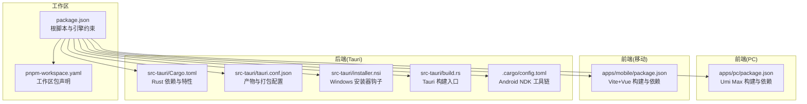
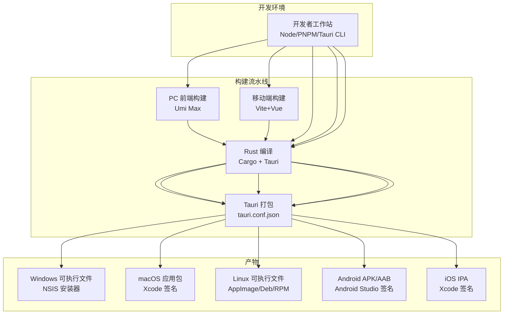
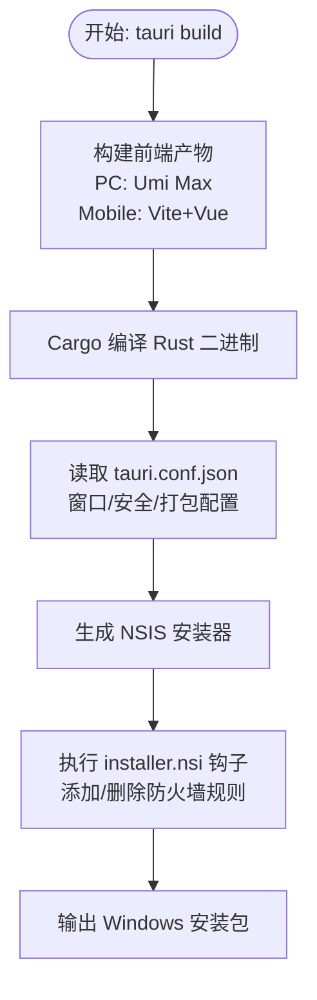
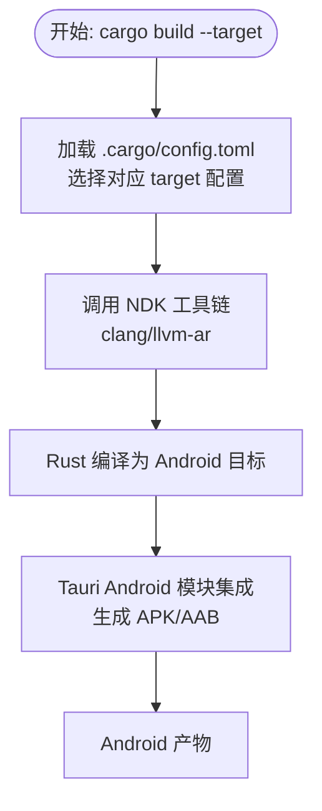
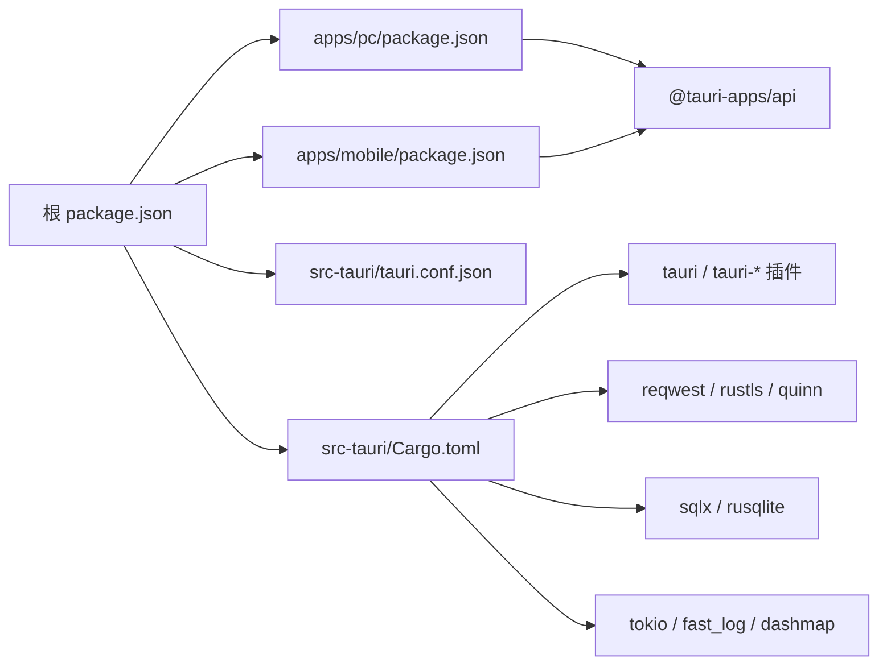
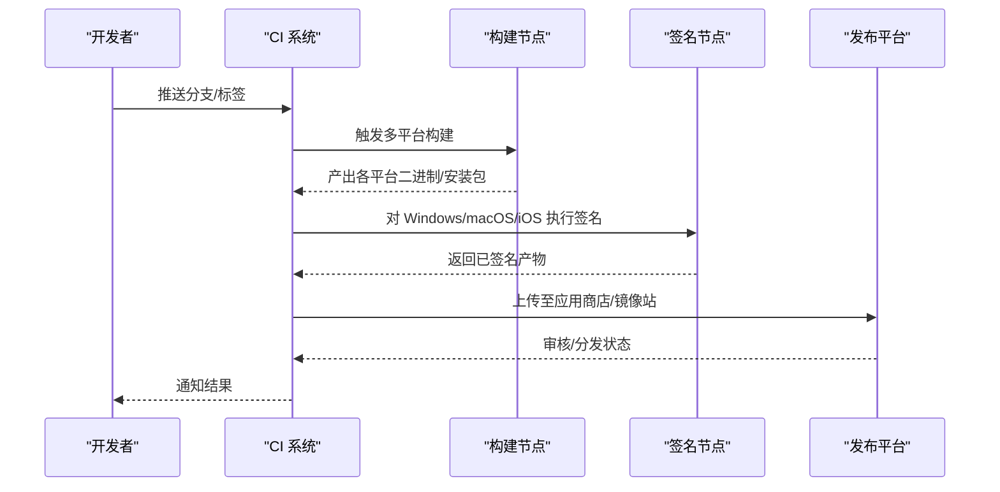

# 部署架构

<cite>
**本文引用的文件**
- [Cargo.toml](file://src-tauri/Cargo.toml)
- [tauri.conf.json](file://src-tauri/tauri.conf.json)
- [package.json](file://package.json)
- [apps/pc/package.json](file://apps/pc/package.json)
- [apps/mobile/package.json](file://apps/mobile/package.json)
- [installer.nsi](file://src-tauri/installer.nsi)
- [build.rs](file://src-tauri/build.rs)
- [.cargo/config.toml](file://src-tauri/.cargo/config.toml)
- [pnpm-workspace.yaml](file://pnpm-workspace.yaml)
</cite>

## 目录
1. [引言](#引言)
2. [项目结构](#项目结构)
3. [核心组件](#核心组件)
4. [架构总览](#架构总览)
5. [详细组件分析](#详细组件分析)
6. [依赖关系分析](#依赖关系分析)
7. [性能考量](#性能考量)
8. [故障排查指南](#故障排查指南)
9. [结论](#结论)
10. [附录](#附录)

## 引言
本文件面向 Rust Tauri Umi 即时通讯应用的部署团队与运维人员，系统化阐述跨平台部署方案，覆盖桌面端（Windows、macOS、Linux）与移动端（Android、iOS）的构建、打包、签名与发布流程；同时给出部署拓扑、CI/CD 流程建议与自动化配置要点，明确各平台的特定要求与限制，并总结版本管理、热更新与故障恢复的最佳实践。

## 项目结构
该仓库采用 monorepo 结构，前端分为 PC 端（Umi Max）与移动端（Vite + Vue），后端与打包配置集中在 src-tauri 目录中，使用 Tauri 2 进行统一构建与分发。

图表来源
- [package.json:1-30](file://package.json#L1-L30)
- [pnpm-workspace.yaml:1-4](file://pnpm-workspace.yaml#L1-L4)
- [apps/pc/package.json:1-45](file://apps/pc/package.json#L1-L45)
- [apps/mobile/package.json:1-37](file://apps/mobile/package.json#L1-L37)
- [src-tauri/Cargo.toml:1-62](file://src-tauri/Cargo.toml#L1-L62)
- [src-tauri/tauri.conf.json:1-58](file://src-tauri/tauri.conf.json#L1-L58)
- [src-tauri/installer.nsi:1-8](file://src-tauri/installer.nsi#L1-L8)
- [src-tauri/build.rs:1-4](file://src-tauri/build.rs#L1-L4)
- [.cargo/config.toml:1-12](file://src-tauri/.cargo/config.toml#L1-L12)

章节来源
- [package.json:1-30](file://package.json#L1-L30)
- [pnpm-workspace.yaml:1-4](file://pnpm-workspace.yaml#L1-L4)

## 核心组件
- 前端 PC 应用：基于 Umi Max 的桌面端界面，负责聊天、联系人、设置等 UI 交互。
- 前端移动端应用：基于 Vite + Vue 的移动端界面，适配触摸与移动端能力。
- 后端与打包：Rust 逻辑与数据库、网络层封装，通过 Tauri 2 统一打包为多平台可执行文件与安装包。
- 打包配置：Tauri 配置文件定义窗口、安全策略、资源协议与打包目标；NSIS 安装器钩子用于 Windows 防火墙规则维护。

章节来源
- [apps/pc/package.json:1-45](file://apps/pc/package.json#L1-L45)
- [apps/mobile/package.json:1-37](file://apps/mobile/package.json#L1-L37)
- [src-tauri/Cargo.toml:1-62](file://src-tauri/Cargo.toml#L1-L62)
- [src-tauri/tauri.conf.json:1-58](file://src-tauri/tauri.conf.json#L1-L58)

## 架构总览
下图展示从源码到多平台产物的总体流程，以及各平台的关键差异点（签名、权限、商店发布）。

图表来源
- [package.json:1-30](file://package.json#L1-L30)
- [apps/pc/package.json:1-45](file://apps/pc/package.json#L1-L45)
- [apps/mobile/package.json:1-37](file://apps/mobile/package.json#L1-L37)
- [src-tauri/Cargo.toml:1-62](file://src-tauri/Cargo.toml#L1-L62)
- [src-tauri/tauri.conf.json:1-58](file://src-tauri/tauri.conf.json#L1-L58)

## 详细组件分析

### Tauri 打包与安装器（Windows）
- 打包目标：配置为“全部平台”，Windows 使用 NSIS 安装器。
- 安装器钩子：在安装/卸载时自动添加/删除防火墙 UDP 入站规则，确保应用通信可用。
- 安全策略：启用资产协议与受限 CSP，限定资源来源与 IPC 访问范围。

图表来源
- [src-tauri/tauri.conf.json:41-56](file://src-tauri/tauri.conf.json#L41-L56)
- [src-tauri/installer.nsi:1-8](file://src-tauri/installer.nsi#L1-L8)
- [build.rs:1-4](file://src-tauri/build.rs#L1-L4)

章节来源
- [src-tauri/tauri.conf.json:1-58](file://src-tauri/tauri.conf.json#L1-L58)
- [src-tauri/installer.nsi:1-8](file://src-tauri/installer.nsi#L1-L8)

### Android 构建与工具链
- 多架构支持：针对 x86_64、ARM64、ARMv7 提供链接器与归档工具配置。
- 工具链路径：通过 .cargo/config.toml 指定 Android NDK 工具链路径，确保在 Windows 上使用正确的编译器与归档器。
- 产物形态：Android 侧生成 APK/AAB，配合签名与商店发布流程。

图表来源
- [.cargo/config.toml:1-12](file://src-tauri/.cargo/config.toml#L1-L12)
- [src-tauri/Cargo.toml:24-62](file://src-tauri/Cargo.toml#L24-L62)

章节来源
- [.cargo/config.toml:1-12](file://src-tauri/.cargo/config.toml#L1-L12)
- [src-tauri/Cargo.toml:1-62](file://src-tauri/Cargo.toml#L1-L62)

### macOS 与 Linux 打包要点
- macOS：需完成签名与公证（notarization），并生成 .app 包；若上架 Mac App Store，需遵循商店审核规范。
- Linux：常见分发格式为 AppImage、Deb、RPM，需配置应用图标、MIME 关联与桌面文件；部分发行版需要额外权限配置。

章节来源
- [src-tauri/tauri.conf.json:41-56](file://src-tauri/tauri.conf.json#L41-L56)

### iOS 发布准备
- 需要 Apple 开发者账号与证书；Xcode 中进行签名与归档，生成 IPA 并上传至 App Store Connect。
- 应用权限与隐私清单需按平台要求完善，确保审核通过。

章节来源
- [src-tauri/tauri.conf.json:41-56](file://src-tauri/tauri.conf.json#L41-L56)

## 依赖关系分析
- 工作区与脚本：根 package.json 统一管理脚本与引擎版本；pnpm-workspace.yaml 声明工作区包集合。
- 前端依赖：PC 端使用 Umi Max，移动端使用 Vite+Vue；两者均依赖 @tauri-apps/api 与相关插件。
- 后端依赖：Rust 侧引入 Tauri 2、网络栈（reqwest/rustls/quinn）、数据库（sqlx/rusqlite）、日志与并发（tokio/fast_log/dashmap）等。

图表来源
- [package.json:1-30](file://package.json#L1-L30)
- [apps/pc/package.json:18-32](file://apps/pc/package.json#L18-L32)
- [apps/mobile/package.json:16-24](file://apps/mobile/package.json#L16-L24)
- [src-tauri/Cargo.toml:24-62](file://src-tauri/Cargo.toml#L24-L62)
- [src-tauri/tauri.conf.json:1-58](file://src-tauri/tauri.conf.json#L1-L58)

章节来源
- [package.json:1-30](file://package.json#L1-L30)
- [apps/pc/package.json:1-45](file://apps/pc/package.json#L1-L45)
- [apps/mobile/package.json:1-37](file://apps/mobile/package.json#L1-L37)
- [src-tauri/Cargo.toml:1-62](file://src-tauri/Cargo.toml#L1-L62)

## 性能考量
- Rust 发布配置：开启 LTO、减少代码生成单元以提升运行时性能；结合 sqlite/sqlcipher 优化本地数据访问。
- 网络与加密：使用 rustls 与 quinn 提升 TLS 与 QUIC 通信效率；合理设置 tokio 任务与并发。
- 前端体积：Umi Max 与 Vite 构建应启用 Tree Shaking、按需加载与代码分割，降低首屏加载时间。
- 打包体积：Tauri 默认启用打包，建议在 CI 中对各平台产物进行体积审计与压缩。

章节来源
- [src-tauri/Cargo.toml:11-19](file://src-tauri/Cargo.toml#L11-L19)
- [src-tauri/Cargo.toml:46-48](file://src-tauri/Cargo.toml#L46-L48)
- [src-tauri/Cargo.toml:34-37](file://src-tauri/Cargo.toml#L34-L37)
- [apps/pc/package.json:8-16](file://apps/pc/package.json#L8-L16)
- [apps/mobile/package.json:7-15](file://apps/mobile/package.json#L7-L15)

## 故障排查指南
- Windows 安装失败或无法通信
  - 检查 NSIS 安装器钩子是否正确执行防火墙规则添加/删除。
  - 确认端口与协议（UDP）在企业防火墙策略中放行。
- Android 构建失败
  - 核对 .cargo/config.toml 中 NDK 工具链路径与版本匹配。
  - 确保 Android SDK/NDK 已安装且 PATH 正确。
- macOS 签名与公证问题
  - 确认 Team ID、Provisioning Profile 与 Notarization 凭据配置正确。
- Linux 分发异常
  - 检查 AppImage/Deb/RPM 的权限与图标路径；确认桌面文件与 MIME 关联。
- 前端构建错误
  - 使用根脚本统一触发 PC 或 Mobile 构建，避免跨工作区依赖不一致。

章节来源
- [src-tauri/installer.nsi:1-8](file://src-tauri/installer.nsi#L1-L8)
- [.cargo/config.toml:1-12](file://src-tauri/.cargo/config.toml#L1-L12)
- [package.json:4-14](file://package.json#L4-L14)

## 结论
本部署架构以 Tauri 2 为核心，结合 Rust 后端与 Umi/Vite 前端，形成统一的多平台构建与分发体系。通过明确的打包配置、平台特定的签名与权限处理，以及可扩展的 CI/CD 流程，能够稳定地交付高质量的即时通讯应用。建议在 CI 中实现自动化构建、签名与发布，并建立完善的版本管理与回滚策略。

## 附录

### CI/CD 流程建议（概念示意）

### 自动化部署配置要点（概念）
- 触发条件：主分支推送、标签打标、PR 合并。
- 构建矩阵：Windows/macOS/Linux/Android/iOS 多目标并行。
- 密钥与凭据：在 CI 系统中安全存储签名证书与商店账号。
- 产物归档：按平台命名版本化保存，便于回溯与热修复。
- 回滚策略：保留最近 N 个版本，支持一键回滚与灰度发布。