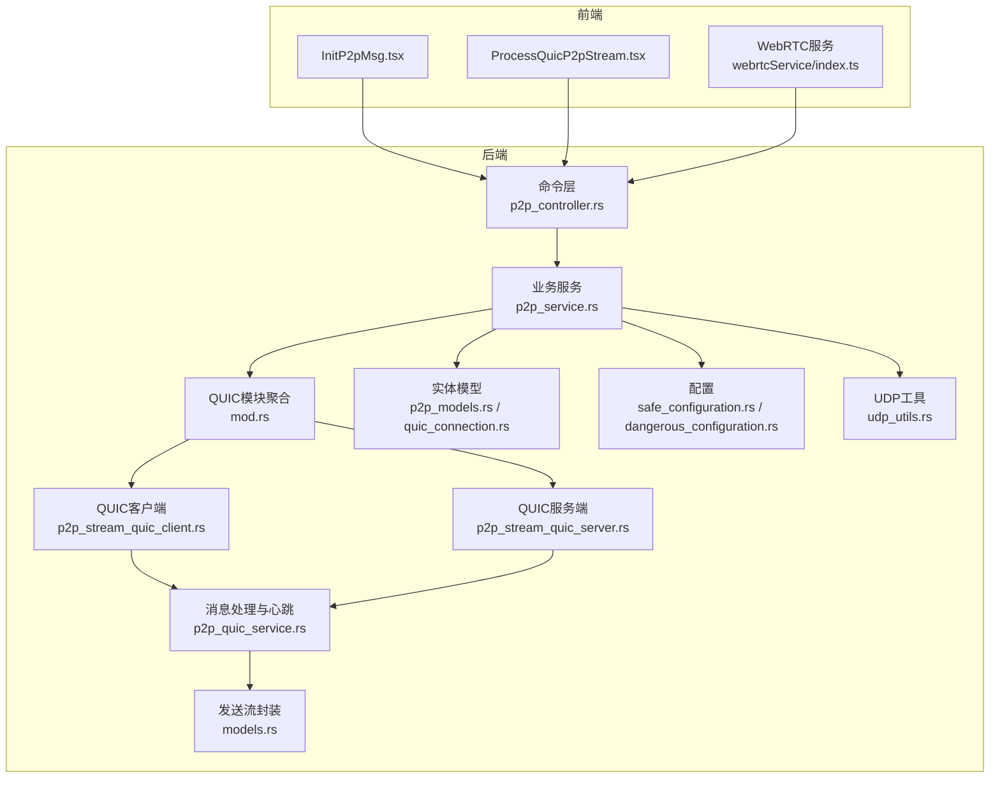
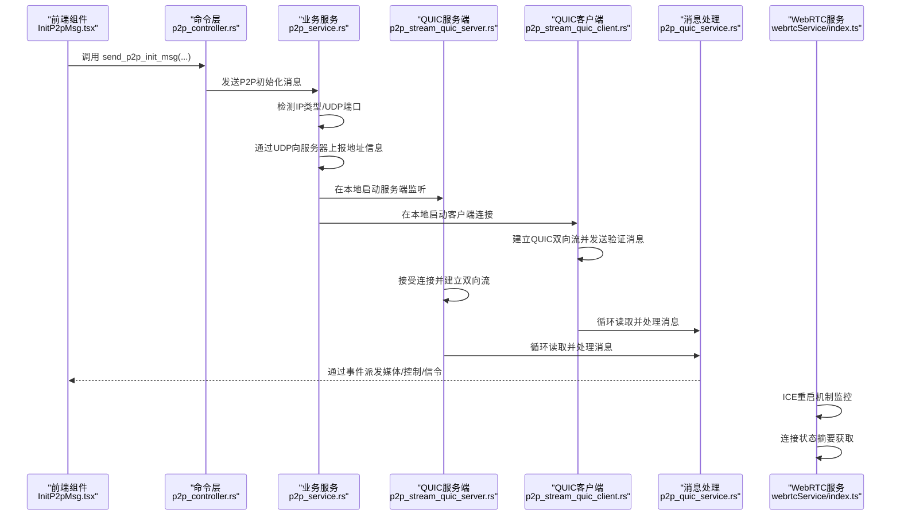
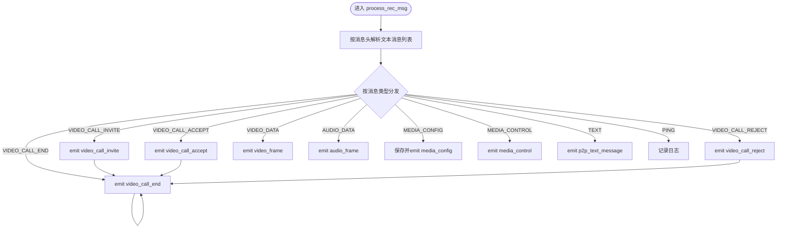
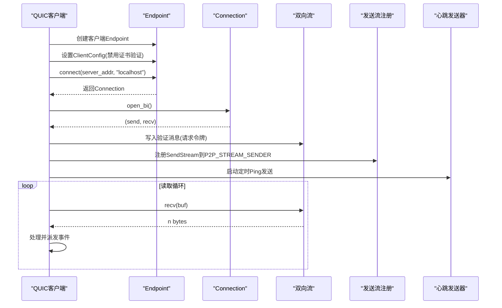
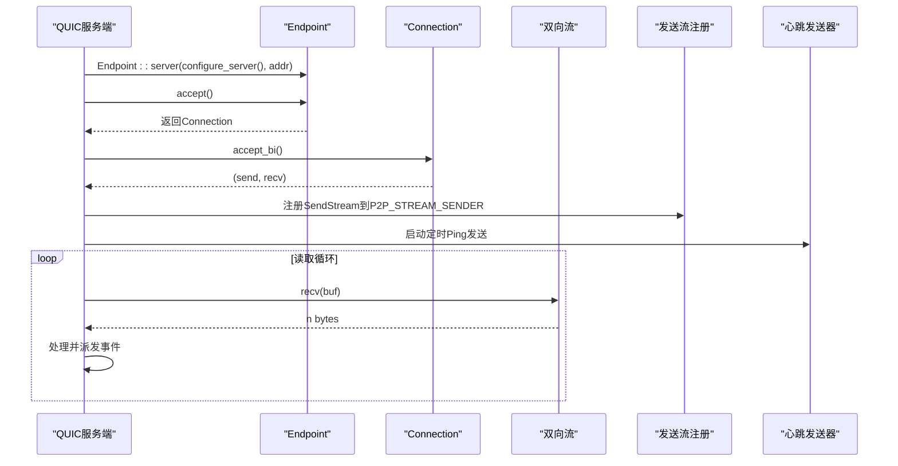
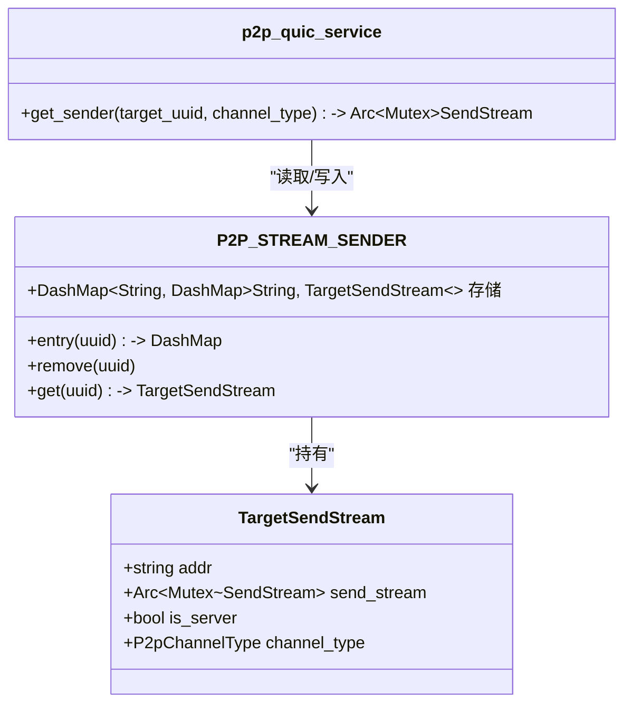
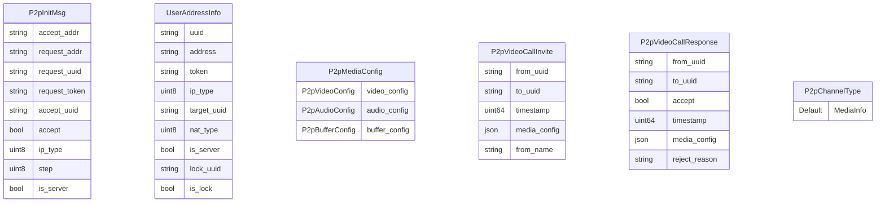
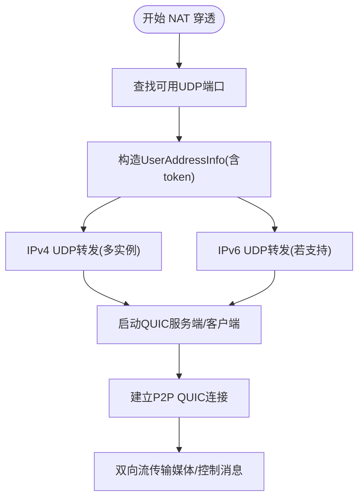
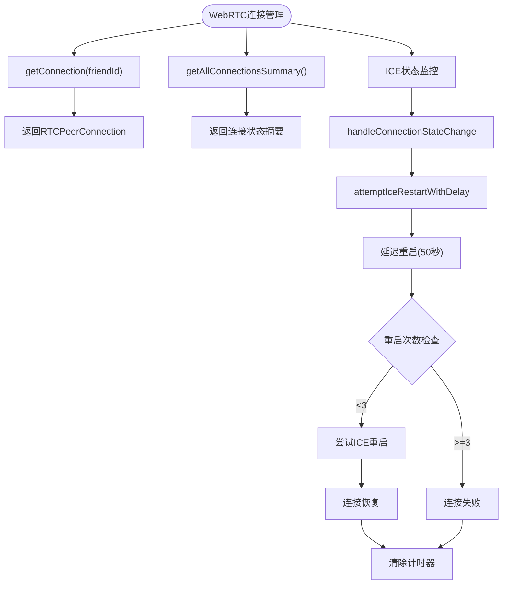
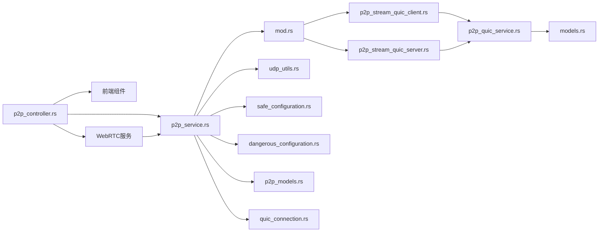

# P2P 连接管理

<cite>
**本文引用的文件**
- [p2p_quic_service.rs](file://src-tauri/src/quic_service/p2p_service/p2p_quic_service.rs)
- [p2p_stream_quic_client.rs](file://src-tauri/src/quic_service/p2p_service/p2p_stream_quic_client.rs)
- [p2p_stream_quic_server.rs](file://src-tauri/src/quic_service/p2p_service/p2p_stream_quic_server.rs)
- [mod.rs](file://src-tauri/src/quic_service/p2p_service/mod.rs)
- [models.rs](file://src-tauri/src/quic_service/models.rs)
- [p2p_models.rs](file://src-tauri/src/entity/p2p_models.rs)
- [message_types.rs](file://src-tauri/src/utils/message_types.rs)
- [quic_connection.rs](file://src-tauri/src/entity/quic_connection.rs)
- [safe_configuration.rs](file://src-tauri/src/quic_service/safe_configuration.rs)
- [dangerous_configuration.rs](file://src-tauri/src/quic_service/dangerous_configuration.rs)
- [udp_utils.rs](file://src-tauri/src/quic_service/udp_utils.rs)
- [p2p_controller.rs](file://src-tauri/src/cmd/p2p_controller.rs)
- [p2p_service.rs](file://src-tauri/src/service/p2p_service.rs)
- [InitP2pMsg.tsx](file://apps/pc/src/components/P2p/InitP2pMsg.tsx)
- [ProcessQuicP2pStream.tsx](file://apps/pc/src/components/P2p/ProcessQuicP2pStream.tsx)
- [index.ts](file://apps/pc/src/services/webrtcService/index.ts)
</cite>

## 更新摘要

**变更内容**

- 新增了 WebRTC 连接管理的 ICE 重启机制，包括 getConnection 和 getAllConnectionsSummary 功能
- 增强了 P2P 连接的监控和状态管理能力
- 完善了 NAT 穿透和连接恢复策略

## 目录

1. [引言](#引言)
2. [项目结构](#项目结构)
3. [核心组件](#核心组件)
4. [架构总览](#架构总览)
5. [详细组件分析](#详细组件分析)
6. [依赖关系分析](#依赖关系分析)
7. [性能考量](#性能考量)
8. [故障排查指南](#故障排查指南)
9. [结论](#结论)
10. [附录](#附录)

## 引言

本技术文档围绕点对点（P2P）连接管理展开，聚焦于基于 QUIC 的 P2P 流式通信实现，覆盖连接建立、状态管理、数据流控制与错误恢复策略，以及消息传递机制与 NAT 穿透方案。文档同时给出前端集成示例与后端关键流程图，帮助读者快速理解并扩展该模块。

**更新** 本版本增加了 WebRTC 连接管理的 ICE 重启机制，包括按好友 ID 检索连接实例和获取所有活动连接状态摘要的功能。

## 项目结构

P2P 相关代码主要分布在以下位置：

- 后端（Rust Tauri）：src-tauri/src/quic_service/p2p_service 下的 QUIC 客户端/服务端与消息处理；实体模型与消息类型定义位于 entity 与 utils；命令层封装在 cmd；业务服务在 service。
- 前端（PC）：apps/pc/src/components/P2p 下的演示组件，展示如何调用后端命令与监听事件。
- WebRTC 服务：apps/pc/src/services/webrtcService/index.ts 提供 WebRTC 连接管理，包括 ICE 重启和连接状态监控。

**图表来源**

- [p2p_controller.rs:1-170](file://src-tauri/src/cmd/p2p_controller.rs#L1-L170)
- [p2p_service.rs:1-771](file://src-tauri/src/service/p2p_service.rs#L1-L771)
- [mod.rs:1-4](file://src-tauri/src/quic_service/p2p_service/mod.rs#L1-L4)
- [p2p_stream_quic_client.rs:1-137](file://src-tauri/src/quic_service/p2p_service/p2p_stream_quic_client.rs#L1-L137)
- [p2p_stream_quic_server.rs:1-168](file://src-tauri/src/quic_service/p2p_service/p2p_stream_quic_server.rs#L1-L168)
- [p2p_quic_service.rs:1-323](file://src-tauri/src/quic_service/p2p_service/p2p_quic_service.rs#L1-L323)
- [models.rs:1-21](file://src-tauri/src/quic_service/models.rs#L1-L21)
- [p2p_models.rs:1-334](file://src-tauri/src/entity/p2p_models.rs#L1-L334)
- [quic_connection.rs:1-64](file://src-tauri/src/entity/quic_connection.rs#L1-L64)
- [safe_configuration.rs:1-69](file://src-tauri/src/quic_service/safe_configuration.rs#L1-L69)
- [dangerous_configuration.rs:1-52](file://src-tauri/src/quic_service/dangerous_configuration.rs#L1-L52)
- [udp_utils.rs:1-100](file://src-tauri/src/quic_service/udp_utils.rs#L1-L100)
- [InitP2pMsg.tsx:1-35](file://apps/pc/src/components/P2p/InitP2pMsg.tsx#L1-L35)
- [ProcessQuicP2pStream.tsx:1-34](file://apps/pc/src/components/P2p/ProcessQuicP2pStream.tsx#L1-L34)
- [index.ts:839-864](file://apps/pc/src/services/webrtcService/index.ts#L839-L864)

**章节来源**

- [p2p_controller.rs:1-170](file://src-tauri/src/cmd/p2p_controller.rs#L1-L170)
- [p2p_service.rs:1-771](file://src-tauri/src/service/p2p_service.rs#L1-L771)
- [mod.rs:1-4](file://src-tauri/src/quic_service/p2p_service/mod.rs#L1-L4)

## 核心组件

- QUIC P2P 服务与消息处理：负责接收/发送 P2P 消息、心跳维持、事件派发至前端。
- QUIC 客户端/服务端：分别作为 P2P 连接的一端，建立双向流并维护发送通道。
- 发送流封装：统一管理每个目标用户的 SendStream，便于跨模块复用。
- 实体与消息类型：定义 P2P 初始化、地址信息、媒体配置、控制命令、视频/音频数据等结构。
- NAT 穿透与 UDP 工具：通过 UDP 端口探测与转发，辅助识别 NAT 类型与交换地址。
- 前端组件：演示如何调用后端命令与监听事件。
- **WebRTC 连接管理**：提供按好友 ID 检索连接实例和获取所有连接状态摘要的功能，增强 ICE 重启机制。

**章节来源**

- [p2p_quic_service.rs:1-323](file://src-tauri/src/quic_service/p2p_service/p2p_quic_service.rs#L1-L323)
- [p2p_stream_quic_client.rs:1-137](file://src-tauri/src/quic_service/p2p_service/p2p_stream_quic_client.rs#L1-L137)
- [p2p_stream_quic_server.rs:1-168](file://src-tauri/src/quic_service/p2p_service/p2p_stream_quic_server.rs#L1-L168)
- [models.rs:1-21](file://src-tauri/src/quic_service/models.rs#L1-L21)
- [p2p_models.rs:1-334](file://src-tauri/src/entity/p2p_models.rs#L1-L334)
- [message_types.rs:1-108](file://src-tauri/src/utils/message_types.rs#L1-L108)
- [udp_utils.rs:1-100](file://src-tauri/src/quic_service/udp_utils.rs#L1-L100)
- [InitP2pMsg.tsx:1-35](file://apps/pc/src/components/P2p/InitP2pMsg.tsx#L1-L35)
- [ProcessQuicP2pStream.tsx:1-34](file://apps/pc/src/components/P2p/ProcessQuicP2pStream.tsx#L1-L34)
- [index.ts:839-864](file://apps/pc/src/services/webrtcService/index.ts#L839-L864)

## 架构总览

P2P 连接由"信令通道（经由中心服务器）+ 直连 QUIC 流"组成。前端通过命令层调用后端服务，后端通过中心服务器交换地址信息，随后在本地 UDP 探测与 QUIC 建连后，双方通过双向流进行媒体数据与控制消息的实时传输。

**更新** 新增 WebRTC 连接管理，提供 ICE 重启和连接状态监控功能，增强 P2P 连接的稳定性和可靠性。

**图表来源**

- [p2p_controller.rs:1-170](file://src-tauri/src/cmd/p2p_controller.rs#L1-L170)
- [p2p_service.rs:52-293](file://src-tauri/src/service/p2p_service.rs#L52-L293)
- [p2p_stream_quic_server.rs:89-167](file://src-tauri/src/quic_service/p2p_service/p2p_stream_quic_server.rs#L89-L167)
- [p2p_stream_quic_client.rs:18-113](file://src-tauri/src/quic_service/p2p_service/p2p_stream_quic_client.rs#L18-L113)
- [p2p_quic_service.rs:79-98](file://src-tauri/src/quic_service/p2p_service/p2p_quic_service.rs#L79-L98)
- [index.ts:839-864](file://apps/pc/src/services/webrtcService/index.ts#L839-L864)

## 详细组件分析

### QUIC P2P 服务与消息处理

- 负责将接收到的二进制数据按消息头解析为多个文本消息，再根据消息类型分发处理。
- 支持的类型包括：视频通话邀请/接受/拒绝/结束、视频/音频数据、媒体配置/控制、文本消息、心跳等。
- 通过全局句柄向前端派发事件，如 video_call_invite、video_frame、audio_frame、media_config、media_control、p2p_text_message 等。
- 提供心跳发送器，周期性发送 Ping 消息以维持连接活性，并在连接非活跃时停止。

**图表来源**

- [p2p_quic_service.rs:118-274](file://src-tauri/src/quic_service/p2p_service/p2p_quic_service.rs#L118-L274)

**章节来源**

- [p2p_quic_service.rs:1-323](file://src-tauri/src/quic_service/p2p_service/p2p_quic_service.rs#L1-L323)
- [message_types.rs:1-108](file://src-tauri/src/utils/message_types.rs#L1-L108)

### QUIC 客户端

- 以本地地址作为源，连接远端服务器地址，建立 QUIC 连接。
- 打开双向流后，发送验证消息（携带请求令牌），随后将 SendStream 注册到全局映射，以便后续写入。
- 启动心跳发送器，循环发送 Ping；持续读取远端数据并交由消息处理模块处理。
- 采用不安全证书验证器（开发用途），生产环境建议替换为安全配置。

**图表来源**

- [p2p_stream_quic_client.rs:18-113](file://src-tauri/src/quic_service/p2p_service/p2p_stream_quic_client.rs#L18-L113)
- [dangerous_configuration.rs:1-52](file://src-tauri/src/quic_service/dangerous_configuration.rs#L1-L52)

**章节来源**

- [p2p_stream_quic_client.rs:1-137](file://src-tauri/src/quic_service/p2p_service/p2p_stream_quic_client.rs#L1-L137)
- [dangerous_configuration.rs:1-52](file://src-tauri/src/quic_service/dangerous_configuration.rs#L1-L52)

### QUIC 服务端

- 以服务器配置启动 Endpoint，接受来自客户端的连接。
- 接受连接后打开双向流，注册发送流，启动心跳发送器。
- 读取客户端数据并交由消息处理模块处理。
- 提供 UDP 端口转发工具，用于 NAT 类型探测与地址交换。

**图表来源**

- [p2p_stream_quic_server.rs:89-167](file://src-tauri/src/quic_service/p2p_service/p2p_stream_quic_server.rs#L89-L167)
- [dangerous_configuration.rs:1-52](file://src-tauri/src/quic_service/dangerous_configuration.rs#L1-L52)

**章节来源**

- [p2p_stream_quic_server.rs:1-168](file://src-tauri/src/quic_service/p2p_service/p2p_stream_quic_server.rs#L1-L168)
- [udp_utils.rs:1-100](file://src-tauri/src/quic_service/udp_utils.rs#L1-L100)

### 发送流封装与全局管理

- TargetSendStream 封装了远端地址、SendStream 的互斥访问包装与角色标记。
- P2P_STREAM_SENDER 是全局的发送流映射，键为目标用户 UUID，值为 TargetSendStream。
- 提供 get_sender 方法，按目标 UUID 获取 SendStream 的异步锁对象，用于写入。

**图表来源**

- [models.rs:1-21](file://src-tauri/src/quic_service/models.rs#L1-L21)
- [p2p_quic_service.rs:62-72](file://src-tauri/src/quic_service/p2p_service/p2p_quic_service.rs#L62-L72)

**章节来源**

- [models.rs:1-21](file://src-tauri/src/quic_service/models.rs#L1-L21)
- [p2p_quic_service.rs:1-323](file://src-tauri/src/quic_service/p2p_service/p2p_quic_service.rs#L1-L323)

### 实体与消息类型

- P2P 初始化消息：包含请求/接受地址、UUID、令牌、IP 类型、步骤状态、角色标记等。
- 用户地址信息：用于在 NAT 穿透阶段交换本地地址与令牌。
- 媒体配置/控制：视频/音频参数、缓冲策略、开关/暂停/恢复/结束等控制命令。
- 视频通话邀请/响应/结束：完整的通话生命周期消息。
- 消息类型常量：集中定义 P2P 相关的消息编号，便于前后端一致性。
- **P2P 通道类型**：支持 Default 和 MediaInfo 两种通道类型，用于区分数据传输和控制信息。

**图表来源**

- [p2p_models.rs:1-334](file://src-tauri/src/entity/p2p_models.rs#L1-L334)

**章节来源**

- [p2p_models.rs:1-334](file://src-tauri/src/entity/p2p_models.rs#L1-L334)
- [message_types.rs:1-108](file://src-tauri/src/utils/message_types.rs#L1-L108)

### NAT 穿透与 UDP 工具

- 业务服务在本地寻找可用 UDP 端口，构造 UserAddressInfo 并通过 UDP 转发至服务器，以暴露本机公网可达地址。
- 支持 IPv4 与 IPv6 的端口转发与探测，若本机不支持 IPv6 则忽略错误。
- 提供 UDP 端口转发工具函数，便于在不同场景下发送探测包。

**图表来源**

- [p2p_service.rs:150-193](file://src-tauri/src/service/p2p_service.rs#L150-L193)
- [p2p_stream_quic_server.rs:16-87](file://src-tauri/src/quic_service/p2p_service/p2p_stream_quic_server.rs#L16-L87)
- [udp_utils.rs:1-100](file://src-tauri/src/quic_service/udp_utils.rs#L1-L100)

**章节来源**

- [p2p_service.rs:150-193](file://src-tauri/src/service/p2p_service.rs#L150-L193)
- [udp_utils.rs:1-100](file://src-tauri/src/quic_service/udp_utils.rs#L1-L100)

### WebRTC 连接管理与 ICE 重启机制

**新增** WebRTC 服务提供了完整的连接管理功能，包括按好友 ID 检索连接实例和获取所有连接状态摘要的能力。

- **getConnection 方法**：根据 friendId 获取 RTCPeerConnection 连接对象，支持按好友 ID 精确检索连接实例。
- **getAllConnectionsSummary 方法**：返回所有活动连接的综合状态信息，包括连接状态、ICE 状态、信令状态、重启次数等。
- **增强的 ICE 重启机制**：实现智能的 ICE 重启策略，包括超时检测、重启计数限制、延迟重启等机制。
- **连接状态监控**：实时监控连接状态变化，自动处理 disconnected 和 failed 状态。

**图表来源**

- [index.ts:839-864](file://apps/pc/src/services/webrtcService/index.ts#L839-L864)
- [index.ts:570-600](file://apps/pc/src/services/webrtcService/index.ts#L570-L600)
- [index.ts:633-751](file://apps/pc/src/services/webrtcService/index.ts#L633-L751)

**章节来源**

- [index.ts:839-864](file://apps/pc/src/services/webrtcService/index.ts#L839-L864)
- [index.ts:570-600](file://apps/pc/src/services/webrtcService/index.ts#L570-L600)
- [index.ts:633-751](file://apps/pc/src/services/webrtcService/index.ts#L633-L751)

### 前端集成与事件监听

- InitP2pMsg.tsx：演示如何调用后端命令发送 P2P 初始化消息。
- ProcessQuicP2pStream.tsx：演示如何监听后端派发的 P2P 请求事件并处理。
- **WebRTC 服务集成**：演示如何使用 WebRTC 服务管理 P2P 连接，包括 ICE 重启和状态监控。

**章节来源**

- [InitP2pMsg.tsx:1-35](file://apps/pc/src/components/P2p/InitP2pMsg.tsx#L1-L35)
- [ProcessQuicP2pStream.tsx:1-34](file://apps/pc/src/components/P2p/ProcessQuicP2pStream.tsx#L1-L34)
- [index.ts:839-864](file://apps/pc/src/services/webrtcService/index.ts#L839-L864)

## 依赖关系分析

- 命令层依赖业务服务，业务服务依赖 QUIC 模块与 UDP 工具。
- QUIC 客户端/服务端依赖消息处理模块与发送流封装。
- 实体模型与消息类型为上层提供契约，确保前后端一致性。
- 配置模块提供安全与不安全两种 TLS 配置，满足不同部署需求。
- **WebRTC 服务**：独立管理 WebRTC 连接，提供 ICE 重启和连接状态监控功能。

**图表来源**

- [p2p_controller.rs:1-170](file://src-tauri/src/cmd/p2p_controller.rs#L1-L170)
- [p2p_service.rs:1-771](file://src-tauri/src/service/p2p_service.rs#L1-L771)
- [mod.rs:1-4](file://src-tauri/src/quic_service/p2p_service/mod.rs#L1-L4)
- [p2p_stream_quic_client.rs:1-137](file://src-tauri/src/quic_service/p2p_service/p2p_stream_quic_client.rs#L1-L137)
- [p2p_stream_quic_server.rs:1-168](file://src-tauri/src/quic_service/p2p_service/p2p_stream_quic_server.rs#L1-L168)
- [p2p_quic_service.rs:1-323](file://src-tauri/src/quic_service/p2p_service/p2p_quic_service.rs#L1-L323)
- [models.rs:1-21](file://src-tauri/src/quic_service/models.rs#L1-L21)
- [udp_utils.rs:1-100](file://src-tauri/src/quic_service/udp_utils.rs#L1-L100)
- [safe_configuration.rs:1-69](file://src-tauri/src/quic_service/safe_configuration.rs#L1-L69)
- [dangerous_configuration.rs:1-52](file://src-tauri/src/quic_service/dangerous_configuration.rs#L1-L52)
- [p2p_models.rs:1-334](file://src-tauri/src/entity/p2p_models.rs#L1-L334)
- [quic_connection.rs:1-64](file://src-tauri/src/entity/quic_connection.rs#L1-L64)
- [index.ts:839-864](file://apps/pc/src/services/webrtcService/index.ts#L839-L864)

**章节来源**

- [p2p_controller.rs:1-170](file://src-tauri/src/cmd/p2p_controller.rs#L1-L170)
- [p2p_service.rs:1-771](file://src-tauri/src/service/p2p_service.rs#L1-L771)
- [mod.rs:1-4](file://src-tauri/src/quic_service/p2p_service/mod.rs#L1-L4)

## 性能考量

- 缓冲区大小：读取缓冲区设定为 10MB，足以容纳高分辨率视频帧（约 230KB/帧），避免频繁扩容。
- 异步通道：视频帧发送采用异步通道与后台任务，避免阻塞主线程。
- 心跳间隔：每 2 秒发送一次 Ping，兼顾保活与网络负载平衡。
- 连接空闲超时：客户端与服务端均配置了较长的空闲超时，适合媒体流场景。
- NAT 穿透：通过 UDP 多实例探测与转发，提升直连成功率。
- **ICE 重启策略**：WebRTC 服务实现智能的 ICE 重启机制，包括超时检测、重启计数限制、延迟重启等，提升连接稳定性。

**章节来源**

- [p2p_stream_quic_client.rs:86-110](file://src-tauri/src/quic_service/p2p_service/p2p_stream_quic_client.rs#L86-L110)
- [p2p_stream_quic_server.rs:140-163](file://src-tauri/src/quic_service/p2p_service/p2p_stream_quic_server.rs#L140-L163)
- [p2p_quic_service.rs:287-322](file://src-tauri/src/quic_service/p2p_service/p2p_quic_service.rs#L287-L322)
- [safe_configuration.rs:60-68](file://src-tauri/src/quic_service/safe_configuration.rs#L60-L68)
- [dangerous_configuration.rs:25-31](file://src-tauri/src/quic_service/dangerous_configuration.rs#L25-L31)
- [index.ts:633-751](file://apps/pc/src/services/webrtcService/index.ts#L633-L751)

## 故障排查指南

- 连接无法建立
  - 检查服务端/客户端是否正确启动，确认地址与端口。
  - 若使用不安全配置，确认证书验证器已启用。
  - 查看日志中"连接成功/失败"与"Stream closed"等信息。
- 媒体数据不达
  - 确认发送流已注册到 P2P_STREAM_SENDER，且 get_sender 能正常获取。
  - 检查消息类型是否正确，前端事件名是否匹配。
- 心跳中断
  - 检查 GLOBAL_QUIC_USER_INFO 中 p2p_active 标记是否为 true。
  - 确认心跳发送器未因错误退出。
- NAT 穿透失败
  - 检查 UDP 端口是否可用，服务器是否正确转发。
  - IPv6 不可用时会忽略错误，确认本机网络支持情况。
- **ICE 连接问题**
  - 检查 WebRTC 服务的 ICE 重启计数，确认是否达到最大重启次数。
  - 使用 getAllConnectionsSummary 获取连接状态摘要，分析连接问题。
  - 监控 ICE 连接状态变化，及时发现和处理连接异常。

**章节来源**

- [p2p_stream_quic_client.rs:18-113](file://src-tauri/src/quic_service/p2p_service/p2p_stream_quic_client.rs#L18-L113)
- [p2p_stream_quic_server.rs:89-167](file://src-tauri/src/quic_service/p2p_service/p2p_stream_quic_server.rs#L89-L167)
- [p2p_quic_service.rs:287-322](file://src-tauri/src/quic_service/p2p_service/p2p_quic_service.rs#L287-L322)
- [p2p_service.rs:354-386](file://src-tauri/src/service/p2p_service.rs#L354-L386)
- [index.ts:570-600](file://apps/pc/src/services/webrtcService/index.ts#L570-L600)
- [index.ts:847-864](file://apps/pc/src/services/webrtcService/index.ts#L847-864)

## 结论

该 P2P 连接管理模块以 QUIC 为基础，结合 UDP NAT 穿透与统一的消息类型体系，实现了从信令交换到媒体直连的完整链路。通过异步通道与心跳保活机制，保证了实时性与稳定性。**新增的 WebRTC 连接管理功能进一步增强了 P2P 连接的稳定性，通过智能的 ICE 重启机制和连接状态监控，有效提升了复杂网络环境下的连接成功率和稳定性。** 建议在生产环境中替换为安全 TLS 配置，并完善错误重试与指标采集。

## 附录

- 前端命令调用与事件监听示例路径
  - [InitP2pMsg.tsx:9-16](file://apps/pc/src/components/P2p/InitP2pMsg.tsx#L9-L16)
  - [ProcessQuicP2pStream.tsx:13-18](file://apps/pc/src/components/P2p/ProcessQuicP2pStream.tsx#L13-L18)
- 后端命令与服务实现路径
  - [p2p_controller.rs:17-169](file://src-tauri/src/cmd/p2p_controller.rs#L17-L169)
  - [p2p_service.rs:52-293](file://src-tauri/src/service/p2p_service.rs#L52-L293)
- **WebRTC 连接管理 API**
  - [getConnection 方法:839-841](file://apps/pc/src/services/webrtcService/index.ts#L839-L841)
  - [getAllConnectionsSummary 方法:847-864](file://apps/pc/src/services/webrtcService/index.ts#L847-864)
  - [ICE 重启机制:633-751](file://apps/pc/src/services/webrtcService/index.ts#L633-751)
