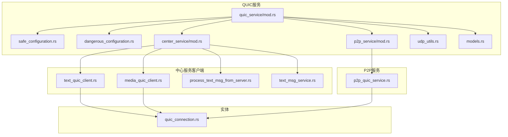
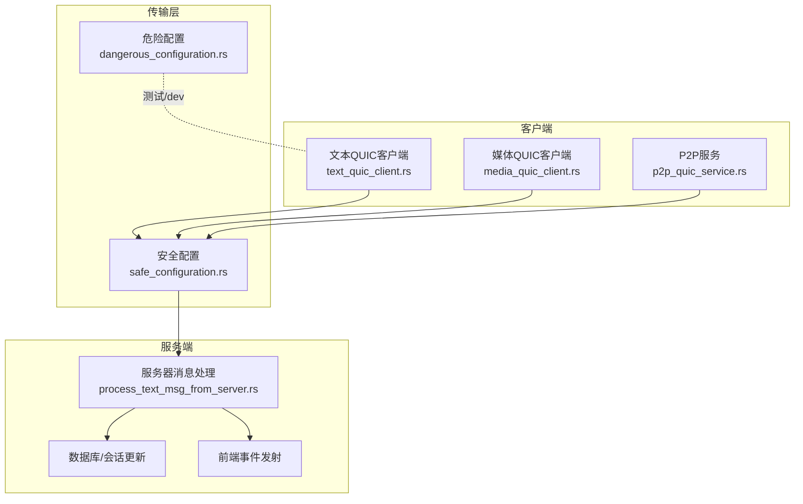
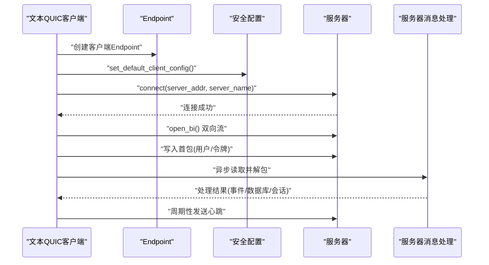
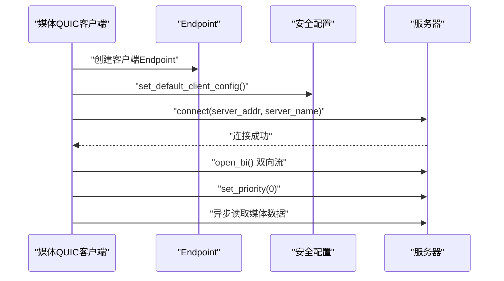
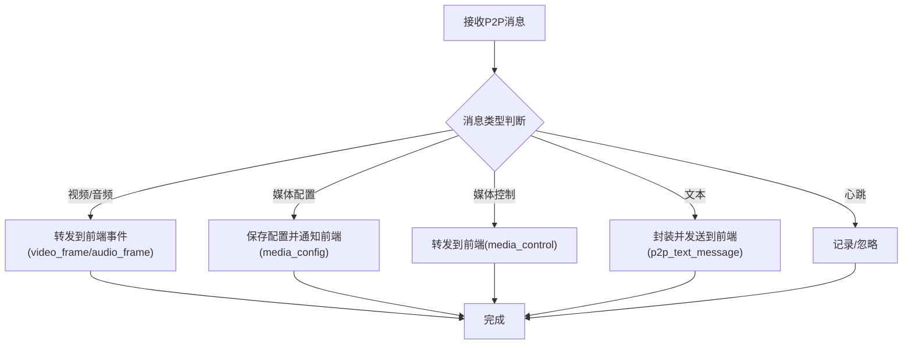
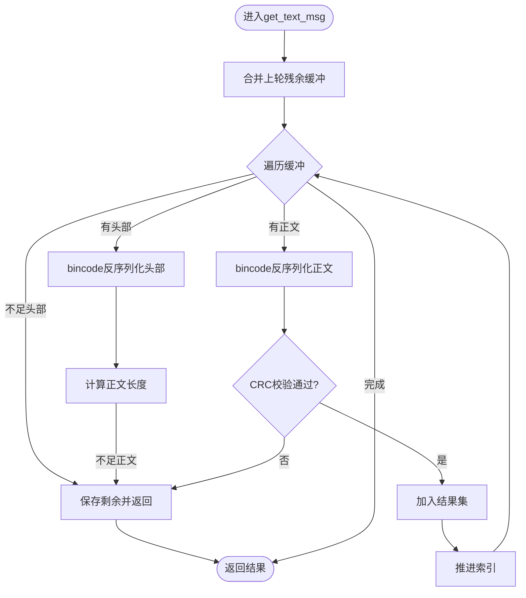
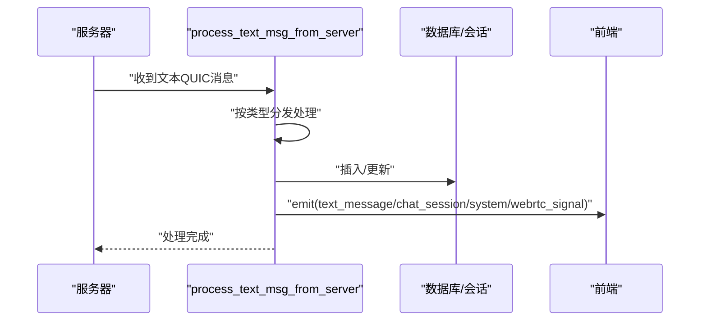
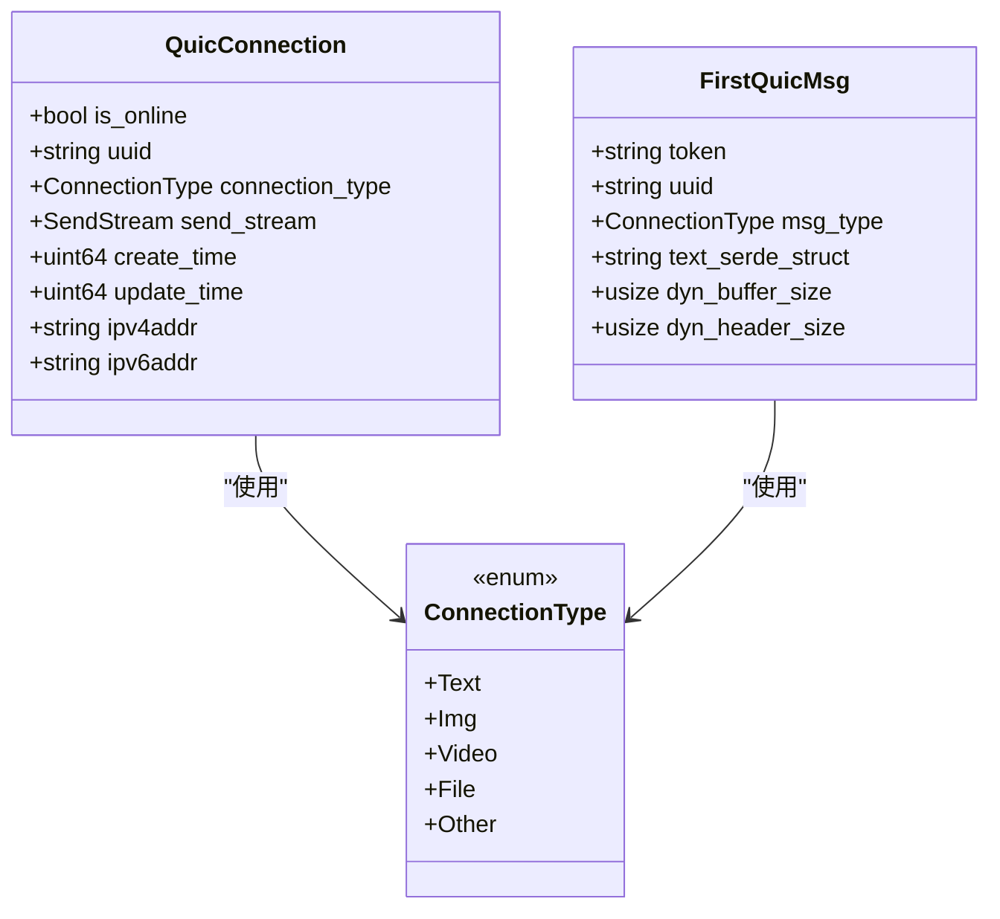
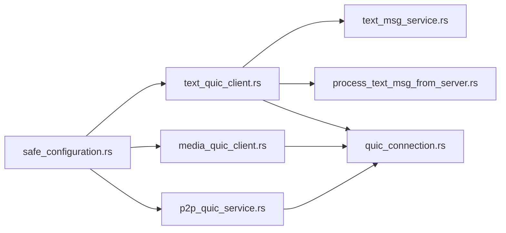

# QUIC传输层

<cite>
**本文引用的文件**
- [src-tauri/src/quic_service/mod.rs](file://src-tauri/src/quic_service/mod.rs)
- [src-tauri/src/quic_service/safe_configuration.rs](file://src-tauri/src/quic_service/safe_configuration.rs)
- [src-tauri/src/quic_service/dangerous_configuration.rs](file://src-tauri/src/quic_service/dangerous_configuration.rs)
- [src-tauri/src/quic_service/center_service/mod.rs](file://src-tauri/src/quic_service/center_service/mod.rs)
- [src-tauri/src/quic_service/center_service/media_quic_client.rs](file://src-tauri/src/quic_service/center_service/media_quic_client.rs)
- [src-tauri/src/quic_service/center_service/text_quic_client.rs](file://src-tauri/src/quic_service/center_service/text_quic_client.rs)
- [src-tauri/src/quic_service/center_service/process_text_msg_from_server.rs](file://src-tauri/src/quic_service/center_service/process_text_msg_from_server.rs)
- [src-tauri/src/quic_service/p2p_service/p2p_quic_service.rs](file://src-tauri/src/quic_service/p2p_service/p2p_quic_service.rs)
- [src-tauri/src/quic_service/models.rs](file://src-tauri/src/quic_service/models.rs)
- [src-tauri/src/entity/quic_connection.rs](file://src-tauri/src/entity/quic_connection.rs)
- [src-tauri/src/quic_service/center_service/text_msg_service.rs](file://src-tauri/src/quic_service/center_service/text_msg_service.rs)
- [src-tauri/src/quic_service/udp_utils.rs](file://src-tauri/src/quic_service/udp_utils.rs)
- [src-tauri/src/main.rs](file://src-tauri/src/main.rs)
</cite>

## 目录
1. [引言](#引言)
2. [项目结构](#项目结构)
3. [核心组件](#核心组件)
4. [架构总览](#架构总览)
5. [详细组件分析](#详细组件分析)
6. [依赖关系分析](#依赖关系分析)
7. [性能考量](#性能考量)
8. [故障排查指南](#故障排查指南)
9. [结论](#结论)
10. [附录](#附录)

## 引言
本文件面向即时通讯场景，系统性梳理本仓库中QUIC传输层的设计与实现，覆盖连接建立、流控制、拥塞控制与错误恢复；详解中心服务的QUIC客户端（文本与媒体）差异及适用场景；对比安全与危险配置；给出在不同网络环境下的性能优化策略；总结连接管理最佳实践、监控指标与故障诊断方法，并提供可定位到源码路径的示例与配置说明。

## 项目结构
QUIC相关代码集中在后端Rust工程的src-tauri模块中，按功能域划分如下：
- quic_service：QUIC通用能力与配置
  - safe_configuration.rs：生产可用的安全TLS与传输配置
  - dangerous_configuration.rs：开发/测试用的自签名与宽松配置
  - center_service：中心服务器侧的文本与媒体QUIC客户端
  - p2p_service：P2P直连的QUIC服务与客户端
  - udp_utils.rs：UDP辅助（P2P打洞/探测预留）
  - models.rs：通用模型
- entity：实体定义，含QUIC连接模型
- 入口：main.rs

**图表来源**
- [src-tauri/src/quic_service/mod.rs:1-7](file://src-tauri/src/quic_service/mod.rs#L1-L7)
- [src-tauri/src/quic_service/safe_configuration.rs:1-69](file://src-tauri/src/quic_service/safe_configuration.rs#L1-L69)
- [src-tauri/src/quic_service/dangerous_configuration.rs:1-52](file://src-tauri/src/quic_service/dangerous_configuration.rs#L1-L52)
- [src-tauri/src/quic_service/center_service/mod.rs:1-5](file://src-tauri/src/quic_service/center_service/mod.rs#L1-L5)
- [src-tauri/src/quic_service/p2p_service/p2p_quic_service.rs:1-308](file://src-tauri/src/quic_service/p2p_service/p2p_quic_service.rs#L1-L308)
- [src-tauri/src/quic_service/center_service/text_quic_client.rs:1-173](file://src-tauri/src/quic_service/center_service/text_quic_client.rs#L1-L173)
- [src-tauri/src/quic_service/center_service/media_quic_client.rs:1-44](file://src-tauri/src/quic_service/center_service/media_quic_client.rs#L1-L44)
- [src-tauri/src/quic_service/center_service/process_text_msg_from_server.rs:1-387](file://src-tauri/src/quic_service/center_service/process_text_msg_from_server.rs#L1-L387)
- [src-tauri/src/quic_service/center_service/text_msg_service.rs:1-135](file://src-tauri/src/quic_service/center_service/text_msg_service.rs#L1-L135)
- [src-tauri/src/quic_service/models.rs:1-11](file://src-tauri/src/quic_service/models.rs#L1-L11)
- [src-tauri/src/entity/quic_connection.rs:1-64](file://src-tauri/src/entity/quic_connection.rs#L1-L64)

**章节来源**
- [src-tauri/src/quic_service/mod.rs:1-7](file://src-tauri/src/quic_service/mod.rs#L1-L7)
- [src-tauri/src/quic_service/center_service/mod.rs:1-5](file://src-tauri/src/quic_service/center_service/mod.rs#L1-L5)
- [src-tauri/src/quic_service/p2p_service/p2p_quic_service.rs:1-308](file://src-tauri/src/quic_service/p2p_service/p2p_quic_service.rs#L1-L308)

## 核心组件
- 安全配置（生产推荐）
  - 构建TLS根证书信任链，优先加载本地CA，失败则回退系统根；设置传输层空闲超时等参数。
  - 参考：[安全配置实现:1-69](file://src-tauri/src/quic_service/safe_configuration.rs#L1-L69)
- 危险配置（仅限开发/测试）
  - 自签名证书与宽松认证，传输层限制单向流并发为0，空闲超时较短。
  - 参考：[危险配置实现:1-52](file://src-tauri/src/quic_service/dangerous_configuration.rs#L1-L52)
- 中心服务文本QUIC客户端
  - 建立双向流，初始化握手消息，维护心跳，异步解包文本消息并交由服务处理。
  - 参考：[文本客户端:1-173](file://src-tauri/src/quic_service/center_service/text_quic_client.rs#L1-L173)
- 中心服务媒体QUIC客户端
  - 建立双向流，设置优先级，异步读取媒体数据。
  - 参考：[媒体客户端:1-44](file://src-tauri/src/quic_service/center_service/media_quic_client.rs#L1-L44)
- 文本消息编解码与聚合
  - 统一头部+正文格式，CRC校验，粘包拆包，生成与解析消息。
  - 参考：[文本消息服务:1-135](file://src-tauri/src/quic_service/center_service/text_msg_service.rs#L1-L135)
- 服务器消息处理（中心侧）
  - 分发文本/图片/文件/P2P/WebRTC/系统/通知等消息，更新会话与数据库，触发前端事件。
  - 参考：[服务器消息处理:1-387](file://src-tauri/src/quic_service/center_service/process_text_msg_from_server.rs#L1-L387)
- P2P QUIC服务
  - 维护P2P发送通道、心跳、消息分发（视频/音频/配置/控制/文本），与前端事件联动。
  - 参考：[P2P服务:1-308](file://src-tauri/src/quic_service/p2p_service/p2p_quic_service.rs#L1-L308)
- QUIC连接模型
  - 统一封装连接状态、发送流、类型、时间戳等。
  - 参考：[QUIC连接模型:1-64](file://src-tauri/src/entity/quic_connection.rs#L1-L64)

**章节来源**
- [src-tauri/src/quic_service/safe_configuration.rs:1-69](file://src-tauri/src/quic_service/safe_configuration.rs#L1-L69)
- [src-tauri/src/quic_service/dangerous_configuration.rs:1-52](file://src-tauri/src/quic_service/dangerous_configuration.rs#L1-L52)
- [src-tauri/src/quic_service/center_service/text_quic_client.rs:1-173](file://src-tauri/src/quic_service/center_service/text_quic_client.rs#L1-L173)
- [src-tauri/src/quic_service/center_service/media_quic_client.rs:1-44](file://src-tauri/src/quic_service/center_service/media_quic_client.rs#L1-L44)
- [src-tauri/src/quic_service/center_service/text_msg_service.rs:1-135](file://src-tauri/src/quic_service/center_service/text_msg_service.rs#L1-L135)
- [src-tauri/src/quic_service/center_service/process_text_msg_from_server.rs:1-387](file://src-tauri/src/quic_service/center_service/process_text_msg_from_server.rs#L1-L387)
- [src-tauri/src/quic_service/p2p_service/p2p_quic_service.rs:1-308](file://src-tauri/src/quic_service/p2p_service/p2p_quic_service.rs#L1-L308)
- [src-tauri/src/entity/quic_connection.rs:1-64](file://src-tauri/src/entity/quic_connection.rs#L1-L64)

## 架构总览
下图展示从客户端到服务端的消息流转与处理路径，涵盖文本与媒体两类连接，以及P2P直连路径。

**图表来源**
- [src-tauri/src/quic_service/safe_configuration.rs:1-69](file://src-tauri/src/quic_service/safe_configuration.rs#L1-L69)
- [src-tauri/src/quic_service/dangerous_configuration.rs:1-52](file://src-tauri/src/quic_service/dangerous_configuration.rs#L1-L52)
- [src-tauri/src/quic_service/center_service/text_quic_client.rs:1-173](file://src-tauri/src/quic_service/center_service/text_quic_client.rs#L1-L173)
- [src-tauri/src/quic_service/center_service/media_quic_client.rs:1-44](file://src-tauri/src/quic_service/center_service/media_quic_client.rs#L1-L44)
- [src-tauri/src/quic_service/center_service/process_text_msg_from_server.rs:1-387](file://src-tauri/src/quic_service/center_service/process_text_msg_from_server.rs#L1-L387)
- [src-tauri/src/quic_service/p2p_service/p2p_quic_service.rs:1-308](file://src-tauri/src/quic_service/p2p_service/p2p_quic_service.rs#L1-L308)

## 详细组件分析

### 文本QUIC客户端（中心服务）
- 连接建立：创建客户端Endpoint，设置安全配置，发起连接，开启双向流。
- 初始化握手：发送首包（携带用户标识与令牌），注册全局连接句柄。
- 心跳维持：周期性发送心跳，保持长连接活性。
- 消息处理：异步读取，按固定头部长度聚合/拆分消息，交给服务器消息处理器。

**图表来源**
- [src-tauri/src/quic_service/center_service/text_quic_client.rs:1-173](file://src-tauri/src/quic_service/center_service/text_quic_client.rs#L1-L173)
- [src-tauri/src/quic_service/safe_configuration.rs:1-69](file://src-tauri/src/quic_service/safe_configuration.rs#L1-L69)
- [src-tauri/src/quic_service/center_service/process_text_msg_from_server.rs:1-387](file://src-tauri/src/quic_service/center_service/process_text_msg_from_server.rs#L1-L387)

**章节来源**
- [src-tauri/src/quic_service/center_service/text_quic_client.rs:1-173](file://src-tauri/src/quic_service/center_service/text_quic_client.rs#L1-L173)
- [src-tauri/src/quic_service/center_service/process_text_msg_from_server.rs:1-387](file://src-tauri/src/quic_service/center_service/process_text_msg_from_server.rs#L1-L387)

### 媒体QUIC客户端（中心服务）
- 连接建立与优先级：创建Endpoint并连接，开启双向流，设置流优先级。
- 数据读取：异步循环读取媒体数据，便于后续转交前端或进一步处理。

**图表来源**
- [src-tauri/src/quic_service/center_service/media_quic_client.rs:1-44](file://src-tauri/src/quic_service/center_service/media_quic_client.rs#L1-L44)
- [src-tauri/src/quic_service/safe_configuration.rs:1-69](file://src-tauri/src/quic_service/safe_configuration.rs#L1-L69)

**章节来源**
- [src-tauri/src/quic_service/center_service/media_quic_client.rs:1-44](file://src-tauri/src/quic_service/center_service/media_quic_client.rs#L1-L44)

### P2P QUIC服务
- 发送通道：通过静态通道将视频帧等数据异步投递至对应发送流。
- 消息分发：根据消息类型分派到视频/音频/配置/控制/文本等处理分支，驱动前端事件。
- 心跳维持：周期性发送心跳，检测连接活跃度。

**图表来源**
- [src-tauri/src/quic_service/p2p_service/p2p_quic_service.rs:1-308](file://src-tauri/src/quic_service/p2p_service/p2p_quic_service.rs#L1-L308)

**章节来源**
- [src-tauri/src/quic_service/p2p_service/p2p_quic_service.rs:1-308](file://src-tauri/src/quic_service/p2p_service/p2p_quic_service.rs#L1-L308)

### 文本消息编解码与聚合
- 头部格式：版本、CRC、体长、消息类型。
- 序列化：bincode编码头部与正文，拼接发送。
- 解析：按固定头部长度聚合/拆分，CRC校验，反序列化正文。

**图表来源**
- [src-tauri/src/quic_service/center_service/text_msg_service.rs:65-135](file://src-tauri/src/quic_service/center_service/text_msg_service.rs#L65-L135)

**章节来源**
- [src-tauri/src/quic_service/center_service/text_msg_service.rs:1-135](file://src-tauri/src/quic_service/center_service/text_msg_service.rs#L1-L135)

### 服务器消息处理（中心侧）
- 分类处理：文本/图片/文件/P2P/WebRTC/系统/通知等。
- 业务动作：入库、更新会话、发送前端事件、触发P2P/WebRTC流程。
- 错误处理：日志记录、告警、容错返回。

**图表来源**
- [src-tauri/src/quic_service/center_service/process_text_msg_from_server.rs:62-126](file://src-tauri/src/quic_service/center_service/process_text_msg_from_server.rs#L62-L126)

**章节来源**
- [src-tauri/src/quic_service/center_service/process_text_msg_from_server.rs:1-387](file://src-tauri/src/quic_service/center_service/process_text_msg_from_server.rs#L1-L387)

### QUIC连接模型
- 字段：在线状态、用户标识、连接类型、发送流、创建/更新时间、IPv4/IPv6地址。
- 类型：枚举Text/Img/Video/File/Other。

**图表来源**
- [src-tauri/src/entity/quic_connection.rs:1-64](file://src-tauri/src/entity/quic_connection.rs#L1-L64)

**章节来源**
- [src-tauri/src/entity/quic_connection.rs:1-64](file://src-tauri/src/entity/quic_connection.rs#L1-L64)

## 依赖关系分析
- 配置依赖：客户端Endpoint依赖安全/危险配置模块提供的ClientConfig/ServerConfig。
- 业务依赖：文本客户端依赖消息编解码与服务器消息处理；P2P服务依赖发送通道与消息分发。
- 并发与同步：多处使用Arc<Mutex>/Arc<RwLock>保护共享状态；Tokio异步运行时驱动。

**图表来源**
- [src-tauri/src/quic_service/safe_configuration.rs:1-69](file://src-tauri/src/quic_service/safe_configuration.rs#L1-L69)
- [src-tauri/src/quic_service/center_service/text_quic_client.rs:1-173](file://src-tauri/src/quic_service/center_service/text_quic_client.rs#L1-L173)
- [src-tauri/src/quic_service/center_service/media_quic_client.rs:1-44](file://src-tauri/src/quic_service/center_service/media_quic_client.rs#L1-L44)
- [src-tauri/src/quic_service/p2p_service/p2p_quic_service.rs:1-308](file://src-tauri/src/quic_service/p2p_service/p2p_quic_service.rs#L1-L308)
- [src-tauri/src/quic_service/center_service/text_msg_service.rs:1-135](file://src-tauri/src/quic_service/center_service/text_msg_service.rs#L1-L135)
- [src-tauri/src/quic_service/center_service/process_text_msg_from_server.rs:1-387](file://src-tauri/src/quic_service/center_service/process_text_msg_from_server.rs#L1-L387)
- [src-tauri/src/entity/quic_connection.rs:1-64](file://src-tauri/src/entity/quic_connection.rs#L1-L64)

**章节来源**
- [src-tauri/src/quic_service/center_service/text_quic_client.rs:1-173](file://src-tauri/src/quic_service/center_service/text_quic_client.rs#L1-L173)
- [src-tauri/src/quic_service/p2p_service/p2p_quic_service.rs:1-308](file://src-tauri/src/quic_service/p2p_service/p2p_quic_service.rs#L1-L308)

## 性能考量
- 连接复用与空闲超时
  - 安全配置设置了较长空闲超时，适合长连接保活；可根据网络波动调整。
  - 参考：[空闲超时设置:61-66](file://src-tauri/src/quic_service/safe_configuration.rs#L61-L66)
- 流优先级与并发
  - 媒体流设置优先级，有助于在多流场景下保障实时性。
  - 参考：[媒体流优先级:24-24](file://src-tauri/src/quic_service/center_service/media_quic_client.rs#L24-L24)
- 心跳频率
  - 文本连接每分钟一次，P2P连接每2秒一次，兼顾存活检测与带宽占用。
  - 参考：[文本心跳:123-123](file://src-tauri/src/quic_service/center_service/text_quic_client.rs#L123-L123)、[P2P心跳:304-304](file://src-tauri/src/quic_service/p2p_service/p2p_quic_service.rs#L304-L304)
- 拆包与缓冲
  - 采用增量聚合与残余缓冲，降低内存拷贝与CPU消耗。
  - 参考：[消息聚合:65-135](file://src-tauri/src/quic_service/center_service/text_msg_service.rs#L65-L135)
- P2P发送通道
  - 使用异步通道背压，避免阻塞主线程。
  - 参考：[发送通道:29-50](file://src-tauri/src/quic_service/p2p_service/p2p_quic_service.rs#L29-L50)

[本节为通用性能建议，不直接分析具体文件]

## 故障排查指南
- 连接失败
  - 检查安全配置是否正确加载本地CA或回退系统根。
  - 参考：[安全配置加载逻辑:27-52](file://src-tauri/src/quic_service/safe_configuration.rs#L27-L52)
- 证书问题
  - 生产环境使用安全配置；开发测试可参考危险配置模板但严禁线上使用。
  - 参考：[危险配置:1-52](file://src-tauri/src/quic_service/dangerous_configuration.rs#L1-L52)
- 心跳中断
  - 文本连接每分钟心跳；P2P每2秒心跳。若异常，检查全局状态与发送流。
  - 参考：[文本心跳:123-147](file://src-tauri/src/quic_service/center_service/text_quic_client.rs#L123-L147)、[P2P心跳:272-307](file://src-tauri/src/quic_service/p2p_service/p2p_quic_service.rs#L272-L307)
- 消息乱序/粘包
  - 校验CRC与头部长度，必要时保留残余缓冲重试。
  - 参考：[消息解析与CRC校验:100-129](file://src-tauri/src/quic_service/center_service/text_msg_service.rs#L100-L129)
- P2P打洞/UDP辅助
  - UDP工具预留了打洞/探测逻辑，可用于NAT穿透辅助。
  - 参考：[UDP工具:1-100](file://src-tauri/src/quic_service/udp_utils.rs#L1-L100)

**章节来源**
- [src-tauri/src/quic_service/safe_configuration.rs:27-52](file://src-tauri/src/quic_service/safe_configuration.rs#L27-L52)
- [src-tauri/src/quic_service/dangerous_configuration.rs:1-52](file://src-tauri/src/quic_service/dangerous_configuration.rs#L1-L52)
- [src-tauri/src/quic_service/center_service/text_quic_client.rs:123-147](file://src-tauri/src/quic_service/center_service/text_quic_client.rs#L123-L147)
- [src-tauri/src/quic_service/p2p_service/p2p_quic_service.rs:272-307](file://src-tauri/src/quic_service/p2p_service/p2p_quic_service.rs#L272-L307)
- [src-tauri/src/quic_service/center_service/text_msg_service.rs:100-129](file://src-tauri/src/quic_service/center_service/text_msg_service.rs#L100-L129)
- [src-tauri/src/quic_service/udp_utils.rs:1-100](file://src-tauri/src/quic_service/udp_utils.rs#L1-L100)

## 结论
本项目以安全配置为核心，构建了稳定的中心服务QUIC客户端（文本/媒体），并通过统一的消息编解码与服务器处理流水线，支撑文本、图片、文件、P2P、WebRTC等多种消息类型。P2P路径通过异步通道与心跳机制保障实时性与可靠性。建议在生产环境严格使用安全配置，结合心跳与CRC校验提升鲁棒性，并依据网络环境调优空闲超时与心跳频率。

[本节为总结性内容，不直接分析具体文件]

## 附录

### 安全配置与危险配置差异
- 安全配置
  - 加载本地CA证书或回退系统根；设置传输层空闲超时。
  - 参考：[安全配置:1-69](file://src-tauri/src/quic_service/safe_configuration.rs#L1-L69)
- 危险配置
  - 自签名证书；限制单向流并发为0；空闲超时较短。
  - 参考：[危险配置:1-52](file://src-tauri/src/quic_service/dangerous_configuration.rs#L1-L52)

**章节来源**
- [src-tauri/src/quic_service/safe_configuration.rs:1-69](file://src-tauri/src/quic_service/safe_configuration.rs#L1-L69)
- [src-tauri/src/quic_service/dangerous_configuration.rs:1-52](file://src-tauri/src/quic_service/dangerous_configuration.rs#L1-L52)

### 文本与媒体QUIC客户端差异与使用场景
- 文本客户端
  - 用途：承载聊天消息、系统通知、WebRTC信令等。
  - 特点：初始化握手、心跳、统一消息编解码。
  - 参考：[文本客户端:1-173](file://src-tauri/src/quic_service/center_service/text_quic_client.rs#L1-L173)
- 媒体客户端
  - 用途：承载视频/音频等媒体数据。
  - 特点：设置流优先级，异步读取媒体数据。
  - 参考：[媒体客户端:1-44](file://src-tauri/src/quic_service/center_service/media_quic_client.rs#L1-L44)

**章节来源**
- [src-tauri/src/quic_service/center_service/text_quic_client.rs:1-173](file://src-tauri/src/quic_service/center_service/text_quic_client.rs#L1-L173)
- [src-tauri/src/quic_service/center_service/media_quic_client.rs:1-44](file://src-tauri/src/quic_service/center_service/media_quic_client.rs#L1-L44)

### QUIC连接管理最佳实践
- 连接生命周期
  - 建立：Endpoint + 安全配置 + connect + open_bi
  - 维护：心跳保活、空闲超时、异常重连
  - 关闭：优雅关闭发送流，清理全局连接表
- 并发与同步
  - 使用Arc<Mutex>/Arc<RwLock>保护共享状态
  - 异步I/O与通道解耦
- 监控指标建议
  - 连接成功率、平均握手耗时、心跳丢失率、消息吞吐量、CRC校验失败率、P2P活跃连接数
- 故障诊断
  - 日志级别区分错误/警告；关键路径增加错误码与回溯信息；对粘包/拆包失败进行缓冲重试

**章节来源**
- [src-tauri/src/quic_service/center_service/text_quic_client.rs:1-173](file://src-tauri/src/quic_service/center_service/text_quic_client.rs#L1-L173)
- [src-tauri/src/quic_service/p2p_service/p2p_quic_service.rs:1-308](file://src-tauri/src/quic_service/p2p_service/p2p_quic_service.rs#L1-L308)
- [src-tauri/src/quic_service/center_service/text_msg_service.rs:1-135](file://src-tauri/src/quic_service/center_service/text_msg_service.rs#L1-L135)

### 代码示例与配置参数说明（路径定位）
- 安全配置（TLS根证书、空闲超时）
  - [安全配置实现:1-69](file://src-tauri/src/quic_service/safe_configuration.rs#L1-L69)
- 危险配置（自签名证书、单向流限制）
  - [危险配置实现:1-52](file://src-tauri/src/quic_service/dangerous_configuration.rs#L1-L52)
- 文本QUIC客户端（连接、握手、心跳、消息处理）
  - [文本客户端:1-173](file://src-tauri/src/quic_service/center_service/text_quic_client.rs#L1-L173)
- 媒体QUIC客户端（连接、优先级、读取）
  - [媒体客户端:1-44](file://src-tauri/src/quic_service/center_service/media_quic_client.rs#L1-L44)
- 文本消息编解码（头部、CRC、聚合）
  - [文本消息服务:1-135](file://src-tauri/src/quic_service/center_service/text_msg_service.rs#L1-L135)
- 服务器消息处理（分发、数据库、前端事件）
  - [服务器消息处理:1-387](file://src-tauri/src/quic_service/center_service/process_text_msg_from_server.rs#L1-L387)
- P2P服务（发送通道、心跳、消息分发）
  - [P2P服务:1-308](file://src-tauri/src/quic_service/p2p_service/p2p_quic_service.rs#L1-L308)
- QUIC连接模型
  - [QUIC连接模型:1-64](file://src-tauri/src/entity/quic_connection.rs#L1-L64)
- 入口
  - [入口:1-8](file://src-tauri/src/main.rs#L1-L8)

**章节来源**
- [src-tauri/src/quic_service/safe_configuration.rs:1-69](file://src-tauri/src/quic_service/safe_configuration.rs#L1-L69)
- [src-tauri/src/quic_service/dangerous_configuration.rs:1-52](file://src-tauri/src/quic_service/dangerous_configuration.rs#L1-L52)
- [src-tauri/src/quic_service/center_service/text_quic_client.rs:1-173](file://src-tauri/src/quic_service/center_service/text_quic_client.rs#L1-L173)
- [src-tauri/src/quic_service/center_service/media_quic_client.rs:1-44](file://src-tauri/src/quic_service/center_service/media_quic_client.rs#L1-L44)
- [src-tauri/src/quic_service/center_service/text_msg_service.rs:1-135](file://src-tauri/src/quic_service/center_service/text_msg_service.rs#L1-L135)
- [src-tauri/src/quic_service/center_service/process_text_msg_from_server.rs:1-387](file://src-tauri/src/quic_service/center_service/process_text_msg_from_server.rs#L1-L387)
- [src-tauri/src/quic_service/p2p_service/p2p_quic_service.rs:1-308](file://src-tauri/src/quic_service/p2p_service/p2p_quic_service.rs#L1-L308)
- [src-tauri/src/entity/quic_connection.rs:1-64](file://src-tauri/src/entity/quic_connection.rs#L1-L64)
- [src-tauri/src/main.rs:1-8](file://src-tauri/src/main.rs#L1-L8)