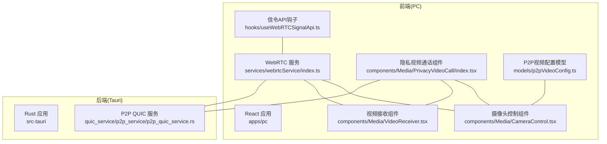
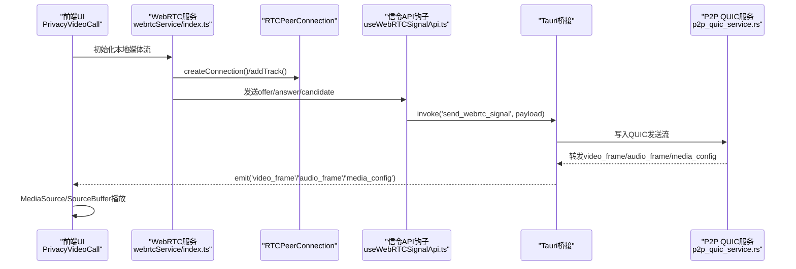
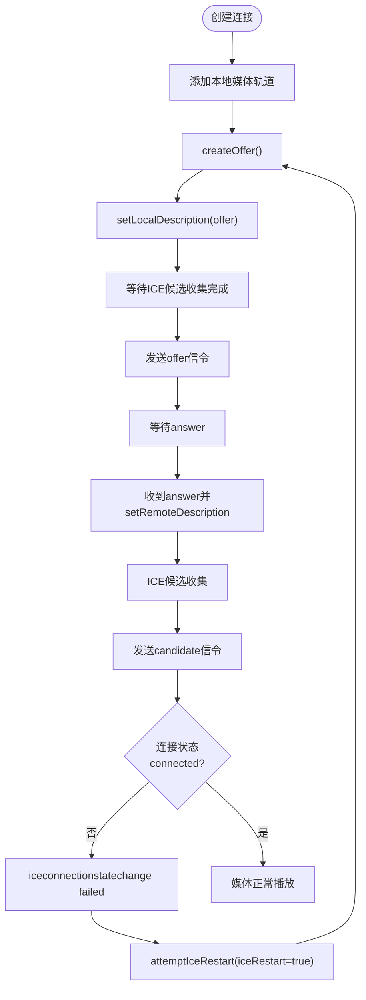
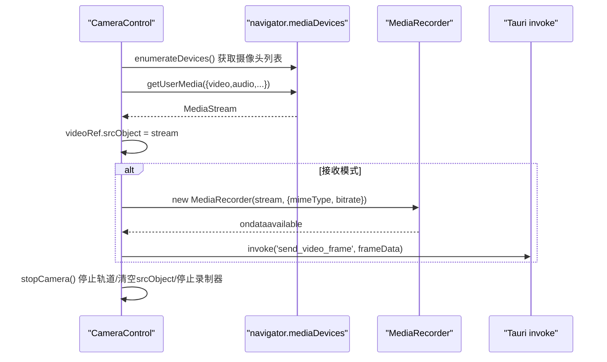
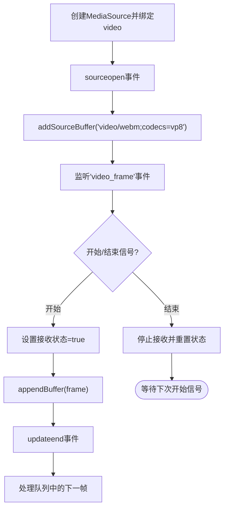
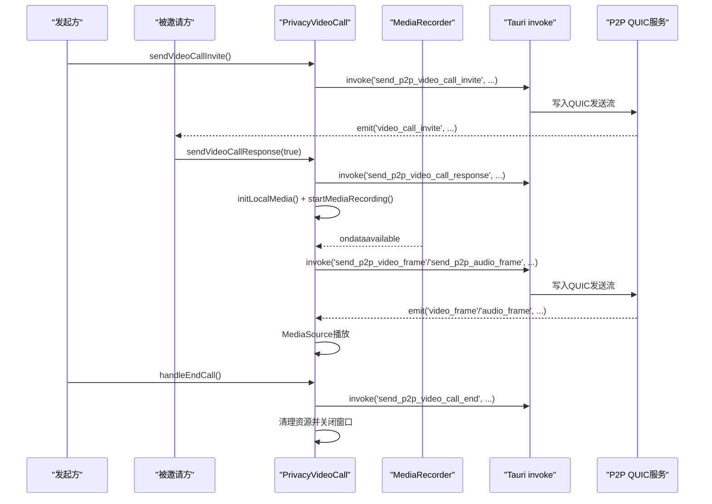
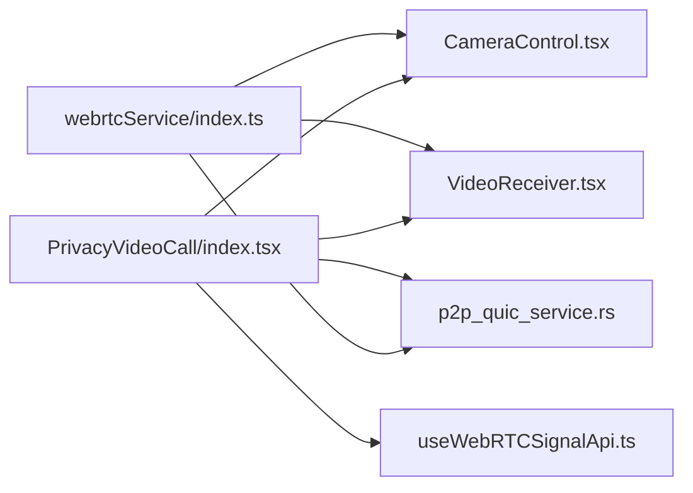

# WebRTC集成

<cite>
**本文档引用的文件**
- [apps/pc/src/services/webrtcService/index.ts](file://apps/pc/src/services/webrtcService/index.ts)
- [apps/pc/src/components/Media/CameraControl.tsx](file://apps/pc/src/components/Media/CameraControl.tsx)
- [apps/pc/src/components/Media/VideoReceiver.tsx](file://apps/pc/src/components/Media/VideoReceiver.tsx)
- [apps/pc/src/components/Media/PrivacyVideoCall/index.tsx](file://apps/pc/src/components/Media/PrivacyVideoCall/index.tsx)
- [apps/pc/src/hooks/useWebRTCSignalApi.ts](file://apps/pc/src/hooks/useWebRTCSignalApi.ts)
- [apps/pc/src/models/p2pVideoConfig.ts](file://apps/pc/src/models/p2pVideoConfig.ts)
- [src-tauri/src/quic_service/p2p_service/p2p_quic_service.rs](file://src-tauri/src/quic_service/p2p_service/p2p_quic_service.rs)
- [NAT3_WEBRTC_FIX.md](file://NAT3_WEBRTC_FIX.md)
</cite>

## 更新摘要
**变更内容**
- 新增NAT3环境支持和优化策略
- 实现Trickle ICE候选收集机制
- 增强ICE候选统计和诊断功能
- 改进连接管理和ICE重启策略
- 新增NAT类型检测和自适应配置

## 目录
1. [引言](#引言)
2. [项目结构](#项目结构)
3. [核心组件](#核心组件)
4. [架构总览](#架构总览)
5. [详细组件分析](#详细组件分析)
6. [NAT3环境优化](#nat3环境优化)
7. [依赖关系分析](#依赖关系分析)
8. [性能考虑](#性能考虑)
9. [故障排除指南](#故障排除指南)
10. [结论](#结论)
11. [附录](#附录)

## 引言
本文件面向需要在桌面应用中集成WebRTC音视频通话功能的开发者，系统性阐述基于Tauri + Rust + React的端到端实现方案。内容覆盖信令交换、媒体协商与ICE候选收集、NAT穿透策略、媒体编解码与质量控制、连接建立流程、错误处理与性能优化，以及实际组件使用方法与调试技巧。

**更新** 本次更新重点加强了NAT3环境下的WebRTC穿透能力，实现了完整的Trickle ICE机制，并新增了详细的ICE候选统计和诊断功能。

## 项目结构
该仓库采用多包架构，PC端React应用负责UI与WebRTC逻辑，Rust后端通过Tauri桥接提供系统能力与P2P传输通道。WebRTC相关代码主要集中在PC应用的组件与服务层，同时配合Rust侧的QUIC消息转发。

**图表来源**
- [apps/pc/src/services/webrtcService/index.ts:131-190](file://apps/pc/src/services/webrtcService/index.ts#L131-L190)
- [apps/pc/src/components/Media/CameraControl.tsx:14-52](file://apps/pc/src/components/Media/CameraControl.tsx#L14-L52)
- [apps/pc/src/components/Media/VideoReceiver.tsx:5-34](file://apps/pc/src/components/Media/VideoReceiver.tsx#L5-L34)
- [apps/pc/src/components/Media/PrivacyVideoCall/index.tsx:18-50](file://apps/pc/src/components/Media/PrivacyVideoCall/index.tsx#L18-L50)
- [apps/pc/src/hooks/useWebRTCSignalApi.ts:53-97](file://apps/pc/src/hooks/useWebRTCSignalApi.ts#L53-L97)
- [apps/pc/src/models/p2pVideoConfig.ts:4-18](file://apps/pc/src/models/p2pVideoConfig.ts#L4-L18)
- [src-tauri/src/quic_service/p2p_service/p2p_quic_service.rs:114-259](file://src-tauri/src/quic_service/p2p_service/p2p_quic_service.rs#L114-L259)

**章节来源**
- [apps/pc/src/services/webrtcService/index.ts:1-120](file://apps/pc/src/services/webrtcService/index.ts#L1-L120)
- [apps/pc/src/components/Media/CameraControl.tsx:1-52](file://apps/pc/src/components/Media/CameraControl.tsx#L1-L52)
- [apps/pc/src/components/Media/VideoReceiver.tsx:1-34](file://apps/pc/src/components/Media/VideoReceiver.tsx#L1-L34)
- [apps/pc/src/components/Media/PrivacyVideoCall/index.tsx:1-50](file://apps/pc/src/components/Media/PrivacyVideoCall/index.tsx#L1-L50)
- [apps/pc/src/hooks/useWebRTCSignalApi.ts:1-50](file://apps/pc/src/hooks/useWebRTCSignalApi.ts#L1-L50)
- [apps/pc/src/models/p2pVideoConfig.ts:1-21](file://apps/pc/src/models/p2pVideoConfig.ts#L1-L21)
- [src-tauri/src/quic_service/p2p_service/p2p_quic_service.rs:1-50](file://src-tauri/src/quic_service/p2p_service/p2p_quic_service.rs#L1-L50)

## 核心组件
- **WebRTC服务**：封装RTCPeerConnection生命周期、信令收发、ICE候选处理、DataChannel、媒体轨道切换与状态回调。**新增** NAT3环境优化、Trickle ICE实现、ICE候选统计和诊断功能。
- **摄像头控制组件**：封装本地媒体流获取、摄像头切换、MediaRecorder录制与帧发送、错误处理。
- **视频接收组件**：基于MediaSource/SourceBuffer接收远端视频帧并播放。
- **隐私视频通话组件**：整合邀请、接受/拒绝、媒体控制、结束通话、窗口管理。
- **信令API钩子**：监听主窗口的webrtc_signal事件，打开独立聊天窗口并传递初始信令。
- **P2P视频配置模型**：统一管理分辨率、帧率、码率、编码格式等参数。
- **P2P QUIC服务**：在Rust侧接收/转发视频/音频帧、媒体配置与控制消息。

**章节来源**
- [apps/pc/src/services/webrtcService/index.ts:117-190](file://apps/pc/src/services/webrtcService/index.ts#L117-L190)
- [apps/pc/src/components/Media/CameraControl.tsx:72-156](file://apps/pc/src/components/Media/CameraControl.tsx#L72-L156)
- [apps/pc/src/components/Media/VideoReceiver.tsx:14-101](file://apps/pc/src/components/Media/VideoReceiver.tsx#L14-L101)
- [apps/pc/src/components/Media/PrivacyVideoCall/index.tsx:174-233](file://apps/pc/src/components/Media/PrivacyVideoCall/index.tsx#L174-L233)
- [apps/pc/src/hooks/useWebRTCSignalApi.ts:53-97](file://apps/pc/src/hooks/useWebRTCSignalApi.ts#L53-L97)
- [apps/pc/src/models/p2pVideoConfig.ts:4-18](file://apps/pc/src/models/p2pVideoConfig.ts#L4-L18)
- [src-tauri/src/quic_service/p2p_service/p2p_quic_service.rs:114-259](file://src-tauri/src/quic_service/p2p_service/p2p_quic_service.rs#L114-L259)

## 架构总览
整体架构分为三层：前端WebRTC层、前端P2P桥接层（Tauri invoke/event）、后端QUIC传输层。WebRTC层负责P2P直连与媒体协商；前端桥接层负责将WebRTC事件与P2P消息在前后端间传递；后端QUIC层负责可靠传输与消息分发。

**图表来源**
- [apps/pc/src/services/webrtcService/index.ts:373-549](file://apps/pc/src/services/webrtcService/index.ts#L373-L549)
- [apps/pc/src/hooks/useWebRTCSignalApi.ts:60-85](file://apps/pc/src/hooks/useWebRTCSignalApi.ts#L60-L85)
- [src-tauri/src/quic_service/p2p_service/p2p_quic_service.rs:114-259](file://src-tauri/src/quic_service/p2p_service/p2p_quic_service.rs#L114-L259)

## 详细组件分析

### WebRTC服务（webrtcService）
职责与流程
- **生命周期管理**：创建/关闭RTCPeerConnection，添加本地媒体轨道，维护连接映射。
- **信令交换**：封装offer/answer/candidate的构造与发送；监听对端信令并设置远端描述。
- **ICE候选处理**：**新增** Trickle ICE实现，收集候选并发送（保留host/srflx，跳过relay），在失败时执行ICE重启。
- **DataChannel**：创建并监听远端DataChannel，提供消息回调。
- **媒体轨道控制**：切换视频/音频轨道状态，查询本地/远程媒体流。
- **状态监控**：连接状态变化、ICE状态变化、超时与重启策略。
- **NAT3优化**：**新增** NAT3环境专用配置，包括STUN服务器列表、候选类型处理和自适应参数调整。

**NAT3穿透优化要点**
- 使用大量STUN服务器（Google、Microsoft、Twilio、Cloudflare、国内等）。
- 保留所有候选类型（host/srflx），不人为过滤，让浏览器自动优选。
- **新增** 预收集候选池，提高成功率。
- **新增** ICE重启与超时策略：失败/disconnected时定时重启，超时后重试，最多3次。
- **新增** NAT类型检测和自适应配置，根据网络环境动态调整参数。

**图表来源**
- [apps/pc/src/services/webrtcService/index.ts:373-549](file://apps/pc/src/services/webrtcService/index.ts#L373-L549)
- [apps/pc/src/services/webrtcService/index.ts:659-738](file://apps/pc/src/services/webrtcService/index.ts#L659-L738)

**章节来源**
- [apps/pc/src/services/webrtcService/index.ts:117-190](file://apps/pc/src/services/webrtcService/index.ts#L117-L190)
- [apps/pc/src/services/webrtcService/index.ts:373-549](file://apps/pc/src/services/webrtcService/index.ts#L373-L549)
- [apps/pc/src/services/webrtcService/index.ts:659-738](file://apps/pc/src/services/webrtcService/index.ts#L659-L738)

### 摄像头控制组件（CameraControl）
功能与实现
- 设备枚举：通过navigator.mediaDevices.enumerateDevices列出摄像头。
- 启动/停止摄像头：getUserMedia获取本地流，设置video元素srcObject，停止时释放轨道与MediaRecorder。
- 摄像头切换：循环切换已枚举设备，重新启动流。
- 帧发送：在接收模式下使用MediaRecorder按固定间隔捕获帧并通过invoke发送至Rust侧。
- 错误处理：设备不可用、编码不支持、录制器创建失败等情况的错误提示与清理。

**图表来源**
- [apps/pc/src/components/Media/CameraControl.tsx:54-156](file://apps/pc/src/components/Media/CameraControl.tsx#L54-L156)

**章节来源**
- [apps/pc/src/components/Media/CameraControl.tsx:54-156](file://apps/pc/src/components/Media/CameraControl.tsx#L54-L156)

### 视频接收组件（VideoReceiver）
功能与实现
- MediaSource初始化：创建MediaSource并绑定到video元素。
- SourceBuffer管理：在sourceopen后创建SourceBuffer，监听updateend事件串行处理缓冲队列。
- 事件监听：监听'video_frame'事件，将payload转为ArrayBuffer追加到SourceBuffer。
- 状态控制：通过开始/结束信号控制接收启停，支持多次复用。

**图表来源**
- [apps/pc/src/components/Media/VideoReceiver.tsx:14-101](file://apps/pc/src/components/Media/VideoReceiver.tsx#L14-L101)

**章节来源**
- [apps/pc/src/components/Media/VideoReceiver.tsx:14-101](file://apps/pc/src/components/Media/VideoReceiver.tsx#L14-L101)

### 隐私视频通话组件（PrivacyVideoCall）
功能与实现
- 邀请/响应：发起方发送邀请，被邀请方接受/拒绝；接受后初始化本地媒体并开始录制发送。
- 媒体接收：初始化两个MediaSource（视频/音频），分别创建SourceBuffer，使用队列避免并发更新。
- 媒体控制：支持视频/音频开关、暂停/恢复、结束通话；通过invoke发送控制命令。
- 资源清理：停止录制器、停止轨道、关闭MediaSource、发送结束通知、关闭窗口。

**图表来源**
- [apps/pc/src/components/Media/PrivacyVideoCall/index.tsx:758-849](file://apps/pc/src/components/Media/PrivacyVideoCall/index.tsx#L758-L849)
- [src-tauri/src/quic_service/p2p_service/p2p_quic_service.rs:114-259](file://src-tauri/src/quic_service/p2p_service/p2p_quic_service.rs#L114-L259)

**章节来源**
- [apps/pc/src/components/Media/PrivacyVideoCall/index.tsx:174-233](file://apps/pc/src/components/Media/PrivacyVideoCall/index.tsx#L174-L233)
- [apps/pc/src/components/Media/PrivacyVideoCall/index.tsx:311-390](file://apps/pc/src/components/Media/PrivacyVideoCall/index.tsx#L311-L390)
- [apps/pc/src/components/Media/PrivacyVideoCall/index.tsx:472-566](file://apps/pc/src/components/Media/PrivacyVideoCall/index.tsx#L472-L566)
- [apps/pc/src/components/Media/PrivacyVideoCall/index.tsx:600-658](file://apps/pc/src/components/Media/PrivacyVideoCall/index.tsx#L600-L658)
- [apps/pc/src/components/Media/PrivacyVideoCall/index.tsx:660-724](file://apps/pc/src/components/Media/PrivacyVideoCall/index.tsx#L660-L724)
- [apps/pc/src/components/Media/PrivacyVideoCall/index.tsx:758-849](file://apps/pc/src/components/Media/PrivacyVideoCall/index.tsx#L758-L849)

### 信令API钩子（useWebRTCSignalApi）
功能与实现
- 监听主窗口的webrtc_signal事件，解析消息并根据类型打开独立聊天窗口。
- 传递初始信令数据，确保被邀请方能直接进入通话流程。

**章节来源**
- [apps/pc/src/hooks/useWebRTCSignalApi.ts:53-97](file://apps/pc/src/hooks/useWebRTCSignalApi.ts#L53-L97)

### P2P视频配置模型（p2pVideoConfig）
功能与实现
- 提供默认视频配置（分辨率、帧率、码率、编码、音频开关），并暴露setter供组件使用。

**章节来源**
- [apps/pc/src/models/p2pVideoConfig.ts:4-18](file://apps/pc/src/models/p2pVideoConfig.ts#L4-L18)

### P2P QUIC服务（p2p_quic_service.rs）
功能与实现
- 消息分发：根据消息类型（邀请、接受、拒绝、结束、视频/音频帧、媒体配置、媒体控制、文本）分发处理。
- 事件发射：将视频/音频帧、媒体配置、媒体控制等转发给前端。
- 发送通道：异步通道将视频帧写入对应发送流，避免阻塞主线程。
- 心跳维持：定期发送心跳消息维持连接活性。

**章节来源**
- [src-tauri/src/quic_service/p2p_service/p2p_quic_service.rs:114-259](file://src-tauri/src/quic_service/p2p_service/p2p_quic_service.rs#L114-L259)
- [src-tauri/src/quic_service/p2p_service/p2p_quic_service.rs:261-308](file://src-tauri/src/quic_service/p2p_service/p2p_quic_service.rs#L261-L308)

## NAT3环境优化

### NAT3穿透原理
NAT3（端口限制型锥形NAT）具有以下特点：
- 内部IP:Port映射到外部IP:Port，但限制外部地址
- 只有在内部主机先向外部地址X发送数据后，NAT才会接受来自X的数据
- 不同的外部地址/端口需要使用不同的映射

现代WebRTC支持NAT3的方式：
1. STUN服务器发现公网映射地址（srflx候选）
2. 同时发送host候选和srflx候选给对方
3. 双方尝试所有候选对（candidate pairs）
4. 利用NAT的"打孔"特性：一旦建立映射，双向通信都可进行
5. 某些路由器支持hairpinning（环回），host候选也能工作

### Trickle ICE实现
**新增** Trickle ICE（渐进式候选交换）机制：
- 使用大量STUN服务器（Google、Microsoft、Twilio、Cloudflare、国内等）
- 保留所有候选类型（host/srflx），不人为过滤，让浏览器自动优选
- 预收集候选池，提高成功率
- 等待ICE候选收集完成，确保offer中包含所有候选

### ICE候选统计和诊断
**新增** 详细的ICE候选统计和诊断功能：
- 候选类型分布统计：host/srflx数量统计
- 候选对统计：总候选对数、成功连接数、失败连接数
- 活跃候选对详情：本地候选类型、地址、RTT、字节数
- ICE诊断工具：logIceDiagnostics()方法提供完整诊断信息

### 自适应配置
**新增** 根据NAT类型自动调整配置：
- NAT3环境：增加超时时间（60秒）、缩短重启间隔（8秒）、增加重启次数（5次）
- NAT1环境：使用标准配置
- 公网环境：无需NAT穿越
- 受限网络：尝试更激进的策略（90秒超时、5秒重启间隔、7次重启）

**章节来源**
- [NAT3_WEBRTC_FIX.md:89-152](file://NAT3_WEBRTC_FIX.md#L89-L152)
- [apps/pc/src/services/webrtcService/index.ts:1097-1134](file://apps/pc/src/services/webrtcService/index.ts#L1097-L1134)
- [apps/pc/src/services/webrtcService/index.ts:1105-1134](file://apps/pc/src/services/webrtcService/index.ts#L1105-L1134)
- [apps/pc/src/services/webrtcService/index.ts:1431-1480](file://apps/pc/src/services/webrtcService/index.ts#L1431-L1480)
- [apps/pc/src/services/webrtcService/index.ts:1037-1081](file://apps/pc/src/services/webrtcService/index.ts#L1037-L1081)

## 依赖关系分析
- 组件耦合
  - PrivacyVideoCall依赖CameraControl与VideoReceiver，负责端到端通话体验。
  - webrtcService与PrivacyVideoCall通过invoke/event交互，形成松耦合。
- 外部依赖
  - WebRTC浏览器API（RTCPeerConnection、MediaStream、MediaRecorder、MediaSource）。
  - Tauri invoke与事件系统作为前后端桥接。
  - Rust QUIC运行时（tokio、quinn）与消息序列化（serde_json）。

**图表来源**
- [apps/pc/src/services/webrtcService/index.ts:131-190](file://apps/pc/src/services/webrtcService/index.ts#L131-L190)
- [apps/pc/src/components/Media/CameraControl.tsx:14-52](file://apps/pc/src/components/Media/CameraControl.tsx#L14-L52)
- [apps/pc/src/components/Media/VideoReceiver.tsx:5-34](file://apps/pc/src/components/Media/VideoReceiver.tsx#L5-L34)
- [apps/pc/src/components/Media/PrivacyVideoCall/index.tsx:18-50](file://apps/pc/src/components/Media/PrivacyVideoCall/index.tsx#L18-L50)
- [apps/pc/src/hooks/useWebRTCSignalApi.ts:53-97](file://apps/pc/src/hooks/useWebRTCSignalApi.ts#L53-L97)
- [src-tauri/src/quic_service/p2p_service/p2p_quic_service.rs:114-259](file://src-tauri/src/quic_service/p2p_service/p2p_quic_service.rs#L114-L259)

## 性能考虑
- **ICE候选池**：预收集候选，减少首次连接耗时。
- **编解码与码率**：根据网络状况动态调整分辨率与码率，避免过度占用带宽。
- **媒体录制间隔**：合理设置MediaRecorder的dataavailable间隔，平衡延迟与CPU占用。
- **SourceBuffer并发**：使用队列与updateend事件串行处理，避免并发写入导致的丢帧。
- **事件监听清理**：组件卸载时及时移除监听器与释放资源，防止内存泄漏。
- **NAT3优化**：保留host/srflx候选，增加STUN服务器数量，提升穿透成功率。
- **自适应配置**：根据NAT类型动态调整超时时间、重启间隔和重启次数。

## 故障排除指南
常见问题与定位
- **无法获取摄像头/麦克风**
  - 检查权限与HTTPS环境；查看错误提示并引导用户授权。
  - **章节来源**: [apps/pc/src/components/Media/CameraControl.tsx:152-156](file://apps/pc/src/components/Media/CameraControl.tsx#L152-L156)
- **浏览器不支持VP8/Opus**
  - 在接收端检查编码类型支持，必要时降级或更换编码。
  - **章节来源**: [apps/pc/src/components/Media/CameraControl.tsx:106-111](file://apps/pc/src/components/Media/CameraControl.tsx#L106-L111)
- **连接失败/断开**
  - 查看ICE候选对统计日志，确认候选类型与数量；触发ICE重启与超时处理。
  - **新增** 使用logIceDiagnostics()获取详细诊断信息。
  - **章节来源**: [apps/pc/src/services/webrtcService/index.ts:765-800](file://apps/pc/src/services/webrtcService/index.ts#L765-L800)
- **媒体播放卡顿/黑屏**
  - 检查SourceBuffer更新队列是否积压；确认updateend事件是否正确处理。
  - **章节来源**: [apps/pc/src/components/Media/VideoReceiver.tsx:33-97](file://apps/pc/src/components/Media/VideoReceiver.tsx#L33-L97)
- **信令未到达**
  - 检查Tauri invoke调用与Rust侧消息分发逻辑，确认事件名称一致。
  - **章节来源**: [apps/pc/src/hooks/useWebRTCSignalApi.ts:60-85](file://apps/pc/src/hooks/useWebRTCSignalApi.ts#L60-L85), [src-tauri/src/quic_service/p2p_service/p2p_quic_service.rs:114-259](file://src-tauri/src/quic_service/p2p_service/p2p_quic_service.rs#L114-L259)
- **NAT3连接困难**
  - **新增** 检查STUN服务器配置、候选类型处理和自适应参数调整。
  - **新增** 使用logIceDiagnostics()查看候选对统计和活跃候选详情。

## 结论
本项目通过WebRTC原生能力与Tauri桥接，实现了端到端的隐私视频通话方案。前端组件清晰分离媒体采集、接收与通话控制，后端QUIC服务提供可靠的消息转发通道。**新增**的NAT3环境优化、Trickle ICE实现、ICE候选统计和诊断功能，以及自适应配置机制，显著提升了复杂网络环境下的连接成功率和稳定性。

## 附录
- 相关文档
  - [WebRTC_CHAT_DOCUMENTATION.md](file://WebRTC_CHAT_DOCUMENTATION.md)
  - [NAT3_WEBRTC_FIX.md](file://NAT3_WEBRTC_FIX.md)