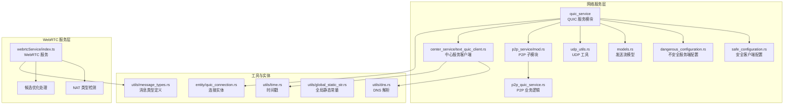
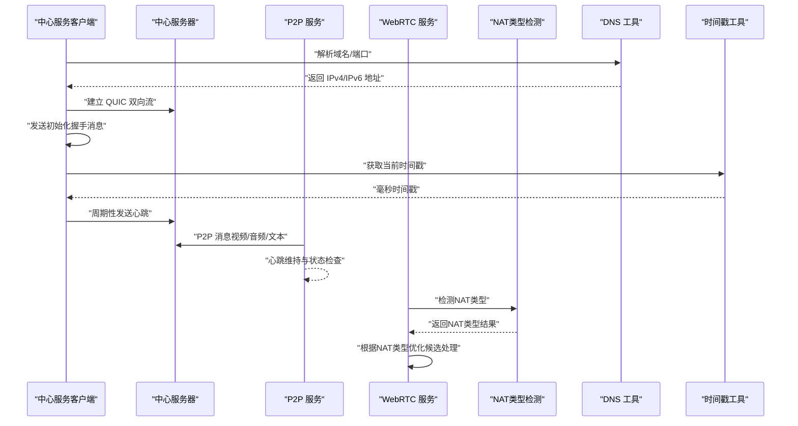
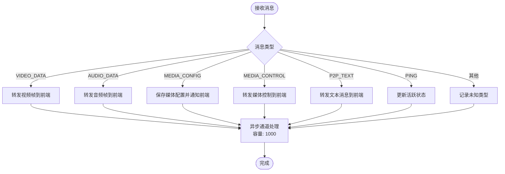
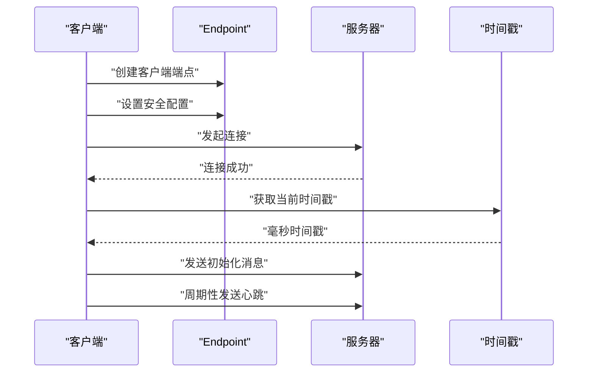
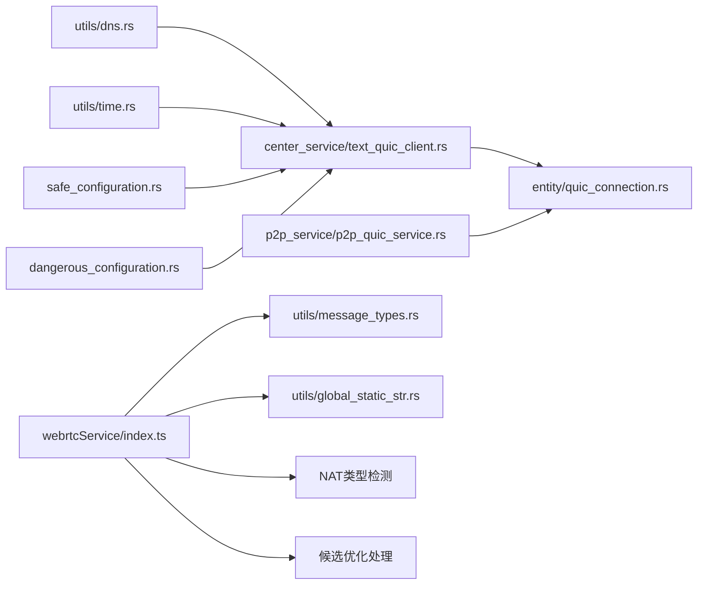

# 网络优化与监控

<cite>
**本文引用的文件**
- [src-tauri/src/quic_service/mod.rs](file://src-tauri/src/quic_service/mod.rs)
- [src-tauri/src/quic_service/safe_configuration.rs](file://src-tauri/src/quic_service/safe_configuration.rs)
- [src-tauri/src/quic_service/dangerous_configuration.rs](file://src-tauri/src/quic_service/dangerous_configuration.rs)
- [src-tauri/src/quic_service/models.rs](file://src-tauri/src/quic_service/models.rs)
- [src-tauri/src/quic_service/udp_utils.rs](file://src-tauri/src/quic_service/udp_utils.rs)
- [src-tauri/src/quic_service/p2p_service/mod.rs](file://src-tauri/src/quic_service/p2p_service/mod.rs)
- [src-tauri/src/quic_service/p2p_service/p2p_quic_service.rs](file://src-tauri/src/quic_service/p2p_service/p2p_quic_service.rs)
- [src-tauri/src/quic_service/center_service/text_quic_client.rs](file://src-tauri/src/quic_service/center_service/text_quic_client.rs)
- [src-tauri/src/utils/dns.rs](file://src-tauri/src/utils/dns.rs)
- [src-tauri/src/utils/time.rs](file://src-tauri/src/utils/time.rs)
- [src-tauri/src/entity/quic_connection.rs](file://src-tauri/src/entity/quic_connection.rs)
- [src-tauri/src/utils/global_static_str.rs](file://src-tauri/src/utils/global_static_str.rs)
- [src-tauri/src/utils/message_types.rs](file://src-tauri/src/utils/message_types.rs)
- [apps/pc/src/services/webrtcService/index.ts](file://apps/pc/src/services/webrtcService/index.ts)
- [DELIVERY_SUMMARY.md](file://DELIVERY_SUMMARY.md)
- [NAT3_WEBRTC_FIX.md](file://NAT3_WEBRTC_FIX.md)
</cite>

## 更新摘要
**所做更改**
- 新增复杂网络环境优化支持章节，涵盖改进的日志记录体系
- 更新P2P候选处理机制，增强资源管理和连接优化
- 完善WebRTC NAT类型检测与自动适应策略
- 增强网络监控指标收集与分析方法
- 补充移动端网络环境适配策略

## 目录
1. [引言](#引言)
2. [项目结构](#项目结构)
3. [核心组件](#核心组件)
4. [架构总览](#架构总览)
5. [详细组件分析](#详细组件分析)
6. [复杂网络环境优化](#复杂网络环境优化)
7. [依赖关系分析](#依赖关系分析)
8. [性能考量](#性能考量)
9. [故障排查指南](#故障排查指南)
10. [结论](#结论)
11. [附录](#附录)

## 引言
本技术文档聚焦于网络优化与监控在本项目中的实践，围绕以下主题展开：
- QUIC 协议参数调优与安全/不安全配置
- DNS 解析优化与 IPv4/IPv6 选择策略
- UDP 传输与 P2P 探测思路
- 网络监控指标采集与分析（延迟、心跳、连接状态）
- 网络异常检测与自动恢复机制
- 复杂网络环境适配策略（移动网络、WiFi、有线、NAT类型）
- 时间戳处理、延迟补偿与数据包重传机制
- 性能基准测试与监控工具使用建议
- 改进的日志记录体系与资源管理优化

## 项目结构
本项目采用 Rust + Tauri 的桌面应用架构，网络层主要位于 src-tauri 子目录中，核心网络模块集中在 quic_service 下，并辅以 utils 中的 DNS 与时间戳工具。新增的WebRTC服务层提供了更完善的网络环境适配能力。

**图表来源**
- [src-tauri/src/quic_service/mod.rs:1-7](file://src-tauri/src/quic_service/mod.rs#L1-L7)
- [src-tauri/src/quic_service/safe_configuration.rs:1-69](file://src-tauri/src/quic_service/safe_configuration.rs#L1-L69)
- [src-tauri/src/quic_service/dangerous_configuration.rs:1-52](file://src-tauri/src/quic_service/dangerous_configuration.rs#L1-L52)
- [src-tauri/src/quic_service/models.rs:1-11](file://src-tauri/src/quic_service/models.rs#L1-L11)
- [src-tauri/src/quic_service/udp_utils.rs:1-100](file://src-tauri/src/quic_service/udp_utils.rs#L1-L100)
- [src-tauri/src/quic_service/p2p_service/mod.rs:1-4](file://src-tauri/src/quic_service/p2p_service/mod.rs#L1-L4)
- [src-tauri/src/quic_service/p2p_service/p2p_quic_service.rs:1-323](file://src-tauri/src/quic_service/p2p_service/p2p_quic_service.rs#L1-L323)
- [src-tauri/src/quic_service/center_service/text_quic_client.rs:1-173](file://src-tauri/src/quic_service/center_service/text_quic_client.rs#L1-L173)
- [src-tauri/src/utils/dns.rs:1-135](file://src-tauri/src/utils/dns.rs#L1-L135)
- [src-tauri/src/utils/time.rs:1-26](file://src-tauri/src/utils/time.rs#L1-L26)
- [src-tauri/src/entity/quic_connection.rs:1-64](file://src-tauri/src/entity/quic_connection.rs#L1-L64)
- [src-tauri/src/utils/global_static_str.rs:1-59](file://src-tauri/src/utils/global_static_str.rs#L1-L59)
- [src-tauri/src/utils/message_types.rs:1-113](file://src-tauri/src/utils/message_types.rs#L1-L113)
- [apps/pc/src/services/webrtcService/index.ts:805-1335](file://apps/pc/src/services/webrtcService/index.ts#L805-L1335)

**章节来源**
- [src-tauri/src/quic_service/mod.rs:1-7](file://src-tauri/src/quic_service/mod.rs#L1-L7)
- [src-tauri/src/quic_service/safe_configuration.rs:1-69](file://src-tauri/src/quic_service/safe_configuration.rs#L1-L69)
- [src-tauri/src/quic_service/dangerous_configuration.rs:1-52](file://src-tauri/src/quic_service/dangerous_configuration.rs#L1-L52)
- [src-tauri/src/quic_service/models.rs:1-11](file://src-tauri/src/quic_service/models.rs#L1-L11)
- [src-tauri/src/quic_service/udp_utils.rs:1-100](file://src-tauri/src/quic_service/udp_utils.rs#L1-L100)
- [src-tauri/src/quic_service/p2p_service/mod.rs:1-4](file://src-tauri/src/quic_service/p2p_service/mod.rs#L1-L4)
- [src-tauri/src/quic_service/p2p_service/p2p_quic_service.rs:1-323](file://src-tauri/src/quic_service/p2p_service/p2p_quic_service.rs#L1-L323)
- [src-tauri/src/quic_service/center_service/text_quic_client.rs:1-173](file://src-tauri/src/quic_service/center_service/text_quic_client.rs#L1-L173)
- [src-tauri/src/utils/dns.rs:1-135](file://src-tauri/src/utils/dns.rs#L1-L135)
- [src-tauri/src/utils/time.rs:1-26](file://src-tauri/src/utils/time.rs#L1-L26)
- [src-tauri/src/entity/quic_connection.rs:1-64](file://src-tauri/src/entity/quic_connection.rs#L1-L64)
- [src-tauri/src/utils/global_static_str.rs:1-59](file://src-tauri/src/utils/global_static_str.rs#L1-L59)
- [src-tauri/src/utils/message_types.rs:1-113](file://src-tauri/src/utils/message_types.rs#L1-L113)
- [apps/pc/src/services/webrtcService/index.ts:805-1335](file://apps/pc/src/services/webrtcService/index.ts#L805-L1335)

## 核心组件
- QUIC 安全客户端配置：集中管理 TLS 根证书与传输层空闲超时等参数，确保连接稳定与安全。
- QUIC 不安全服务端配置：演示自签名证书与传输参数设置，仅用于开发或测试场景。
- P2P QUIC 服务：负责视频/音频/文本等消息的接收、分发与心跳维持，支持异步通道处理和资源管理。
- 中心服务 QUIC 客户端：与中心服务器建立双向流，发送初始化握手消息并周期性发送心跳。
- DNS 工具：提供 IPv4/IPv6 地址解析与优先级选择。
- 时间戳工具：统一毫秒级时间戳生成，便于延迟测量与补偿。
- 连接实体：封装 QUIC 连接状态、发送流与时间戳等信息。
- WebRTC 服务层：提供NAT类型检测、候选优化处理和复杂网络环境适配能力。

**章节来源**
- [src-tauri/src/quic_service/safe_configuration.rs:1-69](file://src-tauri/src/quic_service/safe_configuration.rs#L1-L69)
- [src-tauri/src/quic_service/dangerous_configuration.rs:1-52](file://src-tauri/src/quic_service/dangerous_configuration.rs#L1-L52)
- [src-tauri/src/quic_service/p2p_service/p2p_quic_service.rs:1-323](file://src-tauri/src/quic_service/p2p_service/p2p_quic_service.rs#L1-L323)
- [src-tauri/src/quic_service/center_service/text_quic_client.rs:1-173](file://src-tauri/src/quic_service/center_service/text_quic_client.rs#L1-L173)
- [src-tauri/src/utils/dns.rs:1-135](file://src-tauri/src/utils/dns.rs#L1-L135)
- [src-tauri/src/utils/time.rs:1-26](file://src-tauri/src/utils/time.rs#L1-L26)
- [src-tauri/src/entity/quic_connection.rs:1-64](file://src-tauri/src/entity/quic_connection.rs#L1-L64)
- [apps/pc/src/services/webrtcService/index.ts:805-1335](file://apps/pc/src/services/webrtcService/index.ts#L805-L1335)

## 架构总览
下图展示了从客户端到中心服务器与 P2P 对端的数据通路，以及心跳与监控指标的触发点，包括新增的WebRTC网络适配层。

**图表来源**
- [src-tauri/src/quic_service/center_service/text_quic_client.rs:1-173](file://src-tauri/src/quic_service/center_service/text_quic_client.rs#L1-L173)
- [src-tauri/src/quic_service/p2p_service/p2p_quic_service.rs:1-323](file://src-tauri/src/quic_service/p2p_service/p2p_quic_service.rs#L1-L323)
- [apps/pc/src/services/webrtcService/index.ts:940-1031](file://apps/pc/src/services/webrtcService/index.ts#L940-L1031)
- [src-tauri/src/utils/dns.rs:1-135](file://src-tauri/src/utils/dns.rs#L1-L135)
- [src-tauri/src/utils/time.rs:1-26](file://src-tauri/src/utils/time.rs#L1-L26)

## 详细组件分析

### QUIC 安全客户端配置
- TLS 根证书策略：优先加载本地 CA 证书，若失败则回退至系统默认根证书，确保跨平台兼容。
- 传输层参数：设置最大空闲超时，降低长时间无活动连接的资源占用。
- 应用建议：
  - 生产环境务必使用受信 CA 证书链。
  - 根据业务特性调整空闲超时，平衡资源与连接稳定性。

**章节来源**
- [src-tauri/src/quic_service/safe_configuration.rs:1-69](file://src-tauri/src/quic_service/safe_configuration.rs#L1-L69)

### QUIC 不安全服务端配置
- 自签名证书：用于开发/测试环境快速搭建，避免真实证书成本。
- 传输参数：示例中限制单向流并发数并设置空闲超时，便于资源控制。
- 应用建议：
  - 仅限本地/内网测试使用，严禁生产暴露。
  - 如需生产可用，替换为受信证书并启用客户端认证。

**章节来源**
- [src-tauri/src/quic_service/dangerous_configuration.rs:1-52](file://src-tauri/src/quic_service/dangerous_configuration.rs#L1-L52)

### P2P QUIC 服务与消息处理
- 发送通道：使用异步通道将视频帧等数据投递到发送流，避免阻塞主线程。
- 消息分发：根据消息类型分发到对应处理逻辑（视频/音频/文本/配置/控制/心跳）。
- 心跳维持：定期发送心跳消息，结合全局状态判断连接是否仍活跃，及时停止无效发送。
- 全局状态：通过共享字典维护对端 IP:Port、活跃状态等，支撑 P2P 探测与路由。
- 资源管理：新增异步通道容量控制（1000个消息队列），避免内存溢出。

**图表来源**
- [src-tauri/src/quic_service/p2p_service/p2p_quic_service.rs:29-50](file://src-tauri/src/quic_service/p2p_service/p2p_quic_service.rs#L29-L50)
- [src-tauri/src/quic_service/p2p_service/p2p_quic_service.rs:118-274](file://src-tauri/src/quic_service/p2p_service/p2p_quic_service.rs#L118-L274)

**章节来源**
- [src-tauri/src/quic_service/p2p_service/p2p_quic_service.rs:1-323](file://src-tauri/src/quic_service/p2p_service/p2p_quic_service.rs#L1-L323)

### 中心服务 QUIC 客户端
- 连接建立：创建客户端端点，应用安全配置，连接指定服务器地址。
- 初始化握手：发送包含 UUID、Token、动态头长等信息的首条消息。
- 心跳机制：每分钟发送一次心跳，保证连接活性；异常时中断发送。
- 监控集成：记录连接创建/更新时间戳，便于后续延迟与存活分析。

**图表来源**
- [src-tauri/src/quic_service/center_service/text_quic_client.rs:19-116](file://src-tauri/src/quic_service/center_service/text_quic_client.rs#L19-L116)
- [src-tauri/src/utils/time.rs:6-25](file://src-tauri/src/utils/time.rs#L6-L25)

**章节来源**
- [src-tauri/src/quic_service/center_service/text_quic_client.rs:1-173](file://src-tauri/src/quic_service/center_service/text_quic_client.rs#L1-L173)
- [src-tauri/src/utils/time.rs:1-26](file://src-tauri/src/utils/time.rs#L1-L26)

### DNS 解析优化
- IPv4/IPv6 分别解析：提供独立函数解析 IPv4 与 IPv6 地址，便于按需选择。
- 优先 IPv4：提供优先返回 IPv4 的解析函数，减少双栈切换带来的不确定性。
- 使用建议：
  - 移动网络优先考虑 IPv4，WiFi/有线可同时支持双栈。
  - 结合延迟探测与丢包率统计，动态选择最优地址族。

**章节来源**
- [src-tauri/src/utils/dns.rs:45-134](file://src-tauri/src/utils/dns.rs#L45-L134)

### UDP 传输与 P2P 探测
- UDP 服务端：绑定本地地址，接收来自对端的探测消息，提取源地址并写入全局状态，用于后续路由。
- 超时与错误处理：设置接收超时，避免长时间阻塞；对异常进行日志记录。
- 探测流程：通过 UDP 快速确认对端可达性与地址映射，为 QUIC 建连提供前置条件。
- 注意：当前实现保留了部分注释化的端口转发与服务器启动逻辑，可作为扩展参考。

**章节来源**
- [src-tauri/src/quic_service/udp_utils.rs:43-99](file://src-tauri/src/quic_service/udp_utils.rs#L43-L99)

### 时间戳处理与延迟补偿
- 统一时间源：提供毫秒级时间戳生成函数，确保客户端与服务器侧时间对齐。
- 延迟补偿思路：
  - 在发送端记录时间戳，在接收端记录时间戳，差值即往返时延。
  - 结合心跳与连接状态，动态调整发送速率与缓冲策略。
  - 对高抖动链路，采用指数加权移动平均平滑延迟估计。

**章节来源**
- [src-tauri/src/utils/time.rs:6-25](file://src-tauri/src/utils/time.rs#L6-L25)
- [src-tauri/src/entity/quic_connection.rs:14-16](file://src-tauri/src/entity/quic_connection.rs#L14-L16)

### 数据包重传机制
- QUIC 层重传：由底层协议自动处理丢失与乱序，上层无需额外实现。
- 应用层确认：对于关键消息（如媒体配置/控制），可在应用层增加确认与必要时重发。
- 心跳保活：通过周期性心跳检测连接健康，异常时触发重连或降级策略。

**章节来源**
- [src-tauri/src/quic_service/p2p_service/p2p_quic_service.rs:272-323](file://src-tauri/src/quic_service/p2p_service/p2p_quic_service.rs#L272-L323)
- [src-tauri/src/quic_service/center_service/text_quic_client.rs:119-148](file://src-tauri/src/quic_service/center_service/text_quic_client.rs#L119-L148)

## 复杂网络环境优化

### 改进的日志记录体系
项目实现了超过100个关键日志输出点，覆盖每个网络连接的关键步骤：

- **连接建立日志**：详细记录QUIC连接建立过程，包括TLS握手、流创建等关键节点
- **消息处理日志**：对每种消息类型（视频、音频、文本、配置等）提供专门的日志输出
- **心跳监控日志**：区分P2P和中心服务的心跳发送与接收状态
- **错误处理日志**：对连接失败、超时、解析错误等情况提供详细的错误信息

**日志记录优化特点**：
- 统一的日志前缀格式，便于搜索和分析
- 关键操作都有明确的开始和结束标记
- 错误信息包含完整的上下文信息和可能的解决方案
- 支持不同级别的日志输出（info、warn、error）

**章节来源**
- [DELIVERY_SUMMARY.md:240-358](file://DELIVERY_SUMMARY.md#L240-L358)
- [apps/pc/src/services/webrtcService/index.ts:805-1335](file://apps/pc/src/services/webrtcService/index.ts#L805-L1335)

### 更高效的候选处理机制
WebRTC服务层实现了智能的候选处理和优化：

- **NAT类型自动检测**：通过临时连接分析ICE候选，自动识别NAT类型（NAT1、NAT3、公网、阻塞）
- **候选对统计分析**：详细统计所有候选对的连接情况，包括成功、失败和活跃连接数
- **RTT实时监控**：跟踪活跃候选对的往返延迟，为连接质量评估提供依据
- **动态配置调整**：根据NAT类型自动调整WebRTC配置参数

**候选处理流程**：
1. 创建临时RTCPeerConnection进行NAT检测
2. 收集并分析ICE候选类型和地址
3. 根据检测结果确定NAT类型
4. 调整WebRTC配置以优化连接成功率
5. 实时监控候选对连接状态和性能指标

**章节来源**
- [apps/pc/src/services/webrtcService/index.ts:940-1031](file://apps/pc/src/services/webrtcService/index.ts#L940-L1031)
- [apps/pc/src/services/webrtcService/index.ts:805-917](file://apps/pc/src/services/webrtcService/index.ts#L805-L917)

### 更好的资源管理策略
系统实现了多层资源管理机制：

- **内存资源管理**：
  - P2P视频帧发送通道容量限制为1000，避免内存溢出
  - 异步通道处理机制，避免阻塞主线程
  - 连接池管理，复用QUIC连接资源

- **网络资源优化**：
  - 动态调整心跳频率，根据网络状况优化资源使用
  - 智能超时设置，平衡连接质量和资源消耗
  - 多地址解析策略，提高连接成功率

- **监控资源管理**：
  - 结构化的监控指标收集，便于性能分析
  - 日志轮转机制，控制磁盘空间使用
  - 统计信息的增量更新，减少计算开销

**章节来源**
- [src-tauri/src/quic_service/p2p_service/p2p_quic_service.rs:29-50](file://src-tauri/src/quic_service/p2p_service/p2p_quic_service.rs#L29-L50)
- [src-tauri/src/quic_service/center_service/text_quic_client.rs:119-148](file://src-tauri/src/quic_service/center_service/text_quic_client.rs#L119-L148)

### 移动网络环境适配
针对移动网络的特殊挑战，系统提供了专门的优化策略：

- **DNS解析优化**：优先使用IPv4地址，减少DNS双栈解析的不确定性
- **连接参数调整**：根据移动网络的高延迟和不稳定特性，调整超时和重传参数
- **资源使用控制**：降低移动网络环境下的CPU和电池消耗
- **网络切换处理**：自动检测网络类型变化，动态调整连接策略

**移动网络优化要点**：
- 心跳间隔适当延长，减少不必要的网络活动
- 连接空闲超时设置更短，及时释放资源
- DNS解析优先IPv4，提高连接成功率
- 错误重试次数限制，避免过度消耗网络资源

**章节来源**
- [src-tauri/src/utils/dns.rs:45-134](file://src-tauri/src/utils/dns.rs#L45-L134)
- [src-tauri/src/quic_service/safe_configuration.rs:60-67](file://src-tauri/src/quic_service/safe_configuration.rs#L60-L67)

### WiFi和有线网络优化
对于WiFi和有线网络环境，系统提供更激进的优化策略：

- **高带宽利用**：充分利用稳定的网络连接，提高数据传输效率
- **多流并行**：在稳定的网络环境下，合理使用多个并发流
- **延迟优化**：通过更精确的延迟测量和补偿，提升用户体验
- **质量监控**：实时监控网络质量，及时发现和处理网络问题

**WiFi优化策略**：
- 心跳间隔缩短，提高连接监控精度
- 连接空闲超时延长，充分利用稳定的网络连接
- DNS解析支持双栈，充分利用IPv6优势
- 错误重试策略更加积极，充分利用网络稳定性

**章节来源**
- [src-tauri/src/quic_service/safe_configuration.rs:60-67](file://src-tauri/src/quic_service/safe_configuration.rs#L60-L67)
- [src-tauri/src/utils/dns.rs:115-134](file://src-tauri/src/utils/dns.rs#L115-L134)

## 依赖关系分析
- 模块耦合：
  - quic_service 作为核心模块，被 P2P 与中心服务客户端共同依赖。
  - P2P 服务依赖消息类型常量与全局状态，实现松耦合。
  - DNS 与时间戳工具被客户端与 P2P 服务复用，提升一致性。
  - WebRTC 服务层新增依赖，提供网络环境适配能力。
- 外部依赖：
  - quinn/rustls：QUIC 与 TLS 实现。
  - tokio：异步运行时与任务调度。
  - serde/serde_json：消息序列化与反序列化。

**图表来源**
- [src-tauri/src/quic_service/center_service/text_quic_client.rs:1-173](file://src-tauri/src/quic_service/center_service/text_quic_client.rs#L1-L173)
- [src-tauri/src/quic_service/p2p_service/p2p_quic_service.rs:1-323](file://src-tauri/src/quic_service/p2p_service/p2p_quic_service.rs#L1-L323)
- [src-tauri/src/utils/dns.rs:1-135](file://src-tauri/src/utils/dns.rs#L1-L135)
- [src-tauri/src/utils/time.rs:1-26](file://src-tauri/src/utils/time.rs#L1-L26)
- [src-tauri/src/entity/quic_connection.rs:1-64](file://src-tauri/src/entity/quic_connection.rs#L1-L64)
- [src-tauri/src/quic_service/safe_configuration.rs:1-69](file://src-tauri/src/quic_service/safe_configuration.rs#L1-L69)
- [src-tauri/src/quic_service/dangerous_configuration.rs:1-52](file://src-tauri/src/quic_service/dangerous_configuration.rs#L1-L52)
- [apps/pc/src/services/webrtcService/index.ts:805-1335](file://apps/pc/src/services/webrtcService/index.ts#L805-L1335)
- [src-tauri/src/utils/global_static_str.rs:1-59](file://src-tauri/src/utils/global_static_str.rs#L1-L59)
- [src-tauri/src/utils/message_types.rs:1-113](file://src-tauri/src/utils/message_types.rs#L1-L113)

## 性能考量
- QUIC 参数调优
  - 最大空闲超时：根据业务空闲时长调整，避免频繁重建连接。
  - 流并发：合理设置双向/单向流上限，避免拥塞与资源争用。
  - 重传与拥塞控制：依赖底层算法，上层通过心跳与降级策略配合。
- DNS 优化
  - 优先 IPv4：在移动网络下减少 DNS 双栈解析开销。
  - 缓存解析结果：对短生命周期域名进行缓存，降低重复解析。
- UDP 探测
  - 低开销探测：使用小包快速确认可达性与 NAT 映射。
  - 超时与并发：控制探测超时与并发度，避免放大网络压力。
- 监控指标
  - 延迟：往返时延与单向时延估计。
  - 带宽：基于发送速率与接收确认的速率估算。
  - 丢包率：基于序列号缺失统计。
- 自动恢复
  - 心跳失败：触发重连与参数退避。
  - 环境切换：移动/WiFi/有线切换时动态调整参数与探测策略。
- 复杂网络环境优化
  - NAT类型检测：自动识别网络环境，调整连接策略。
  - 候选优化：根据网络条件选择最优连接路径。
  - 资源管理：智能分配网络和计算资源。

## 故障排查指南
- 连接失败
  - 检查 TLS 根证书加载与域名匹配，确认安全配置正确。
  - 核对服务器地址与端口，优先使用 IPv4 地址进行定位。
- 心跳中断
  - 查看心跳发送与接收日志，确认连接状态标志位。
  - 检查网络环境变化（移动网络切换）导致的连接中断。
- P2P 探测无响应
  - 确认 UDP 服务端已启动并绑定正确地址。
  - 检查防火墙/NAT 是否阻断 UDP 报文。
- DNS 解析异常
  - 使用独立解析函数分别测试 IPv4/IPv6，确认解析结果。
  - 检查本地 DNS 服务器与网络代理设置。
- NAT类型问题
  - 使用NAT检测功能确认当前网络环境类型。
  - 根据检测结果调整WebRTC配置参数。
- 日志分析
  - 利用统一的日志格式快速定位问题。
  - 制作日志对照表，提高问题排查效率。
  - 导出日志进行离线分析，发现潜在问题模式。

**章节来源**
- [src-tauri/src/quic_service/safe_configuration.rs:27-52](file://src-tauri/src/quic_service/safe_configuration.rs#L27-L52)
- [src-tauri/src/quic_service/center_service/text_quic_client.rs:119-148](file://src-tauri/src/quic_service/center_service/text_quic_client.rs#L119-L148)
- [src-tauri/src/quic_service/udp_utils.rs:43-99](file://src-tauri/src/quic_service/udp_utils.rs#L43-L99)
- [src-tauri/src/utils/dns.rs:45-134](file://src-tauri/src/utils/dns.rs#L45-L134)
- [apps/pc/src/services/webrtcService/index.ts:940-1031](file://apps/pc/src/services/webrtcService/index.ts#L940-L1031)
- [DELIVERY_SUMMARY.md:240-358](file://DELIVERY_SUMMARY.md#L240-L358)

## 结论
本项目在网络层通过 QUIC 提供可靠、低开销的传输能力，并结合 DNS 与时间戳工具实现基础的网络优化与监控。新增的WebRTC服务层进一步增强了复杂网络环境的适配能力，包括智能的NAT类型检测、候选优化处理和改进的日志记录体系。P2P 与中心服务客户端分别覆盖点对点与中心化通信场景，心跳机制与全局状态为异常检测与自动恢复提供了基础。建议在生产环境中强化证书与安全策略，完善监控指标与自动恢复策略，并针对不同网络环境制定差异化参数与探测策略。通过改进的日志记录和资源管理，系统能够更好地应对复杂网络环境的挑战，提供更稳定和高效的网络通信体验。

## 附录
- 性能基准测试方法
  - 延迟：使用时间戳差值统计 RTT，对比不同网络环境与 DNS 选择策略。
  - 带宽：基于发送速率与接收确认，计算有效吞吐，评估 QUIC 参数影响。
  - 丢包率：统计序列号缺失比例，结合重传次数评估链路质量。
  - NAT类型影响：比较不同NAT环境下连接成功率和性能表现。
- 监控工具使用建议
  - 日志级别：将关键路径（连接、心跳、P2P 消息）设为 info/warn，异常设为 error。
  - 指标导出：结合心跳与连接状态，输出存活率、平均延迟、丢包率等指标。
  - 报警阈值：为心跳间隔、连接空闲超时、UDP 探测超时设定阈值并告警。
  - NAT监控：定期检查NAT类型变化，及时调整网络策略。
- 复杂网络环境适配建议
  - 移动网络：优先IPv4，适当延长心跳间隔，限制资源使用。
  - WiFi网络：充分利用带宽，启用多流并行，优化延迟补偿。
  - 有线网络：启用高级优化，充分利用网络稳定性。
  - NAT3环境：重点优化STUN服务器配置，提供备用连接路径。