# 网络通信

<cite>
**本文引用的文件**
- [src-tauri/src/quic_service/mod.rs](file://src-tauri/src/quic_service/mod.rs)
- [src-tauri/src/quic_service/safe_configuration.rs](file://src-tauri/src/quic_service/safe_configuration.rs)
- [src-tauri/src/quic_service/dangerous_configuration.rs](file://src-tauri/src/quic_service/dangerous_configuration.rs)
- [src-tauri/src/quic_service/p2p_service/mod.rs](file://src-tauri/src/quic_service/p2p_service/mod.rs)
- [src-tauri/src/quic_service/p2p_service/p2p_quic_service.rs](file://src-tauri/src/quic_service/p2p_service/p2p_quic_service.rs)
- [src-tauri/src/quic_service/p2p_service/p2p_stream_quic_client.rs](file://src-tauri/src/quic_service/p2p_service/p2p_stream_quic_client.rs)
- [src-tauri/src/quic_service/p2p_service/p2p_stream_quic_server.rs](file://src-tauri/src/quic_service/p2p_service/p2p_stream_quic_server.rs)
- [src-tauri/src/entity/quic_connection.rs](file://src-tauri/src/entity/quic_connection.rs)
- [src-tauri/src/entity/p2p_models.rs](file://src-tauri/src/entity/p2p_models.rs)
- [src-tauri/src/utils/message_types.rs](file://src-tauri/src/utils/message_types.rs)
- [src-tauri/src/service/p2p_service.rs](file://src-tauri/src/service/p2p_service.rs)
- [apps/pc/src/services/webrtcService/index.ts](file://apps/pc/src/services/webrtcService/index.ts)
- [apps/pc/src/hooks/useWebRTCSignalApi.ts](file://apps/pc/src/hooks/useWebRTCSignalApi.ts)
- [apps/pc/src/hooks/useP2pMessageApi.ts](file://apps/pc/src/hooks/useP2pMessageApi.ts)
- [apps/pc/src/components/P2p/InitP2pMsg.tsx](file://apps/pc/src/components/P2p/InitP2pMsg.tsx)
- [apps/pc/src/components/P2p/ProcessQuicP2pStream.tsx](file://apps/pc/src/components/P2p/ProcessQuicP2pStream.tsx)
- [packages/types/src/p2p/index.ts](file://packages/types/src/p2p/index.ts)
</cite>

## 更新摘要
**所做更改**
- 新增 P2P 文件传输通道章节，详细介绍文件传输的完整实现
- 更新消息类型定义，包含新增的 MSG_TYPE_P2P_FILE_DATA、MSG_TYPE_P2P_FILE_TRANSFER_REQUEST、MSG_TYPE_P2P_FILE_TRANSFER_RESPONSE
- 新增 P2P 文件传输服务章节，说明后端文件传输服务的实现
- 更新 P2P 媒体模型，包含文件传输相关的数据结构
- 新增前端文件传输事件处理章节，说明前端如何处理文件传输事件

## 目录
1. [引言](#引言)
2. [项目结构](#项目结构)
3. [核心组件](#核心组件)
4. [架构总览](#架构总览)
5. [详细组件分析](#详细组件分析)
6. [P2P 文件传输通道](#p2p-文件传输通道)
7. [依赖关系分析](#依赖关系分析)
8. [性能考量](#性能考量)
9. [故障排查指南](#故障排查指南)
10. [结论](#结论)
11. [附录](#附录)

## 引言
本技术文档面向网络工程师与高级开发者，系统梳理即时通讯应用中的网络传输机制与通信协议，重点覆盖以下方面：
- QUIC 协议在本项目中的应用场景与实现细节：包括连接管理、流控制、错误处理与安全配置。
- WebRTC 集成方案：信令交换机制、NAT 穿越策略（含 STUN/候选池、ICE 重启与超时控制）、P2P 媒体流传输与质量控制。
- P2P 点对点连接建立流程、媒体流传输与质量控制策略。
- **新增** P2P 文件传输通道：基于独立文件通道的文件分片传输机制，支持大文件传输与断点续传。
- 网络优化技巧、性能监控方法与故障排查指南。
- 提供具体代码示例路径、协议规范与最佳实践。

## 项目结构
本项目采用前后端分离架构，后端基于 Tauri + Rust，前端基于 React/Vite。网络相关能力主要分布在：
- 后端 Rust 模块：QUIC 服务（安全/危险配置、P2P 服务）、实体模型与消息类型定义。
- 前端模块：WebRTC 服务封装、信令 API 钩子、P2P 控制组件。

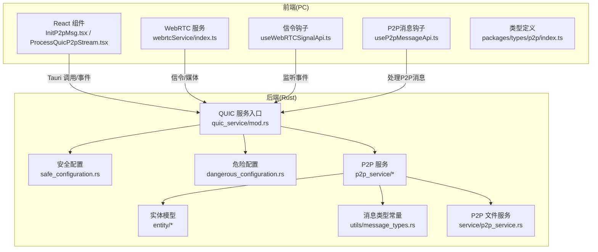

**图表来源**
- [src-tauri/src/quic_service/mod.rs:1-7](file://src-tauri/src/quic_service/mod.rs#L1-L7)
- [src-tauri/src/quic_service/safe_configuration.rs:1-69](file://src-tauri/src/quic_service/safe_configuration.rs#L1-L69)
- [src-tauri/src/quic_service/dangerous_configuration.rs:1-52](file://src-tauri/src/quic_service/dangerous_configuration.rs#L1-L52)
- [src-tauri/src/quic_service/p2p_service/mod.rs:1-4](file://src-tauri/src/quic_service/p2p_service/mod.rs#L1-L4)
- [apps/pc/src/services/webrtcService/index.ts:1-120](file://apps/pc/src/services/webrtcService/index.ts#L1-L120)
- [apps/pc/src/hooks/useWebRTCSignalApi.ts:1-100](file://apps/pc/src/hooks/useWebRTCSignalApi.ts#L1-L100)
- [apps/pc/src/hooks/useP2pMessageApi.ts:1-114](file://apps/pc/src/hooks/useP2pMessageApi.ts#L1-L114)
- [packages/types/src/p2p/index.ts:1-276](file://packages/types/src/p2p/index.ts#L1-L276)

**章节来源**
- [src-tauri/src/quic_service/mod.rs:1-7](file://src-tauri/src/quic_service/mod.rs#L1-L7)
- [apps/pc/src/services/webrtcService/index.ts:1-120](file://apps/pc/src/services/webrtcService/index.ts#L1-L120)

## 核心组件
- QUIC 安全配置：构建可信根证书、设置传输超时与客户端配置，确保与中央服务器的安全连接。
- QUIC 危险配置：用于本地测试的自签名证书与不安全传输参数，便于开发与联调。
- P2P QUIC 服务：统一的消息处理与分发、心跳保活、视频/音频数据通道与媒体配置/控制消息。
- **新增** P2P 文件传输服务：基于独立文件通道的文件分片传输机制，支持文件传输请求/响应与数据分片传输。
- WebRTC 服务：封装 STUN 服务器列表、ICE 候选池、连接状态监控、ICE 重启与超时控制、媒体轨道管理。
- 实体模型与消息类型：定义 P2P 媒体配置、控制命令、**新增**文件传输数据结构与消息类型常量，支撑跨语言/跨进程通信。

**章节来源**
- [src-tauri/src/quic_service/safe_configuration.rs:13-68](file://src-tauri/src/quic_service/safe_configuration.rs#L13-L68)
- [src-tauri/src/quic_service/dangerous_configuration.rs:7-34](file://src-tauri/src/quic_service/dangerous_configuration.rs#L7-L34)
- [src-tauri/src/quic_service/p2p_service/p2p_quic_service.rs:114-259](file://src-tauri/src/quic_service/p2p_service/p2p_quic_service.rs#L114-L259)
- [src-tauri/src/service/p2p_service.rs:800-914](file://src-tauri/src/service/p2p_service.rs#L800-L914)
- [apps/pc/src/services/webrtcService/index.ts:35-101](file://apps/pc/src/services/webrtcService/index.ts#L35-L101)
- [src-tauri/src/entity/p2p_models.rs:121-171](file://src-tauri/src/entity/p2p_models.rs#L121-L171)
- [src-tauri/src/utils/message_types.rs:77-86](file://src-tauri/src/utils/message_types.rs#L77-L86)

## 架构总览
下图展示从前端到后端的网络交互路径，包括 QUIC P2P 与 WebRTC 两条主干通道，以及新增的 P2P 文件传输通道：

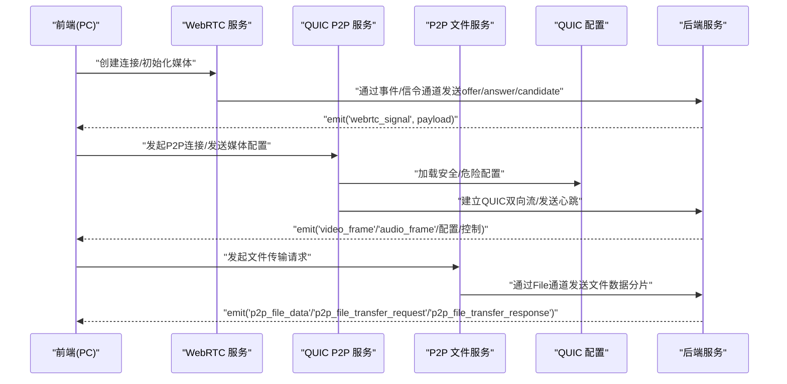

**图表来源**
- [apps/pc/src/services/webrtcService/index.ts:373-549](file://apps/pc/src/services/webrtcService/index.ts#L373-L549)
- [apps/pc/src/hooks/useWebRTCSignalApi.ts:62-81](file://apps/pc/src/hooks/useWebRTCSignalApi.ts#L62-L81)
- [src-tauri/src/quic_service/p2p_service/p2p_quic_service.rs:114-259](file://src-tauri/src/quic_service/p2p_service/p2p_quic_service.rs#L114-L259)
- [src-tauri/src/quic_service/safe_configuration.rs:13-68](file://src-tauri/src/quic_service/safe_configuration.rs#L13-L68)
- [src-tauri/src/service/p2p_service.rs:800-914](file://src-tauri/src/service/p2p_service.rs#L800-L914)

## 详细组件分析

### QUIC 安全配置与连接管理
- 安全客户端配置：加载系统/本地 CA 证书，构建 TLS 客户端配置，并设置传输层空闲超时，保障长连接稳定性。
- 传输参数：最大空闲超时、并发单向流限制等，平衡资源占用与并发需求。
- 适用场景：与中央服务器建立安全可靠的长连接，承载文本、文件、媒体配置等消息。

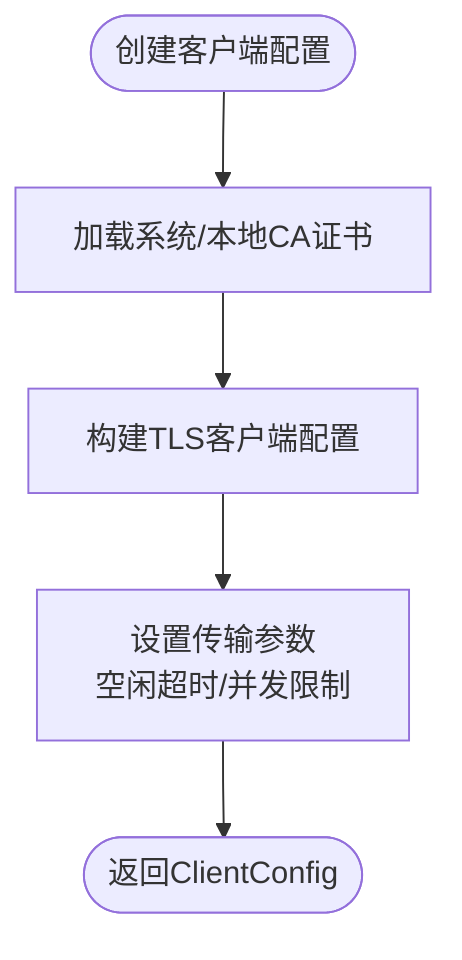

**图表来源**
- [src-tauri/src/quic_service/safe_configuration.rs:13-68](file://src-tauri/src/quic_service/safe_configuration.rs#L13-L68)

**章节来源**
- [src-tauri/src/quic_service/safe_configuration.rs:13-68](file://src-tauri/src/quic_service/safe_configuration.rs#L13-L68)

### QUIC 危险配置与测试环境
- 自签名证书：用于本地开发与联调，快速搭建 QUIC 服务端。
- 传输参数：限制单向流并发，缩短空闲超时，便于测试连接回收。
- 注意：仅限开发/测试使用，生产环境请使用安全配置。

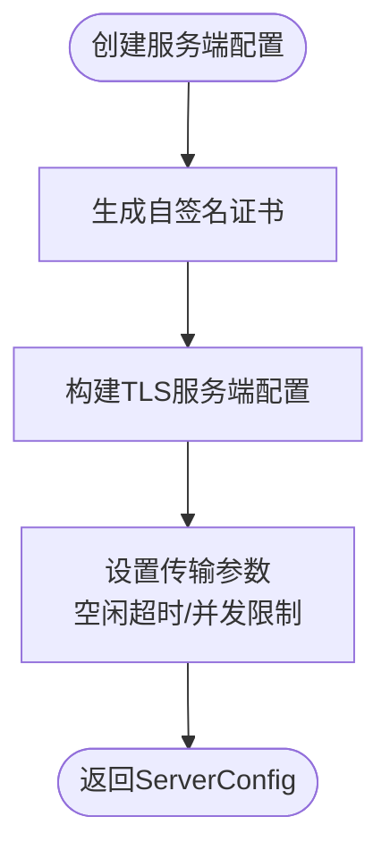

**图表来源**
- [src-tauri/src/quic_service/dangerous_configuration.rs:7-34](file://src-tauri/src/quic_service/dangerous_configuration.rs#L7-L34)

**章节来源**
- [src-tauri/src/quic_service/dangerous_configuration.rs:7-34](file://src-tauri/src/quic_service/dangerous_configuration.rs#L7-L34)

### P2P QUIC 服务：消息处理与心跳保活
- 发送通道：使用异步通道将视频帧数据转为文本消息并通过 QUIC 发送，避免阻塞主线程。
- 接收处理：根据消息类型分发至对应处理函数，包括视频/音频数据、媒体配置/控制、**新增**文件传输数据与心跳。
- 心跳保活：定时发送 Ping 消息，检测连接活跃状态；若连接关闭则停止发送。
- 连接管理：维护发送流映射与连接活跃状态，支持服务端/客户端两种角色。

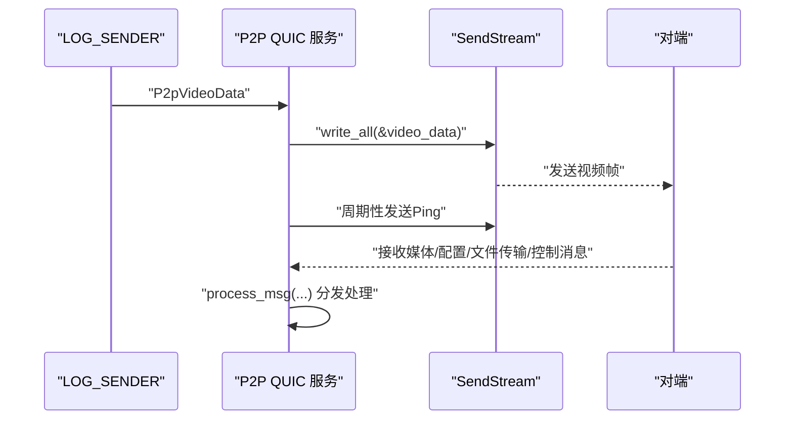

**图表来源**
- [src-tauri/src/quic_service/p2p_service/p2p_quic_service.rs:29-50](file://src-tauri/src/quic_service/p2p_service/p2p_quic_service.rs#L29-L50)
- [src-tauri/src/quic_service/p2p_service/p2p_quic_service.rs:114-259](file://src-tauri/src/quic_service/p2p_service/p2p_quic_service.rs#L114-L259)
- [src-tauri/src/quic_service/p2p_service/p2p_quic_service.rs:272-307](file://src-tauri/src/quic_service/p2p_service/p2p_quic_service.rs#L272-L307)

**章节来源**
- [src-tauri/src/quic_service/p2p_service/p2p_quic_service.rs:29-50](file://src-tauri/src/quic_service/p2p_service/p2p_quic_service.rs#L29-L50)
- [src-tauri/src/quic_service/p2p_service/p2p_quic_service.rs:114-259](file://src-tauri/src/quic_service/p2p_service/p2p_quic_service.rs#L114-L259)
- [src-tauri/src/quic_service/p2p_service/p2p_quic_service.rs:272-307](file://src-tauri/src/quic_service/p2p_service/p2p_quic_service.rs#L272-L307)

### QUIC P2P 客户端与服务端
- 客户端：创建 Endpoint、禁用证书校验（开发用途）、连接服务器、开启双向流、发送验证消息、注册心跳与接收处理。
- 服务端：创建 Endpoint（使用危险配置）、接受连接、为每个连接开启双向流、注册心跳与接收处理、维护发送流映射。

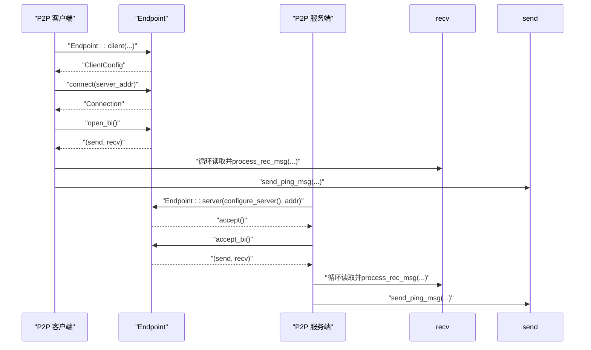

**图表来源**
- [src-tauri/src/quic_service/p2p_service/p2p_stream_quic_client.rs:18-113](file://src-tauri/src/quic_service/p2p_service/p2p_stream_quic_client.rs#L18-L113)
- [src-tauri/src/quic_service/p2p_service/p2p_stream_quic_server.rs:89-167](file://src-tauri/src/quic_service/p2p_service/p2p_stream_quic_server.rs#L89-L167)
- [src-tauri/src/quic_service/dangerous_configuration.rs:7-34](file://src-tauri/src/quic_service/dangerous_configuration.rs#L7-L34)

**章节来源**
- [src-tauri/src/quic_service/p2p_service/p2p_stream_quic_client.rs:18-113](file://src-tauri/src/quic_service/p2p_service/p2p_stream_quic_client.rs#L18-L113)
- [src-tauri/src/quic_service/p2p_service/p2p_stream_quic_server.rs:89-167](file://src-tauri/src/quic_service/p2p_service/p2p_stream_quic_server.rs#L89-L167)

### WebRTC 服务：信令交换与 NAT 穿越
- STUN 服务器：大量国内外 STUN 服务器列表，覆盖多端口与不同提供商，提升公网映射成功率。
- ICE 候选池：预收集候选，加速连接建立；保留 host/srflx 候选，避免人为过滤导致失败。
- ICE 重启与超时：连接失败时自动重启 ICE，设置合理超时时间，避免长时间等待。
- 媒体轨道：本地媒体流初始化、切换音视频轨道、远程媒体流接收回调。
- 信令通道：通过 Tauri 事件在前端与后端之间传递 offer/answer/candidate。

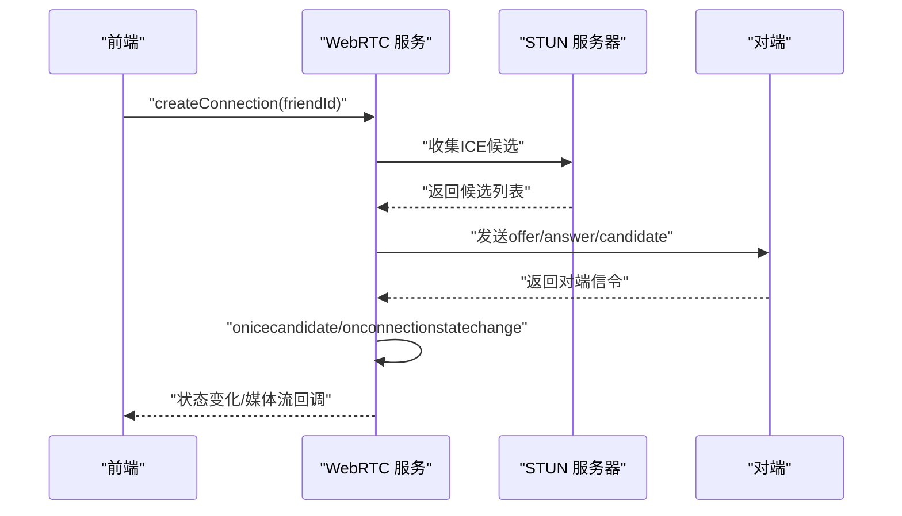

**图表来源**
- [apps/pc/src/services/webrtcService/index.ts:373-549](file://apps/pc/src/services/webrtcService/index.ts#L373-L549)
- [apps/pc/src/services/webrtcService/index.ts:659-738](file://apps/pc/src/services/webrtcService/index.ts#L659-L738)

**章节来源**
- [apps/pc/src/services/webrtcService/index.ts:35-101](file://apps/pc/src/services/webrtcService/index.ts#L35-L101)
- [apps/pc/src/services/webrtcService/index.ts:373-549](file://apps/pc/src/services/webrtcService/index.ts#L373-L549)
- [apps/pc/src/services/webrtcService/index.ts:659-738](file://apps/pc/src/services/webrtcService/index.ts#L659-L738)

### P2P 媒体模型与消息类型
- 媒体配置：视频/音频参数（分辨率、帧率、采样率、码率等）、缓冲策略与自适应延迟。
- 媒体控制：视频/音频开关、暂停/恢复、结束通话等控制命令。
- **更新** 消息类型：统一定义 P2P 文本、媒体配置、媒体控制、**新增**文件传输、视频通话邀请/接受/拒绝/结束、心跳等消息类型。

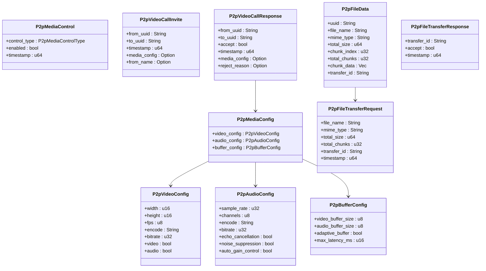

**图表来源**
- [src-tauri/src/entity/p2p_models.rs:76-141](file://src-tauri/src/entity/p2p_models.rs#L76-L141)
- [src-tauri/src/entity/p2p_models.rs:170-203](file://src-tauri/src/entity/p2p_models.rs#L170-L203)
- [src-tauri/src/entity/p2p_models.rs:121-171](file://src-tauri/src/entity/p2p_models.rs#L121-L171)

**章节来源**
- [src-tauri/src/entity/p2p_models.rs:1-283](file://src-tauri/src/entity/p2p_models.rs#L1-L283)
- [src-tauri/src/utils/message_types.rs:23-86](file://src-tauri/src/utils/message_types.rs#L23-L86)

### 前端 P2P 控制与 WebRTC 信令集成
- P2P 初始化组件：通过 Tauri 调用发送 UDP P2P 初始化消息，辅助 NAT 穿越与地址交换。
- 信令监听：监听后端通过事件通道下发的 WebRTC 信令，打开视频聊天窗口并处理 offer/answer/candidate。
- P2P 流处理组件：监听后端事件，解析并处理 P2P 请求与媒体流事件。

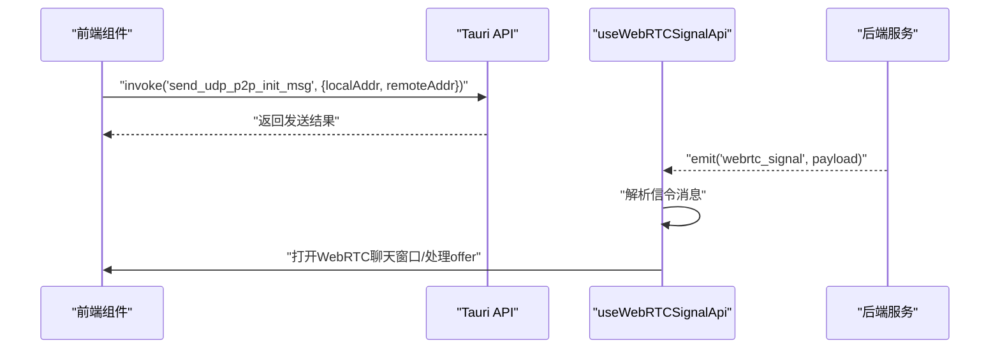

**图表来源**
- [apps/pc/src/components/P2p/InitP2pMsg.tsx:9-16](file://apps/pc/src/components/P2p/InitP2pMsg.tsx#L9-L16)
- [apps/pc/src/hooks/useWebRTCSignalApi.ts:62-81](file://apps/pc/src/hooks/useWebRTCSignalApi.ts#L62-L81)

**章节来源**
- [apps/pc/src/components/P2p/InitP2pMsg.tsx:1-35](file://apps/pc/src/components/P2p/InitP2pMsg.tsx#L1-L35)
- [apps/pc/src/hooks/useWebRTCSignalApi.ts:1-100](file://apps/pc/src/hooks/useWebRTCSignalApi.ts#L1-L100)
- [apps/pc/src/components/P2p/ProcessQuicP2pStream.tsx:1-34](file://apps/pc/src/components/P2p/ProcessQuicP2pStream.tsx#L1-L34)

## P2P 文件传输通道

### 文件传输通道架构
P2P 文件传输通道是基于 QUIC 协议的独立通道，专门用于文件传输，具有以下特点：
- **独立通道**：与媒体通道分离，避免大文件传输影响实时通话质量
- **分片传输**：支持大文件分片传输，提高传输可靠性
- **握手机制**：文件传输前需要发送请求并等待对方确认
- **事件驱动**：通过 Tauri 事件系统在前后端之间传递文件传输状态

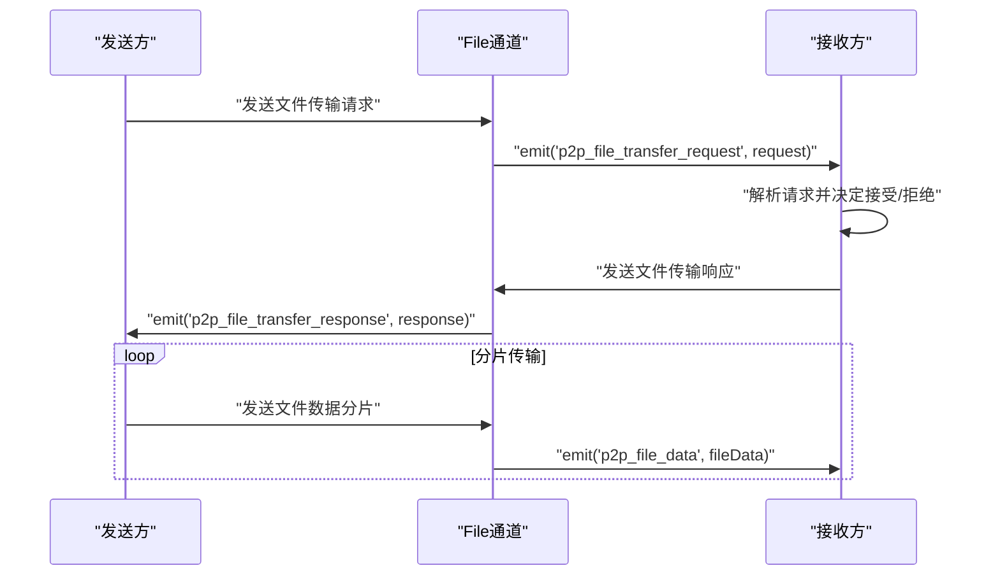

**图表来源**
- [src-tauri/src/service/p2p_service.rs:824-914](file://src-tauri/src/service/p2p_service.rs#L824-L914)
- [src-tauri/src/quic_service/p2p_service/p2p_quic_service.rs:245-273](file://src-tauri/src/quic_service/p2p_service/p2p_quic_service.rs#L245-L273)

### 文件传输消息类型
新增的文件传输消息类型定义如下：

| 消息类型 | 常量名称 | 描述 |
|---------|----------|------|
| 17 | MSG_TYPE_P2P_FILE_DATA | 通过File通道传输文件分片数据 |
| 18 | MSG_TYPE_P2P_FILE_TRANSFER_REQUEST | 发送方发起文件传输时的握手消息 |
| 19 | MSG_TYPE_P2P_FILE_TRANSFER_RESPONSE | 接收方确认或拒绝文件传输 |

**章节来源**
- [src-tauri/src/utils/message_types.rs:77-86](file://src-tauri/src/utils/message_types.rs#L77-L86)

### 文件传输数据结构
文件传输涉及三个核心数据结构：

#### P2pFileData - 文件数据包
用于通过 File 通道传输文件数据分片：
- `uuid`: 目标用户UUID
- `file_name`: 文件名
- `mime_type`: 文件MIME类型
- `total_size`: 文件总大小 (字节)
- `chunk_index`: 当前分片索引 (从0开始)
- `total_chunks`: 总分片数
- `chunk_data`: 分片数据
- `transfer_id`: 文件传输ID

#### P2pFileTransferRequest - 文件传输请求
发送方发起文件传输时的握手消息：
- `file_name`: 文件名
- `mime_type`: 文件MIME类型
- `total_size`: 文件总大小 (字节)
- `total_chunks`: 总分片数
- `transfer_id`: 文件传输ID
- `timestamp`: 时间戳

#### P2pFileTransferResponse - 文件传输响应
接收方响应文件传输请求：
- `transfer_id`: 文件传输ID
- `accept`: 是否接受传输
- `timestamp`: 时间戳

**章节来源**
- [src-tauri/src/entity/p2p_models.rs:121-171](file://src-tauri/src/entity/p2p_models.rs#L121-L171)

### P2P 文件传输服务实现
后端文件传输服务提供了完整的文件传输功能：

#### 发送文件数据分片
```rust
async fn send_p2p_file_data_service(
    file_data: P2pFileData,
    target_uuid: String,
) -> Result<(), anyhow::Error>
```
- 将文件数据转换为消息格式
- 通过 File 通道发送到目标用户
- 记录分片发送完成日志

#### 发送文件传输请求
```rust
async fn send_p2p_file_transfer_request_service(
    transfer_request: P2pFileTransferRequest,
    target_uuid: String,
) -> Result<(), anyhow::Error>
```
- 发送方发起文件传输时调用
- 等待接收方确认
- 记录请求发送日志

#### 发送文件传输响应
```rust
async fn send_p2p_file_transfer_response_service(
    transfer_response: P2pFileTransferResponse,
    target_uuid: String,
) -> Result<(), anyhow::Error>
```
- 接收方确认或拒绝文件传输
- 回复给发送方

**章节来源**
- [src-tauri/src/service/p2p_service.rs:800-914](file://src-tauri/src/service/p2p_service.rs#L800-L914)

### 前端文件传输事件处理
前端通过 Tauri 事件系统处理文件传输相关事件：

#### 文件传输事件监听
前端组件可以监听以下事件：
- `p2p_file_data`: 接收文件数据分片
- `p2p_file_transfer_request`: 接收文件传输请求
- `p2p_file_transfer_response`: 接收文件传输响应

#### 文件传输类型定义
前端 TypeScript 类型定义包括：
- `FileData`: 文件数据分片接口
- `FileTransferRequest`: 文件传输请求接口  
- `FileTransferResponse`: 文件传输响应接口

**章节来源**
- [packages/types/src/p2p/index.ts:195-256](file://packages/types/src/p2p/index.ts#L195-L256)

## 依赖关系分析
- QUIC 服务模块：通过安全/危险配置模块提供连接参数，P2P 服务模块负责消息处理与心跳，**新增**文件传输服务模块处理文件传输逻辑，实体模型与消息类型提供数据契约。
- WebRTC 服务：依赖浏览器 WebRTC API，通过 Tauri 事件与后端通信，实现信令交换与媒体传输。
- 前端组件：通过 Tauri 调用与事件监听，桥接后端网络能力与用户界面。

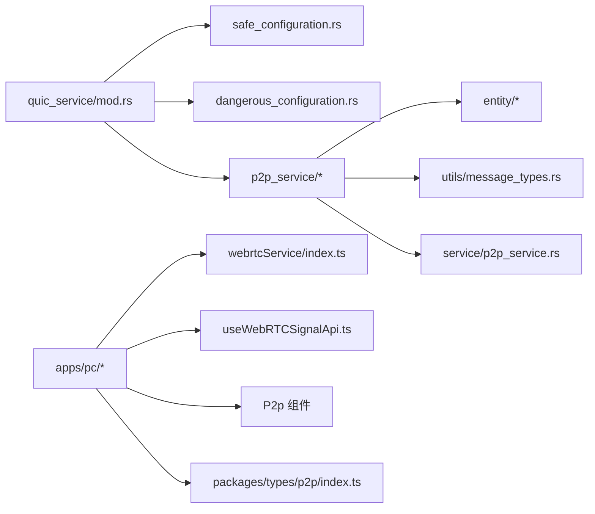

**图表来源**
- [src-tauri/src/quic_service/mod.rs:1-7](file://src-tauri/src/quic_service/mod.rs#L1-L7)
- [src-tauri/src/quic_service/p2p_service/mod.rs:1-4](file://src-tauri/src/quic_service/p2p_service/mod.rs#L1-L4)
- [apps/pc/src/services/webrtcService/index.ts:1-120](file://apps/pc/src/services/webrtcService/index.ts#L1-L120)
- [apps/pc/src/hooks/useWebRTCSignalApi.ts:1-100](file://apps/pc/src/hooks/useWebRTCSignalApi.ts#L1-L100)
- [src-tauri/src/service/p2p_service.rs:800-914](file://src-tauri/src/service/p2p_service.rs#L800-L914)
- [packages/types/src/p2p/index.ts:1-276](file://packages/types/src/p2p/index.ts#L1-L276)

**章节来源**
- [src-tauri/src/quic_service/mod.rs:1-7](file://src-tauri/src/quic_service/mod.rs#L1-L7)
- [src-tauri/src/quic_service/p2p_service/mod.rs:1-4](file://src-tauri/src/quic_service/p2p_service/mod.rs#L1-L4)

## 性能考量
- QUIC 连接管理
  - 合理设置空闲超时，避免资源长期占用；在高并发场景下适当降低并发单向流上限。
  - 使用异步通道发送媒体数据，避免阻塞主线程，提升吞吐。
- WebRTC 候选与 ICE
  - 保留 host/srflx 候选，避免人为过滤；增大 ICE 候选池，提升连接成功率。
  - 合理设置 ICE 超时与重启间隔，NAT3 环境建议延长超时时间。
- 媒体质量控制
  - 动态调整分辨率/帧率/码率，结合缓冲策略与自适应延迟，平衡流畅度与清晰度。
  - 音频启用回声消除/噪声抑制/自动增益，提升通话体验。
- **新增** 文件传输优化
  - 文件传输使用独立通道，避免影响媒体传输质量。
  - 分片大小可根据网络状况动态调整，提高传输效率。
  - 传输过程中支持断点续传，提高大文件传输成功率。

## 故障排查指南
- QUIC 连接问题
  - 证书校验失败：检查安全配置中的 CA 证书加载逻辑，确认本地证书文件是否存在。
  - 连接被回收：检查空闲超时设置，必要时延长超时时间。
  - 心跳中断：确认心跳发送循环与连接活跃状态标志位，排查写入错误。
- WebRTC 连接问题
  - ICE 失败：查看候选对统计，确认 host/srflx 候选是否被正确发送；检查 STUN 服务器可达性。
  - 连接超时：适当延长 ICE 超时时间，增加 ICE 重启次数与间隔。
  - 媒体流异常：检查本地媒体流初始化与轨道状态，确认远程媒体流回调是否触发。
- **新增** 文件传输问题
  - 文件传输请求未响应：检查文件传输请求消息是否正确发送，确认接收方是否在线。
  - 文件传输响应失败：确认接收方的响应逻辑，检查 accept 字段是否正确设置。
  - 文件数据分片丢失：检查分片索引与总数是否匹配，确认传输ID是否一致。
  - 传输速度慢：调整分片大小，检查网络状况，考虑使用更优的传输参数。
- 事件与信令
  - 信令未到达：确认前端事件监听是否正确，后端是否正确 emit 事件。
  - P2P 请求未处理：检查后端事件解析与消息分发逻辑。

**章节来源**
- [src-tauri/src/quic_service/safe_configuration.rs:27-52](file://src-tauri/src/quic_service/safe_configuration.rs#L27-L52)
- [src-tauri/src/quic_service/p2p_service/p2p_quic_service.rs:272-307](file://src-tauri/src/quic_service/p2p_service/p2p_quic_service.rs#L272-L307)
- [apps/pc/src/services/webrtcService/index.ts:765-800](file://apps/pc/src/services/webrtcService/index.ts#L765-L800)
- [apps/pc/src/hooks/useWebRTCSignalApi.ts:62-81](file://apps/pc/src/hooks/useWebRTCSignalApi.ts#L62-L81)
- [src-tauri/src/service/p2p_service.rs:800-914](file://src-tauri/src/service/p2p_service.rs#L800-L914)

## 结论
本项目在网络通信层面实现了 QUIC 与 WebRTC 的协同：QUIC 负责安全稳定的点对点数据通道与媒体配置/控制消息，**新增**文件传输通道支持大文件的可靠传输，WebRTC 负责媒体轨道的高效传输与 NAT 穿越。通过完善的配置、消息类型与事件机制，系统在保证安全性的同时兼顾性能与用户体验。**新增的文件传输功能**进一步增强了应用的实用性，通过独立通道和分片传输机制，确保大文件传输的稳定性和效率。建议在生产环境中优先采用安全配置与严格的错误处理，并持续优化候选池与媒体质量控制策略。

## 附录
- 代码示例路径（不含具体代码内容）
  - QUIC 安全配置：[src-tauri/src/quic_service/safe_configuration.rs:13-68](file://src-tauri/src/quic_service/safe_configuration.rs#L13-L68)
  - QUIC 危险配置：[src-tauri/src/quic_service/dangerous_configuration.rs:7-34](file://src-tauri/src/quic_service/dangerous_configuration.rs#L7-L34)
  - P2P QUIC 服务消息处理：[src-tauri/src/quic_service/p2p_service/p2p_quic_service.rs:114-259](file://src-tauri/src/quic_service/p2p_service/p2p_quic_service.rs#L114-L259)
  - P2P QUIC 客户端/服务端：[src-tauri/src/quic_service/p2p_service/p2p_stream_quic_client.rs:18-113](file://src-tauri/src/quic_service/p2p_service/p2p_stream_quic_client.rs#L18-L113)、[src-tauri/src/quic_service/p2p_service/p2p_stream_quic_server.rs:89-167](file://src-tauri/src/quic_service/p2p_service/p2p_stream_quic_server.rs#L89-L167)
  - WebRTC 服务配置与连接：[apps/pc/src/services/webrtcService/index.ts:35-101](file://apps/pc/src/services/webrtcService/index.ts#L35-L101)、[apps/pc/src/services/webrtcService/index.ts:373-549](file://apps/pc/src/services/webrtcService/index.ts#L373-L549)
  - P2P 媒体模型与消息类型：[src-tauri/src/entity/p2p_models.rs:1-283](file://src-tauri/src/entity/p2p_models.rs#L1-L283)、[src-tauri/src/utils/message_types.rs:23-86](file://src-tauri/src/utils/message_types.rs#L23-L86)
  - **新增** P2P 文件传输服务：[src-tauri/src/service/p2p_service.rs:800-914](file://src-tauri/src/service/p2p_service.rs#L800-L914)
  - 前端 P2P 控制与信令：[apps/pc/src/components/P2p/InitP2pMsg.tsx:9-16](file://apps/pc/src/components/P2p/InitP2pMsg.tsx#L9-L16)、[apps/pc/src/hooks/useWebRTCSignalApi.ts:62-81](file://apps/pc/src/hooks/useWebRTCSignalApi.ts#L62-L81)
  - **新增** 前端文件传输类型定义：[packages/types/src/p2p/index.ts:195-256](file://packages/types/src/p2p/index.ts#L195-L256)