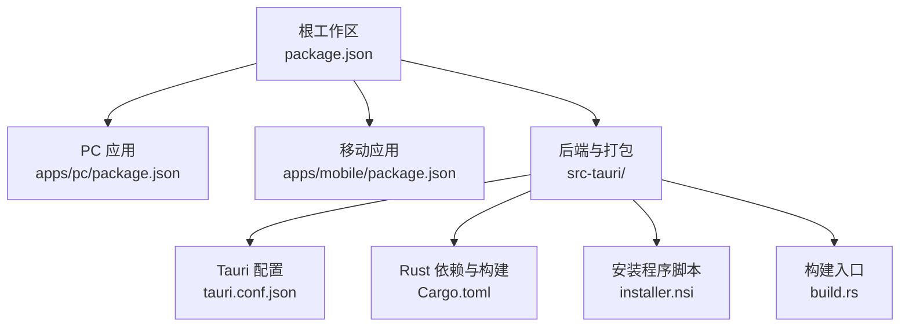
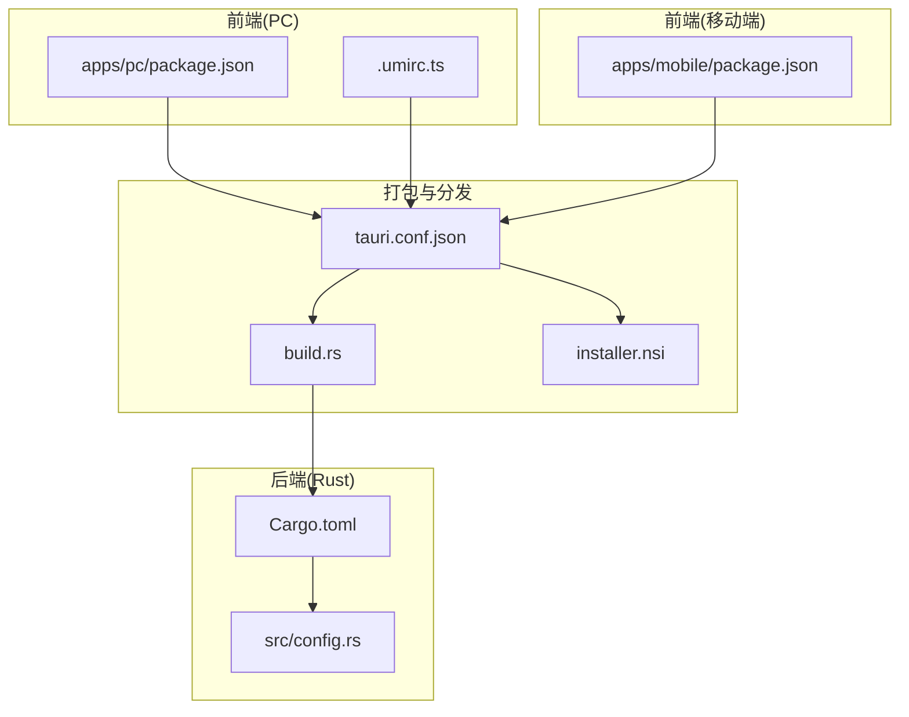
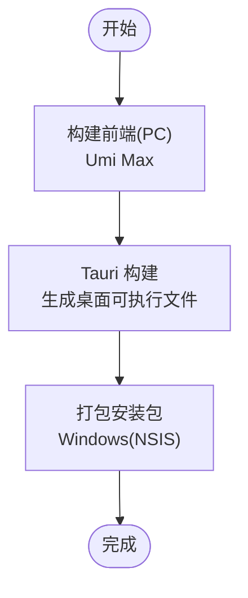
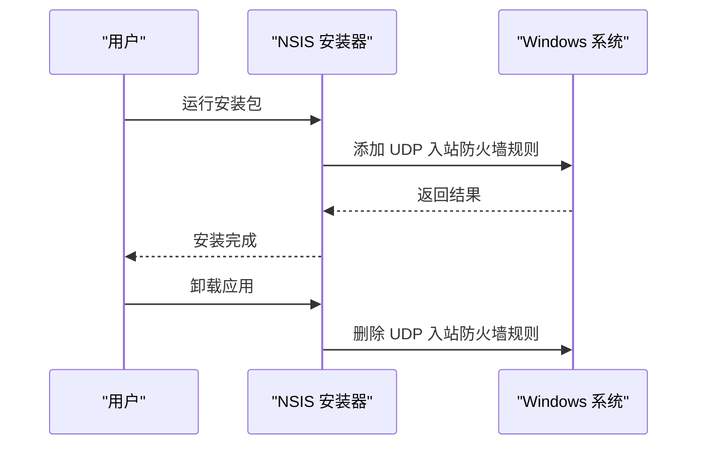

# 部署指南

<cite>
**本文引用的文件**
- [Cargo.toml](file://src-tauri/Cargo.toml)
- [package.json](file://package.json)
- [apps/pc/package.json](file://apps/pc/package.json)
- [apps/mobile/package.json](file://apps/mobile/package.json)
- [tauri.conf.json](file://src-tauri/tauri.conf.json)
- [installer.nsi](file://src-tauri/installer.nsi)
- [build.rs](file://src-tauri/build.rs)
- [pnpm-workspace.yaml](file://pnpm-workspace.yaml)
- [src/config.rs](file://src-tauri/src/config.rs)
- [.cargo/config.toml](file://src-tauri/.cargo/config.toml)
- [.husky/_/husky.sh](file://.husky/_/husky.sh)
- [apps/pc/.umirc.ts](file://apps/pc/.umirc.ts)
</cite>

## 目录

1. [简介](#简介)
2. [项目结构](#项目结构)
3. [核心组件](#核心组件)
4. [架构总览](#架构总览)
5. [详细组件分析](#详细组件分析)
6. [依赖与环境准备](#依赖与环境准备)
7. [多平台构建与打包](#多平台构建与打包)
8. [安装程序与签名验证](#安装程序与签名验证)
9. [CI/CD 流水线与自动化部署](#cicd-流水线与自动化部署)
10. [版本管理与发布策略](#版本管理与发布策略)
11. [生产环境部署建议](#生产环境部署建议)
12. [性能监控与故障排查](#性能监控与故障排查)
13. [安全加固与更新回滚](#安全加固与更新回滚)
14. [结论](#结论)

## 简介

本指南面向运维与 DevOps 工程师，系统阐述即时通讯应用在桌面端（Windows/macOS/Linux）与移动端（Android/iOS）的构建、打包与发布流程；覆盖多平台构建配置、依赖管理、安装程序制作与签名验证、CI/CD 自动化部署、版本管理、生产部署建议、性能监控与故障排查、安全加固与更新回滚策略。

## 项目结构

该仓库采用 monorepo 结构，前端应用位于 apps 目录，后端与原生打包逻辑位于 src-tauri 目录，根目录通过 pnpm 工作区统一管理脚本与依赖。

图表来源

- [package.json:1-30](file://package.json#L1-L30)
- [apps/pc/package.json:1-45](file://apps/pc/package.json#L1-L45)
- [apps/mobile/package.json:1-37](file://apps/mobile/package.json#L1-L37)
- [tauri.conf.json:1-58](file://src-tauri/tauri.conf.json#L1-L58)
- [Cargo.toml:1-62](file://src-tauri/Cargo.toml#L1-L62)
- [installer.nsi:1-8](file://src-tauri/installer.nsi#L1-L8)
- [build.rs:1-4](file://src-tauri/build.rs#L1-L4)

章节来源

- [pnpm-workspace.yaml:1-4](file://pnpm-workspace.yaml#L1-L4)
- [package.json:1-30](file://package.json#L1-L30)

## 核心组件

- 前端 PC 应用：基于 Umi Max 构建，开发与生产构建脚本由其 CLI 管理。
- 前端 移动应用：基于 Vite/Vue3，提供移动端构建与 Tauri 集成能力。
- 后端 Rust 服务：通过 Tauri 2 封装为桌面应用，集成网络、数据库、日志等能力。
- 打包与分发：Tauri CLI 统一生成各平台可执行文件与安装包，Windows 使用 NSIS 安装器。

章节来源

- [apps/pc/package.json:1-45](file://apps/pc/package.json#L1-L45)
- [apps/mobile/package.json:1-37](file://apps/mobile/package.json#L1-L37)
- [Cargo.toml:1-62](file://src-tauri/Cargo.toml#L1-L62)
- [tauri.conf.json:1-58](file://src-tauri/tauri.conf.json#L1-L58)

## 架构总览

应用采用“前端渲染 + Rust 后端服务”的桌面应用架构，前端负责界面与交互，Rust 负责业务逻辑、网络通信与本地数据持久化，Tauri 提供跨平台运行时与系统集成能力。

图表来源

- [apps/pc/package.json:1-45](file://apps/pc/package.json#L1-L45)
- [apps/mobile/package.json:1-37](file://apps/mobile/package.json#L1-L37)
- [tauri.conf.json:1-58](file://src-tauri/tauri.conf.json#L1-L58)
- [build.rs:1-4](file://src-tauri/build.rs#L1-L4)
- [Cargo.toml:1-62](file://src-tauri/Cargo.toml#L1-L62)
- [src/config.rs:1-154](file://src-tauri/src/config.rs#L1-L154)
- [installer.nsi:1-8](file://src-tauri/installer.nsi#L1-L8)

## 详细组件分析

### Tauri 配置与窗口策略

- 产品名称、版本、标识符与构建入口由配置文件定义。
- 开发与构建命令分别指向 PC 应用的 dev/build 脚本。
- 安全策略包含 CSP、资源协议与能力集，限制前端访问范围。
- 打包目标为 all，图标覆盖多尺寸与平台格式；Windows 使用 NSIS 并注入自定义安装/卸载钩子。

章节来源

- [tauri.conf.json:1-58](file://src-tauri/tauri.conf.json#L1-L58)

### 安装程序与防火墙规则

- Windows 安装器通过 NSIS 注入安装/卸载钩子，在安装时添加 UDP 入站防火墙规则，在卸载时移除。
- 该策略确保应用在特定网络模式下可正常收发数据。

章节来源

- [installer.nsi:1-8](file://src-tauri/installer.nsi#L1-L8)

### Rust 依赖与运行时特性

- 语言与工具链版本、编译优化配置明确。
- 关键依赖包括：Tauri 运行时、网络栈（QUIC）、TLS（rustls）、数据库（SQLite/sqlx 与 rusqlite + sqlcipher）、日志、并发容器、图像处理等。
- 通过插件扩展能力，如对话框、文件系统等。

章节来源

- [Cargo.toml:1-62](file://src-tauri/Cargo.toml#L1-L62)

### 前端构建与开发脚本

- 根工作区提供统一的开发与构建脚本，按需构建 PC/移动端应用。
- PC 应用使用 Umi Max，配置了国际化、路由与最小化 IIFE。
- 移动端应用使用 Vite/Vue3，支持 Tauri 开发与构建。

章节来源

- [package.json:1-30](file://package.json#L1-L30)
- [apps/pc/package.json:1-45](file://apps/pc/package.json#L1-L45)
- [apps/pc/.umirc.ts:1-22](file://apps/pc/.umirc.ts#L1-L22)
- [apps/mobile/package.json:1-37](file://apps/mobile/package.json#L1-L37)

### Android NDK 链接器配置

- 针对 Android 目标平台设置了交叉编译工具链路径，便于在 Windows 上构建 Android 组件或共享库。

章节来源

- [.cargo/config.toml:1-12](file://src-tauri/.cargo/config.toml#L1-L12)

## 依赖与环境准备

- Node 与包管理器：根工作区声明 Node 与 pnpm 版本要求，确保团队一致性。
- Rust 工具链：Rust 版本与 Tauri 版本在 Cargo.toml 中固定，保证二进制兼容。
- 平台 SDK：Windows 安装器依赖 Windows 系统防火墙命令；Android 构建依赖 NDK 工具链。
- Husky：提供 Git 钩子支持，建议在 CI 中保持一致行为。

章节来源

- [package.json:25-28](file://package.json#L25-L28)
- [Cargo.toml:8-9](file://src-tauri/Cargo.toml#L8-L9)
- [.cargo/config.toml:1-12](file://src-tauri/.cargo/config.toml#L1-L12)
- [.husky/\_/husky.sh:1-9](file://.husky/_/husky.sh#L1-L9)

## 多平台构建与打包

- 桌面端（Windows/macOS/Linux）：通过 Tauri CLI 在本地或 CI 中执行构建，生成对应平台可执行文件与安装包。
- 移动端（Android/iOS）：Android 侧生成 APK/APK 分包产物，iOS 侧生成 IPA 或模拟器/设备构建产物；Android 构建配置中已启用签名版本信息。
- 前端构建：PC 应用先于 Tauri 构建，确保静态资源可用；移动端可独立构建或与 Tauri 集成构建。

图表来源

- [apps/pc/package.json:8-16](file://apps/pc/package.json#L8-L16)
- [tauri.conf.json:6-11](file://src-tauri/tauri.conf.json#L6-L11)
- [build.rs:1-4](file://src-tauri/build.rs#L1-L4)

章节来源

- [apps/pc/package.json:8-16](file://apps/pc/package.json#L8-L16)
- [apps/mobile/package.json:7-15](file://apps/mobile/package.json#L7-L15)
- [tauri.conf.json:41-56](file://src-tauri/tauri.conf.json#L41-L56)
- [src-tauri/gen/android/app/build/intermediates/signing_config_versions/universalRelease/writeUniversalReleaseSigningConfigVersions/signing-config-versions.json:1-6](file://src-tauri/gen/android/app/build/intermediates/signing_config_versions/universalRelease/writeUniversalReleaseSigningConfigVersions/signing-config-versions.json#L1-L6)

## 安装程序与签名验证

- Windows 安装器：使用 NSIS，安装时自动添加 UDP 入站防火墙规则，卸载时清理规则，保障网络功能。
- Android 签名：构建产物中包含签名版本信息，表明启用 V2 签名；建议在 CI 中配置 keystore 环境变量以实现自动化签名。
- macOS/iOS：未在当前仓库中发现专用签名配置文件，建议在 CI 中配置 Apple 证书与 Provisioning Profile。

图表来源

- [installer.nsi:1-8](file://src-tauri/installer.nsi#L1-L8)

章节来源

- [installer.nsi:1-8](file://src-tauri/installer.nsi#L1-L8)
- [src-tauri/gen/android/app/build/intermediates/signing_config_versions/universalRelease/writeUniversalReleaseSigningConfigVersions/signing-config-versions.json:1-6](file://src-tauri/gen/android/app/build/intermediates/signing_config_versions/universalRelease/writeUniversalReleaseSigningConfigVersions/signing-config-versions.json#L1-L6)

## CI/CD 流水线与自动化部署

- 本地开发：根脚本提供统一入口，先构建前端再触发 Tauri 构建。
- 建议在 CI 中：
  - 固定 Node/pnpm 与 Rust 工具链版本；
  - 缓存依赖与构建产物；
  - 分阶段执行：安装依赖 → 前端构建 → Rust/Tauri 构建 → 打包 → 上传制品；
  - Windows 使用 NSIS 安装器，Android 使用 Gradle 打包并签名，iOS 使用 Xcode Archive；
  - 发布阶段：上传到制品库或应用商店，生成变更日志与版本标签。
- Husky 钩子在本地生效，建议在 CI 中保持一致的提交规范与检查。

章节来源

- [package.json:4-14](file://package.json#L4-L14)
- [.husky/\_/husky.sh:1-9](file://.husky/_/husky.sh#L1-L9)

## 版本管理与发布策略

- 版本号：桌面端与应用产品版本在配置中统一维护，建议与 Git 标签同步。
- 发布节奏：建议采用语义化版本控制，主版本用于破坏性变更，次版本用于新增功能，修订版本用于修复。
- 变更日志：在发布前生成 CHANGELOG，记录关键改动与已知问题。
- 回归测试：在发布前进行关键场景回归测试，确保桌面与移动端核心功能稳定。

章节来源

- [tauri.conf.json:3-4](file://src-tauri/tauri.conf.json#L3-L4)
- [Cargo.toml:2-3](file://src-tauri/Cargo.toml#L2-L3)

## 生产环境部署建议

- 桌面端：
  - Windows：使用 NSIS 安装器分发，确保防火墙规则正确配置；提供静默安装参数以便批量部署。
  - macOS：建议使用 DMG 包或 Homebrew Formula；注意沙盒与权限配置。
  - Linux：提供 AppImage 或 DEB/RPM 包，确保依赖齐全。
- 移动端：
  - Android：上架 Google Play 或国内应用市场，配置混淆与签名；提供增量更新渠道。
  - iOS：上架 App Store，遵循审核指南与隐私政策。
- 基础设施：建议使用 CDN 分发安装包，记录下载统计与完整性校验。

## 性能监控与故障排查

- 日志与指标：
  - Rust 层使用异步日志库输出运行日志，建议接入集中式日志系统（如 ELK/OTEL）。
  - 前端层可通过浏览器开发者工具与网络面板定位性能瓶颈。
- 网络与连接：
  - QUIC/TLS 配置应结合实际网络环境调优；关注 NAT 穿越与防火墙放通。
- 故障排查步骤：
  - 收集日志与崩溃报告；
  - 快速回滚至上一个稳定版本；
  - 验证安装器与系统权限（Windows 防火墙规则）。

章节来源

- [Cargo.toml:38](file://src-tauri/Cargo.toml#L38)
- [src/config.rs:1-154](file://src-tauri/src/config.rs#L1-L154)

## 安全加固与更新回滚

- 安全策略：
  - CSP 严格限制资源加载来源，减少 XSS 风险。
  - 资源协议限定在受控目录范围内，避免任意文件读取。
  - TLS 使用 rustls，建议在生产中禁用危险配置特性，仅保留必要功能。
- 更新机制：
  - 桌面端：可集成 Tauri 的自动更新能力，或通过安装器替换方式推送新版本。
  - 移动端：通过应用商店发布更新，或企业内部分发渠道。
- 回滚策略：
  - 保留最近三个版本的安装包与补丁；
  - 回滚时清理用户配置与缓存，避免残留状态导致异常。

章节来源

- [tauri.conf.json:26-39](file://src-tauri/tauri.conf.json#L26-L39)
- [Cargo.toml:36](file://src-tauri/Cargo.toml#L36)

## 结论

本部署指南提供了从开发到生产的完整路径：统一的 monorepo 结构、明确的多平台构建与打包策略、可审计的安装程序与签名流程、可落地的 CI/CD 自动化方案、完善的版本与发布策略、以及生产级的安全加固与回滚机制。建议在实际落地时结合团队流程与合规要求进一步细化。
