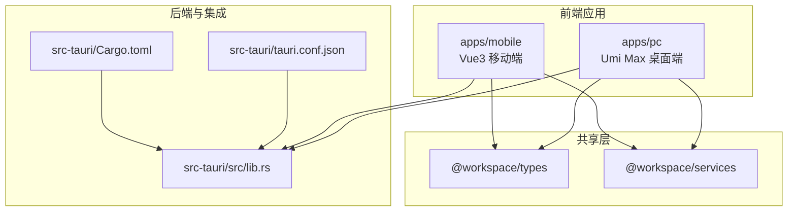
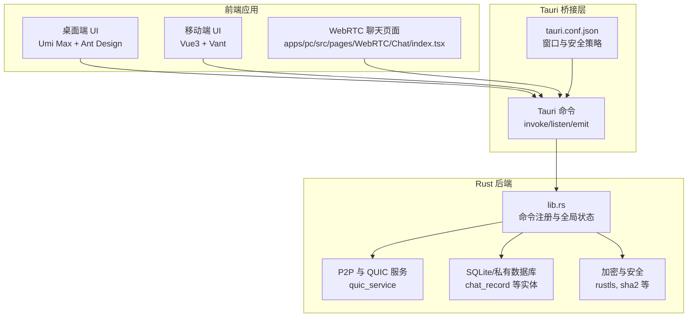
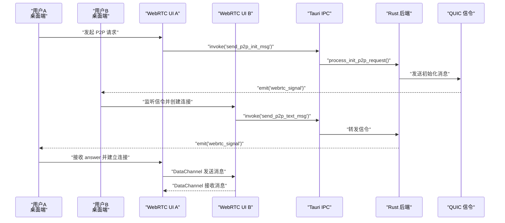
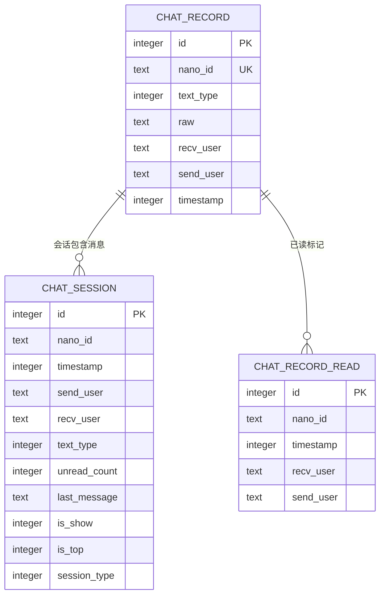
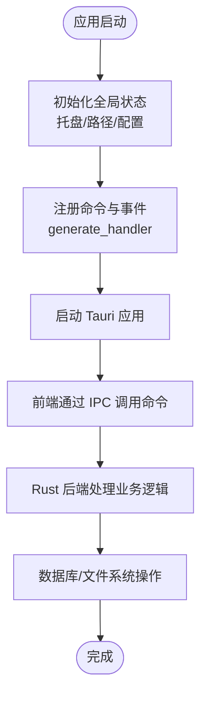
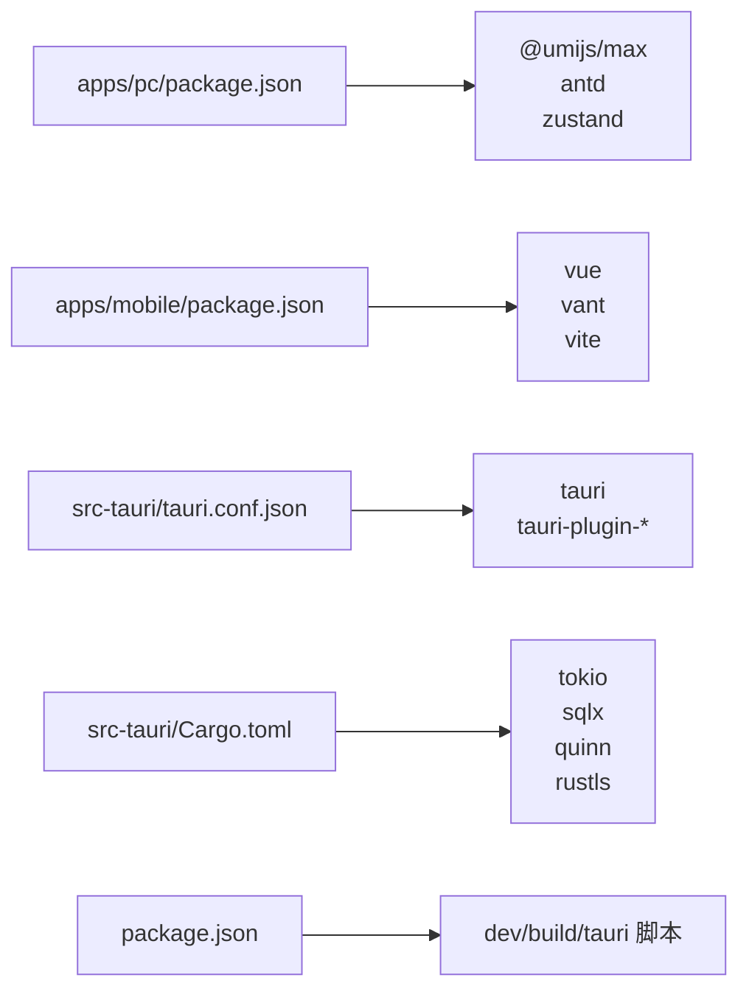

# 项目概述

<cite>
**本文引用的文件**   
- [README.md](file://README.md)
- [package.json](file://package.json)
- [pnpm-workspace.yaml](file://pnpm-workspace.yaml)
- [apps/pc/package.json](file://apps/pc/package.json)
- [apps/mobile/package.json](file://apps/mobile/package.json)
- [src-tauri/Cargo.toml](file://src-tauri/Cargo.toml)
- [src-tauri/tauri.conf.json](file://src-tauri/tauri.conf.json)
- [src-tauri/src/main.rs](file://src-tauri/src/main.rs)
- [src-tauri/src/lib.rs](file://src-tauri/src/lib.rs)
- [apps/pc/.umirc.ts](file://apps/pc/.umirc.ts)
- [apps/pc/src/app.ts](file://apps/pc/src/app.ts)
- [apps/pc/src/pages/Privacy/Chat/index.tsx](file://apps/pc/src/pages/Privacy/Chat/index.tsx)
- [WebRTC_CHAT_DOCUMENTATION.md](file://WebRTC_CHAT_DOCUMENTATION.md)
- [COMPLETION_SUMMARY.md](file://COMPLETION_SUMMARY.md)
- [DELIVERY_SUMMARY.md](file://DELIVERY_SUMMARY.md)
</cite>

## 目录

1. [引言](#引言)
2. [项目结构](#项目结构)
3. [核心组件](#核心组件)
4. [架构总览](#架构总览)
5. [详细组件分析](#详细组件分析)
6. [依赖分析](#依赖分析)
7. [性能考量](#性能考量)
8. [故障排查指南](#故障排查指南)
9. [结论](#结论)
10. [附录](#附录)

## 引言

本项目是一个基于 Rust + Tauri + Vue3/Umi 的跨平台即时通讯应用，旨在提供高性能、低耦合、可扩展的桌面与移动端一体化解决方案。项目通过 Tauri 将 Rust 后端能力与前端 UI 技术栈无缝融合，既能在桌面端提供原生体验，也能在移动端通过统一的前端框架实现一致的功能与交互。

项目的核心目标包括：

- 提供跨平台即时通讯能力（桌面端与移动端）
- 支持隐私优先的 P2P 直连通信（WebRTC）
- 以模块化架构实现高内聚、低耦合的系统设计
- 通过完善的文档与日志体系降低维护成本，提升可扩展性

独特价值体现在：

- 桌面端与移动端共享同一套业务逻辑与 UI 组件，减少重复开发
- Rust 后端提供高性能与安全性保障，配合 Tauri 实现轻量级原生体验
- WebRTC P2P 能力在隐私聊天与低延迟通信方面具备显著优势

## 项目结构

项目采用 monorepo 结构，通过工作区管理多包与多应用：

- apps/pc：基于 Umi Max 的桌面端应用
- apps/mobile：基于 Vue3 + Vite 的移动端应用
- src-tauri：Rust 后端与 Tauri 集成层
- packages：共享类型与服务定义
- 根目录脚本与配置：统一的构建、开发与发布流程

**图表来源**

- [pnpm-workspace.yaml:1-4](file://pnpm-workspace.yaml#L1-L4)
- [apps/pc/package.json:1-45](file://apps/pc/package.json#L1-L45)
- [apps/mobile/package.json:1-37](file://apps/mobile/package.json#L1-L37)
- [src-tauri/tauri.conf.json:1-58](file://src-tauri/tauri.conf.json#L1-L58)
- [src-tauri/src/lib.rs:1-167](file://src-tauri/src/lib.rs#L1-L167)
- [src-tauri/Cargo.toml:1-62](file://src-tauri/Cargo.toml#L1-L62)

**章节来源**

- [README.md:76-100](file://README.md#L76-L100)
- [pnpm-workspace.yaml:1-4](file://pnpm-workspace.yaml#L1-L4)
- [apps/pc/package.json:1-45](file://apps/pc/package.json#L1-L45)
- [apps/mobile/package.json:1-37](file://apps/mobile/package.json#L1-L37)
- [src-tauri/tauri.conf.json:1-58](file://src-tauri/tauri.conf.json#L1-L58)
- [src-tauri/src/lib.rs:1-167](file://src-tauri/src/lib.rs#L1-L167)
- [src-tauri/Cargo.toml:1-62](file://src-tauri/Cargo.toml#L1-L62)

## 核心组件

- 前端应用层
  - 桌面端：Umi Max + Ant Design + Zustand，提供路由、布局、国际化与状态管理
  - 移动端：Vue3 + Vant + Vite，提供移动端适配与组件生态
- 后端与系统集成层
  - Tauri 应用入口与插件系统，暴露命令与事件，桥接前端与 Rust 后端
  - Rust 核心服务：数据库、加密、网络、P2P 与 WebRTC 信令
- 共享层
  - 类型定义与服务接口，确保前后端契约一致

关键职责划分：

- 前端负责 UI、交互与业务编排
- Rust 后端负责数据持久化、网络通信与系统能力
- Tauri 作为桥梁，提供 IPC 能力与原生系统集成

**章节来源**

- [apps/pc/.umirc.ts:1-22](file://apps/pc/.umirc.ts#L1-L22)
- [apps/pc/src/app.ts:1-23](file://apps/pc/src/app.ts#L1-L23)
- [src-tauri/src/lib.rs:117-163](file://src-tauri/src/lib.rs#L117-L163)
- [src-tauri/Cargo.toml:24-62](file://src-tauri/Cargo.toml#L24-L62)

## 架构总览

系统采用“前端应用 + Tauri 桥接 + Rust 后端”的三层架构，结合 WebRTC P2P 与 QUIC 信令通道，实现端到端的即时通信能力。

**图表来源**

- [apps/pc/src/pages/Privacy/Chat/index.tsx:93-189](file://apps/pc/src/pages/Privacy/Chat/index.tsx#L93-L189)
- [src-tauri/src/lib.rs:117-163](file://src-tauri/src/lib.rs#L117-L163)
- [src-tauri/src/main.rs:1-8](file://src-tauri/src/main.rs#L1-L8)
- [src-tauri/tauri.conf.json:1-58](file://src-tauri/tauri.conf.json#L1-L58)

**章节来源**

- [src-tauri/src/lib.rs:1-167](file://src-tauri/src/lib.rs#L1-L167)
- [src-tauri/src/main.rs:1-8](file://src-tauri/src/main.rs#L1-L8)
- [src-tauri/tauri.conf.json:1-58](file://src-tauri/tauri.conf.json#L1-L58)
- [apps/pc/src/pages/Privacy/Chat/index.tsx:93-189](file://apps/pc/src/pages/Privacy/Chat/index.tsx#L93-L189)

## 详细组件分析

### WebRTC P2P 聊天组件

该组件是项目隐私通信的核心，基于 WebRTC DataChannel 实现 P2P 直连消息传递，并通过 Rust 后端的 QUIC 信令通道完成连接初始化与候选交换。

**图表来源**

- [WebRTC_CHAT_DOCUMENTATION.md:110-163](file://WebRTC_CHAT_DOCUMENTATION.md#L110-L163)
- [apps/pc/src/pages/Privacy/Chat/index.tsx:93-189](file://apps/pc/src/pages/Privacy/Chat/index.tsx#L93-L189)
- [src-tauri/src/lib.rs:117-163](file://src-tauri/src/lib.rs#L117-L163)

**章节来源**

- [WebRTC_CHAT_DOCUMENTATION.md:14-331](file://WebRTC_CHAT_DOCUMENTATION.md#L14-L331)
- [apps/pc/src/pages/Privacy/Chat/index.tsx:93-189](file://apps/pc/src/pages/Privacy/Chat/index.tsx#L93-L189)
- [src-tauri/src/lib.rs:117-163](file://src-tauri/src/lib.rs#L117-L163)

### 数据模型与持久化

系统通过 SQLite/私有数据库存储聊天记录、会话与用户信息，采用实体定义与 DAO 查询封装，确保数据一致性与可维护性。

**图表来源**

- [src-tauri/src/entity/chat_record.rs:1-47](file://src-tauri/src/entity/chat_record.rs#L1-L47)
- [src-tauri/src/entity/chat_session.rs:41-71](file://src-tauri/src/entity/chat_session.rs#L41-L71)
- [src-tauri/src/entity/chat_record_read.rs:1-40](file://src-tauri/src/entity/chat_record_read.rs#L1-L40)

**章节来源**

- [src-tauri/src/entity/chat_record.rs:1-47](file://src-tauri/src/entity/chat_record.rs#L1-L47)
- [src-tauri/src/entity/chat_session.rs:41-71](file://src-tauri/src/entity/chat_session.rs#L41-L71)
- [src-tauri/src/entity/chat_record_read.rs:1-40](file://src-tauri/src/entity/chat_record_read.rs#L1-L40)

### Tauri 应用入口与命令注册

应用入口负责初始化全局状态、托盘与后台任务，并通过 generate_handler 注册所有可调用命令，统一暴露给前端。

**图表来源**

- [src-tauri/src/lib.rs:77-167](file://src-tauri/src/lib.rs#L77-L167)
- [src-tauri/src/main.rs:1-8](file://src-tauri/src/main.rs#L1-L8)

**章节来源**

- [src-tauri/src/lib.rs:77-167](file://src-tauri/src/lib.rs#L77-L167)
- [src-tauri/src/main.rs:1-8](file://src-tauri/src/main.rs#L1-L8)

## 依赖分析

- 前端依赖
  - 桌面端：Umi Max、Ant Design、Zustand、React、react-markdown 等
  - 移动端：Vue3、Vant、Vite、TypeScript 等
- 后端依赖
  - Tauri、Tokio、Serde、SQLx、QUIC（quinn）、rustls、图像处理（image/webp/zune）等
- 工作区与脚本
  - pnpm workspace 管理多包；统一脚本实现开发、构建与打包

**图表来源**

- [apps/pc/package.json:18-32](file://apps/pc/package.json#L18-L32)
- [apps/mobile/package.json:16-24](file://apps/mobile/package.json#L16-L24)
- [src-tauri/tauri.conf.json:1-58](file://src-tauri/tauri.conf.json#L1-L58)
- [src-tauri/Cargo.toml:24-62](file://src-tauri/Cargo.toml#L24-L62)
- [package.json:4-14](file://package.json#L4-L14)

**章节来源**

- [apps/pc/package.json:18-32](file://apps/pc/package.json#L18-L32)
- [apps/mobile/package.json:16-24](file://apps/mobile/package.json#L16-L24)
- [src-tauri/tauri.conf.json:1-58](file://src-tauri/tauri.conf.json#L1-L58)
- [src-tauri/Cargo.toml:24-62](file://src-tauri/Cargo.toml#L24-L62)
- [package.json:4-14](file://package.json#L4-L14)

## 性能考量

- 异步运行时与并发
  - 使用 Tokio 提供高性能异步运行时，支持大量并发连接与任务调度
- 数据库与缓存
  - SQLite/私有数据库用于本地持久化；DashMap 用于全局共享状态，降低锁竞争
- 网络与传输
  - QUIC 提供可靠、低延迟的信令通道；WebRTC DataChannel 实现端到端直连
- 前端性能
  - Umi Max 与 Vite 提供快速开发与构建优化；按需加载与组件拆分降低首屏负担

[本节为通用性能讨论，无需列出具体文件来源]

## 故障排查指南

- WebRTC 连接问题
  - 检查 ICE 候选收集与信令转发；确认 QUIC 信令通道正常
- DataChannel 打开失败
  - 确认 offer/answer 流程完整且连接状态已切换为 connected
- 消息发送失败
  - 检查 DataChannel 状态与消息大小限制
- 信令未到达
  - 确认前端 invoke 的命令与后端 emit 的事件匹配

**章节来源**

- [WebRTC_CHAT_DOCUMENTATION.md:546-762](file://WebRTC_CHAT_DOCUMENTATION.md#L546-L762)
- [DELIVERY_SUMMARY.md:172-235](file://DELIVERY_SUMMARY.md#L172-L235)

## 结论

本项目通过 Rust + Tauri + Vue3/Umi 的组合，构建了一个跨平台、模块化、可扩展的即时通讯系统。其核心优势在于：

- 高性能与安全的后端能力（Rust + Tauri）
- 低耦合的前端架构（Umi/Vue3）
- 隐私优先的 P2P 通信（WebRTC + QUIC）
- 完善的文档与日志体系，便于维护与扩展

面向初学者，建议从 WebRTC 快速参考与日志指南入手；面向有经验的开发者，可深入架构设计与核心模块实现，按需扩展媒体、文件传输与多端同步能力。

[本节为总结性内容，无需列出具体文件来源]

## 附录

- 开发与构建
  - 使用 pnpm 管理依赖与脚本；桌面端与移动端分别构建与运行
- 文档与交付
  - 完整的流程文档、快速参考与日志指南，确保知识沉淀与问题定位

**章节来源**

- [README.md:32-75](file://README.md#L32-L75)
- [COMPLETION_SUMMARY.md:1-331](file://COMPLETION_SUMMARY.md#L1-L331)
- [DELIVERY_SUMMARY.md:1-358](file://DELIVERY_SUMMARY.md#L1-L358)
